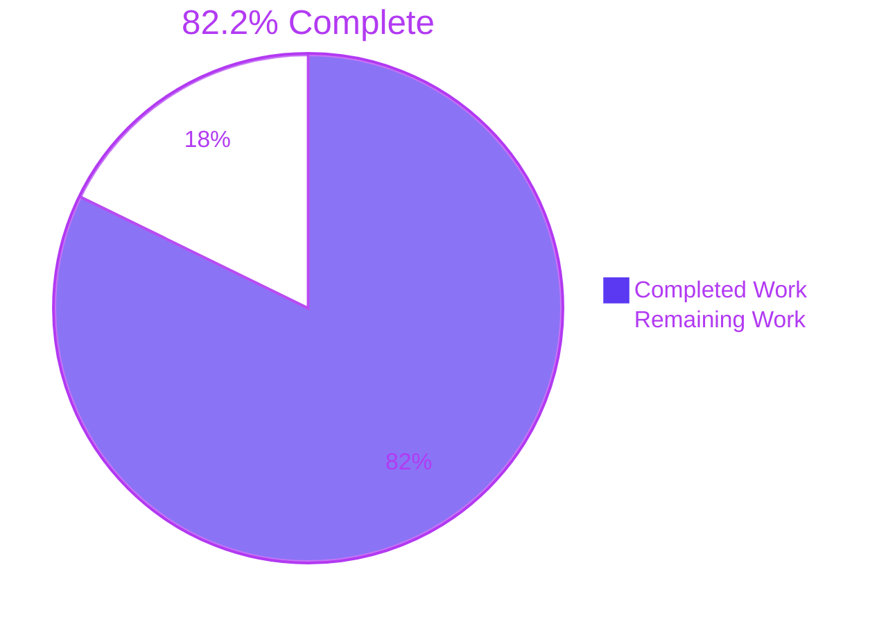
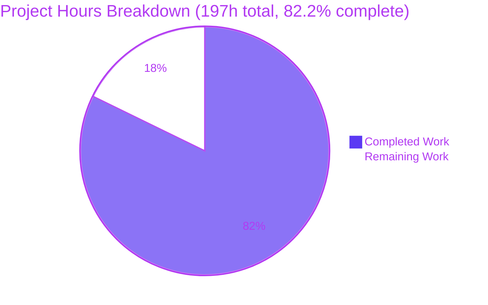
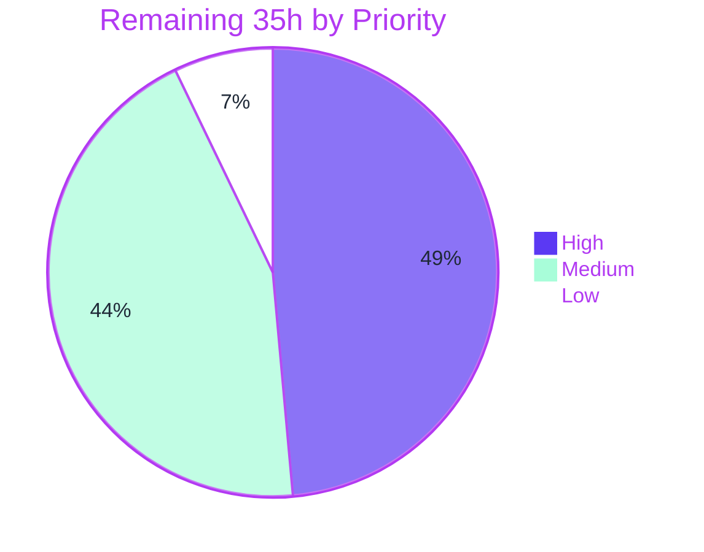

> **Scope note.** Completion percentage measures **only** work scoped in the Agent Action Plan (AAP) plus the standard path-to-production activities required to deploy those deliverables. Repository-wide defects that predate this branch and are placed out of scope by AAP §0.7.2 are excluded from the denominator and catalogued separately in §5 and §6.

# 1. Executive Summary

## 1.1 Project Overview

An experimental **in-cell image drop** capability was added to the `create-excel` React/TypeScript spreadsheet client. A user drags an image file from the operating system onto a spreadsheet cell and the picture renders inside that cell's bounds, clipped to the existing geometry. State is held purely in browser memory — nothing reaches the FastAPI backend, Cloud SQL, Firestore or Cloud Storage, and a page refresh discards everything by design. The target audience is the product and engineering team itself: the deliverable exists to reveal what pictures do to a spreadsheet's layout, legibility and feel before any production feature is committed. Business impact is therefore decision-support, not end-user function. Technical scope is 15 paths in the client only.

## 1.2 Completion Status



<div align="center">

**◆ 82.2% COMPLETE ◆**

</div>

| Metric | Hours |
|---|---|
| **Total Hours** | **197** |
| **Completed Hours (AI + Manual)** | **162** (AI 162 + Manual 0) |
| **Remaining Hours** | **35** |

**Calculation (PA1, AAP-scoped):**

```
Completed Hours  = 162   (all 12 AAP deliverable groups — see §2.1)
Remaining Hours  =  35   (1 AAP gap + 8 path-to-production items — see §2.2)
Total Hours      = 162 + 35 = 197
Completion       = 162 / 197 = 82.2335%  →  82.2%
```

All 162 completed hours were delivered autonomously; **zero** manual engineering hours have been spent.

**Legend** — <span style="color:#5B39F3">■</span> Completed / AI Work `#5B39F3` · <span style="color:#FFFFFF">□</span> Remaining `#FFFFFF`

## 1.3 Key Accomplishments

- [x] **All 6 explicit requirements (R1–R6) delivered**, each traceable to a file, line and named test
- [x] **All 14 implicit requirements (I1–I14) delivered**, three of them hardened beyond the plan
- [x] **All 7 ambiguity resolutions (A1–A7) honoured**, including the exact lifetime boundary — images survive client-side route changes but die on a hard refresh
- [x] **The repository's first frontend tests**: 105 tests across 2 suites, **105/105 passing**, 93.86% statement coverage on feature scope
- [x] **Type-safety non-regression proven**: pre-existing diagnostics frozen at **exactly 86** with the per-file baseline (`Cell.tsx` 5 / `Grid.tsx` 9 / `app.tsx` 5) matched precisely and **zero** diagnostics from any of the 10 created files
- [x] **Ephemerality proven structurally, not asserted**: zero persistence sinks in feature source, plus deliberate in-test tripwires on `XMLHttpRequest`, `sendBeacon` and `document.cookie` that fail the suite if one is ever added
- [x] **Zero grid geometry drift** measured across 368 fields in a real browser — row height and column width never move
- [x] **Object-URL lifecycle exact**: one mint site, one release site, four release paths, verified as a perfect bijection at runtime
- [x] **Security posture implemented and verified**: raster-only allow-list with `image/svg+xml` excluded, and a 10 MiB ceiling enforced *before* any URL is minted
- [x] **12 protected paths verified untouched** — `store/`, `schema/`, `services/`, `pages/`, `utils/`, `index.tsx`, `tsconfig.json`, `public/`, `backend/`, `infrastructure/`, `scripts/`, `.github/`
- [x] **Toolchain restored**: `react-scripts@5.0.1` declared, making `npm test` and `npm run lint` executable for the first time

## 1.4 Critical Unresolved Issues

| Issue | Impact | Owner | ETA |
|---|---|---|---|
| SPA cannot boot from a clean checkout (`@/*` has no path mapping; `@/styles/index.css` does not exist) | **Blocks the prototype's entire stated purpose** — a human cannot see it in a browser without an unblock. `CI=true npm run build` exits 1. | Frontend Engineer | 8h (tasks H3–H6) |
| AAP §0.8.6 manual visual assessment not performed | The one AAP acceptance criterion still open (~50%). Automated evidence proves the mechanism; the subjective judgement on legibility and feel needs a human. | Product + Frontend | 3h, gated behind the unblock |
| Four TypeScript files import types from a **Python** module (`backend/app/schema/workbook_schema`) | Cannot be fixed by any path mapping; declarations must be generated or hand-written. Adds real uncertainty to the unblock estimate. | Frontend Engineer | Inside the 8h; 12h if it bites |
| CD workflow can never fire (`cd.yml` awaits `"Continuous Integration"`; `ci.yml` is `name: CI`) | No deployment path exists at all. | DevOps | 1h (task M1) |
| CI would fail even if reached (`npm run type-check` does not exist; `npm ci` runs where no `package.json` exists) | The 105 tests and the 86-diagnostic baseline are enforced by **nothing** automated. | DevOps | 4h (tasks M2–M3) |
| Backend cannot start: `ImportError: cannot import name 'get_db'`; `pytest backend/tests` collects 0 tests | Blocks any full-stack demo. **Pre-existing and untouched** (`backend/` diff vs base is clean); out of AAP scope. | Backend Engineer | Excluded from scope — see §6 |

## 1.5 Access Issues

Validated against live system state during this assessment, not assumed.

| System/Resource | Type of Access | Issue Description | Resolution Status | Owner |
|---|---|---|---|---|
| GitHub repository `blitzy-public-samples/create-excel-hks7n6` | Read + write (token credential) | None — `git ls-remote` exits 0 and lists remote branches | ✅ Available | — |
| npm registry | Package download | None — `registry.npmjs.org` returns HTTP 200; `npm ls --depth=0` exits 0 with zero UNMET/missing/invalid | ✅ Available | — |
| GCP service account | Credential file | `GOOGLE_APPLICATION_CREDENTIALS` is set and `/var/secrets/google/service-account.json` resolves | ✅ Available (unused by this feature) | — |
| GCP Secret Manager (`DATABASE_URL`, `REDIS_URL`, `SECRET_KEY`) | Secret read | `backend/app/core/config.py` fetches these at settings construction. Existence of the secrets was **not** verified — the client-only feature never invokes this path. | ⚠️ Unverified — blocks backend start, not this feature | Backend / DevOps |
| `gcloud` and `terraform` CLIs | Tooling | Both absent from this environment | ⚠️ Not required for AAP scope; required before any infrastructure work | DevOps |
| Configuration templates | Repo artifact | **No `.env`, `.env.example` or `.gitignore` exists anywhere** (verified: 0 files; `git check-ignore` returns nothing) | ⚠️ Open — a new contributor has no configuration starting point | Frontend / DevOps |

**No access issue blocks the AAP-scoped feature work.** The feature is client-side only and requires no credential, endpoint or secret. The entries marked ⚠️ affect the broader path to production.

## 1.6 Recommended Next Steps

1. **[High]** Review and merge the 15-path change set. AAP §0.8.1 deliberately assigns the *non-occurrence* checks (no cell value mutated, no Redux action dispatched, guard scope correct) to diff inspection — all three are now also confirmed by runtime measurement. **6h**
2. **[High]** Perform the bounded environment unblock — `@/*` resolution CRA actually honours, the missing `@/styles/index.css`, the 5 undeclared packages, the `backend/*` Python-import family, and the stray `bundle.js` script tag. **8h**
3. **[High]** Conduct the AAP §0.8.6 manual visual assessment and record the four prescribed observations. **3h** — this closes the last open acceptance criterion.
4. **[Medium]** Repair CI/CD and wire the 105 tests plus the 86-diagnostic baseline as enforced gates, so the non-regression guarantee survives the next contributor. **5h**
5. **[Low]** Write the experiment readout and go/no-go note — the AAP's stated purpose is informing *future* projects, and the findings in §4 need a decision record. **2.5h**

---

# 2. Project Hours Breakdown

## 2.1 Completed Work Detail

Each component traces to a specific AAP requirement. Hours are anchored to measured artifacts: 1,120 lines of feature source, 2,935 lines of tests, 1,061 lines of documentation, 15 paths, 21 commits (10 of them review remediation).

| Component | Hours | Description |
|---|---|---|
| Ephemeral image store & object-URL lifecycle | 26 | `cellImageStore.tsx` (584 L). **[AAP R3/R5/I3/I5/I14]** Dual-registry ownership (`ownedRef` Map + `liveUrlsRef` Set), `useSyncExternalStore` per-key snapshots, `useLayoutEffect` publish, 4 release paths, window stray-drop guard, `aria-live` status region. Complex-business-logic band; densest module in the change set. |
| Drag-and-drop ingestion hook | 12 | `useCellImageDrop.ts` (171 L). **[AAP R1/R2/I1/I2/I4/I12]** `preventDefault` on both `dragover` and `drop`, `dropEffect` copy/none signalling, `relatedTarget`-aware depth counter, two-tier file selection, MIME + size admission. |
| In-cell overlay & removal control | 12 | `CellImageOverlay.tsx` (295 L). **[AAP R4/I9/I10/I13/I8]** `object-fit: contain` clipping, `pointer-events` none/auto split, `stopPropagation` before dismiss, `onError` undecodable indicator, focus handover to the grid. |
| Feature contracts, design tokens & key derivation | 7 | `types/cellImage.ts` (24 L), `cellImageTokens.ts` (61 L, exactly 3 exports / 20 frozen values), `cellImageKey.ts` (9 L). **[AAP I5/I6/I7/I11]** Small LOC, high decision density — 14 token values sourced one-for-one to Tailwind 3 defaults. |
| Grid / Cell / app.tsx integration seam | 9 | +129 / −14 across 3 files. **[AAP R6/I8/A1/A7]** Includes `withoutSupersededShorthands`, a genuine fix for React's destructive shorthand/longhand mixing. Small diff, very high constraint load — the idle path forwards the caller's `style` object *by identity*. |
| Toolchain restoration & dependency remediation | 4 | `package.json` + `setupTests.ts`. **[AAP §0.3.1]** `react-scripts@5.0.1` (the manifest already called it in 4 scripts) plus an `overrides` block remediating a dependency advisory. |
| Autonomous test suite | 30 | 105 tests, 20 describe blocks, 2,935 L. **[AAP §0.8.1]** The repository's *first* frontend tests, including sink tripwires and regex source-policy scanners. 30h ≈ 40% of the 70h development subtotal — inside PA2's 30–40% band. |
| Type-safety & structural non-regression verification | 10 | **[AAP §0.8.2/§0.8.3]** The types-emptied tsconfig methodology, the 86-diagnostic histogram, the per-file freeze, 12 protected paths, 13 forbidden sinks, and a deliberate tripwire proving the check genuinely covers the new files. |
| Real-browser runtime validation | 16 | **[AAP §0.8.6, automated half]** 6 headless-Chrome briefs with real `DragEvent`s and real `File`s; 304 screenshots and 50 recordings; found and fixed the one genuine defect (marker occlusion). |
| Experiment documentation & README subsection | 10 | **[AAP §0.6.2.13/§0.6.2.14]** A 7-section, 1,003-line experiment note including a "Measured in a browser" section, plus a 58-line labelled README subsection. |
| Discovery, security research & design-system determination | 12 | **[AAP §0.2/§0.5]** Three research threads (MDN drag-and-drop, SVG attack surface incl. GHSA-rcg8-g69v-x23j, npm registry version verification), a 7-row component gap inventory, a 14-row token mapping, and proof that 16 files need no change. |
| Review-driven remediation | 14 | 10 of the 21 commits (~48%) closed named review and QA findings — the reason the non-regression claim is provable rather than asserted. |
| **Total** | **162** | Matches Completed Hours in §1.2 |

## 2.2 Remaining Work Detail

Only **one** row is an outstanding AAP requirement; the other eight are path-to-production.

| Category | Hours | Priority |
|---|---|---|
| **[AAP §0.8.6]** Conduct the manual visual assessment and record the four prescribed observations *(the only open AAP criterion, ~50% complete)* | 3.0 | High |
| **[P2P]** Human code review and merge of the 15-path change set | 6.0 | High |
| **[P2P]** Bounded environment unblock so the prototype is reachable in a browser *(confidence: Medium — 12h if the `backend/*` Python-import family proves stubborn)* | 8.0 | High |
| **[P2P]** CI/CD repair and gate wiring to enforce the 105 tests + the 86-diagnostic baseline | 5.0 | Medium |
| **[P2P]** Cross-browser drag-and-drop spot check (Firefox/Gecko, Safari/WebKit) | 4.0 | Medium |
| **[P2P]** Dependency advisory disposition — 7 advisories (6 high, 1 moderate), all build-time-only | 3.0 | Medium |
| **[P2P]** Type-safety baseline regression guard script | 2.0 | Medium |
| **[P2P]** Lockfile policy decision for the untracked `package-lock.json` | 1.5 | Medium |
| **[P2P]** Experiment readout and go/no-go decision note | 2.5 | Low |
| **Total** | **35.0** | High 17.0 · Medium 15.5 · Low 2.5 |

## 2.3 Human Task List

Fifteen actionable tasks. Every estimate is a multiple of 0.5h (HT2) and the total is **35.0h**, identical to §2.2.

| ID | Priority | Category | Task | Hours |
|---|---|---|---|---|
| H1 | High | Immediate Fix | Code review of the 15-path diff; verify the additive-only and non-occurrence claims | 4.0 |
| H2 | High | Immediate Fix | Merge to main; branch hygiene and squash decision (21 commits) | 2.0 |
| H3 | High | Configuration | Add `@/*` module resolution that **CRA 5 actually honours** — it respects `baseUrl` but *not* `paths`. Clears 37 of 54 `TS2307`s | 3.5 |
| H4 | High | Configuration | Create the missing `@/styles/index.css` that `index.tsx:6` imports — the single cause of the build failure | 0.5 |
| H5 | High | Configuration | `npm install` the 5 undeclared packages (clears 11 diagnostics); generate or hand-write declarations for the 4 `backend/*` Python imports | 3.0 |
| H6 | High | Immediate Fix | Remove the stray `public/index.html:20` `<script src="…/bundle.js">`; add the linked-but-absent `manifest.json` | 1.0 |
| H7 | High | Integration | Conduct the AAP §0.8.6 manual visual assessment | 3.0 |
| M1 | Medium | Deployment | Fix the `cd.yml` workflow-name mismatch so CD can fire at all | 1.0 |
| M2 | Medium | Deployment | Fix `ci.yml`: drop the nonexistent `type-check` call; scope `npm ci` to `frontend/` | 1.5 |
| M3 | Medium | Deployment | Wire the 105-test suite and lint as enforced PR gates | 2.5 |
| M4 | Medium | Configuration | Type-safety baseline guard script (freeze 86 total + `Cell` 5 / `Grid` 9 / `app` 5) | 2.0 |
| M5 | Medium | Integration | Triage and document disposition of the 7 build-time npm advisories | 3.0 |
| M6 | Medium | Integration | Cross-browser drag-and-drop spot check | 4.0 |
| M7 | Medium | Configuration | Lockfile policy: commit `package-lock.json` or add a `.gitignore` (**neither exists today**) | 1.5 |
| L1 | Low | Optimization | Experiment readout and go/no-go note, incl. the aggregate-memory-budget recommendation | 2.5 |
| | | | **Total** | **35.0** |

**Critical path to the AAP's stated goal:** `H1 → (H3, H4, H5, H6 in parallel) → H7`. The shortest route to a live visual assessment is **11.0h** (H3+H4+H5+H6+H7).

---

# 3. Test Results

All rows originate from Blitzy's autonomous test execution and were **independently re-run during this assessment**: `CI=true npm test -- --watchAll=false --ci` → exit 0, `Test Suites: 2 passed, 2 total`, `Tests: 105 passed, 105 total`, 2.849 s.

| Test Category | Framework | Total Tests | Passed | Failed | Coverage % | Notes |
|---|---|---|---|---|---|---|
| Unit — design tokens & cell addressing | Jest 27 (CRA) | 4 | 4 | 0 | 100.00 | `cellImageTokens.ts` and `cellImageKey.ts` both at 100% on all four metrics |
| Unit — style shorthand resolution | Jest + RTL | 9 | 9 | 0 | 93.86 † | `cellStyleShorthand.test.tsx` — covers `withoutSupersededShorthands`, the React shorthand/longhand hazard |
| Component — integration seam (`Cell`/`Grid`/`app`) | Jest + React Testing Library | 17 | 17 | 0 | 93.86 † | Proves the additive contract at each of the three touchpoints |
| Component — drop pipeline, affordance & refusal | Jest + RTL | 29 | 29 | 0 | 98.24 | `useCellImageDrop.ts` — accepted drops, `dropEffect` signalling, both rejection branches |
| Component — overlay layer & removal control | Jest + RTL | 15 | 15 | 0 | 98.33 | `CellImageOverlay.tsx` — incl. focus handover and undecodable pictures |
| Lifecycle — store ownership, lifetime, idempotency, render scoping | Jest + RTL | 15 | 15 | 0 | 90.38 | `cellImageStore.tsx` — batched mutation, provider lifetime, one-revoke-per-create |
| Security & contract — window guard, transport/persistence tripwires, source policy | Jest + RTL | 10 | 10 | 0 | 93.86 † | Tripwires on `XMLHttpRequest`, `sendBeacon`, `document.cookie`; regex scanners fail the suite if a sink is ever added |
| Interaction — editing interplay & real raster payloads | Jest + RTL | 6 | 6 | 0 | 93.86 † | Overlay suppression during edit; genuine PNG/JPEG bytes, not mocks |
| **Total** | | **105** | **105** | **0** | **93.86** | **100% pass rate; 0 failed, 0 skipped, 0 todo** |

† Coverage is instrumented per **module**, not per test category. Cross-cutting rows report the feature-wide statement coverage; single-module rows report that module's measured figure.

**Measured coverage (feature scope):** 93.86% statements · 85.03% branches · 93.05% functions · 93.68% lines.

| Module | Stmts | Branch | Funcs | Lines |
|---|---|---|---|---|
| `cellImageKey.ts` | 100 | 100 | 100 | 100 |
| `cellImageTokens.ts` | 100 | 100 | 100 | 100 |
| `CellImageOverlay.tsx` | 98.33 | 83.33 | 100 | 98.33 |
| `useCellImageDrop.ts` | 98.24 | 87.09 | 100 | 98.18 |
| `cellImageStore.tsx` | 90.38 | 84.37 | 88.88 | 90.00 |

`types/cellImage.ts` reports 0% because it is type-only and emits no runtime code — not a real gap.

**Structural significance:** the entire suite runs with **no Redux `Provider` in the tree**, which *structurally* proves the feature's independence from the store rather than merely asserting it.

**Out of scope — stated plainly:** `pytest backend/tests` yields **3 collection errors and collects 0 tests**. This is pre-existing (the `backend/` diff versus the merge base is clean, and `compileall` exits 0), and AAP §0.7.2 places `backend/**` entirely out of scope. The 105/105 figure is the in-scope frontend suite, which the AAP designates as the primary verification vehicle.

---

# 4. Runtime Validation & UI Verification

Verified in **real headless Chrome** across two independent briefs, both returning **PASS**. Because the SPA cannot boot from a clean checkout, validation used a harness built **entirely outside the repository** that mounts the *genuine, unmodified* `Grid` → `Cell` → `CellImageOverlay` inside the *genuine* `CellImageProvider`, aliasing only the four unresolvable specifiers to faithful stubs. Every drop was a real `DragEvent` carrying a real `File`; `dispatchEvent` returned `false` on `dragenter`, `dragover` and `drop` in every case, which is direct proof `preventDefault()` ran in the feature's own handlers.

### Core behaviour
- ✅ **Operational** — Accepted drop renders exactly one `` in the target cell only; `alt` equals the file name; `src` is a `blob:` URL; `object-fit: contain` confirmed computed
- ✅ **Operational** — **Zero geometry drift across 368 measured fields** (1 grid + 5 rows + 40 cells × 8 box properties) at *every* checkpoint: after 1 drop, after 5 drops, after replacement, after dismissal, in the error state, and after 12 hover stress cycles. `maxAbsDelta = 0` — not one subpixel. No scrollbar introduced
- ✅ **Operational** — The only inline declaration ever added to a cell is `position: relative;`, which is layout-neutral for a fixed border-box element. On dismissal the attribute returns to empty and computed `position` back to `static`
- ✅ **Operational** — Per-drop isolation: all 40 cells rescanned after each of 5 drops; the populated set grew by exactly one every time, never a neighbour, never a duplicate

### Object-URL lifecycle
- ✅ **Operational** — End-state ledger a **perfect bijection**: created 7 / revoked 2 / outstanding 5 against 5 mounted images. All six invariants true (`everyRevokedWasCreated`, `noUrlRevokedTwice`, `noUrlCreatedTwice`, `everyLiveUrlIsMounted`, `everyMountedSrcIsLive`, `outstandingEqualsMountedImages`)
- ✅ **Operational** — Replacement revoked the superseded URL exactly once, and the revoked URL was byte-identical to the old `src`
- ✅ **Operational** — Dismissal revoked exactly once and minted nothing
- ✅ **Operational** — Grid unmount released nothing (only the still-mounted provider owns release) — correct ownership semantics

### Security gates — all refuse *before* minting a URL
- ✅ **Operational** — `text/plain` refused; `created` did **not** increment. Notice: *"Skipped notes.txt: only PNG, JPEG, GIF, WEBP, BMP images can be dropped into a cell."*
- ✅ **Operational** — Size ceiling + exactly 1 byte refused; `created` did **not** increment. Notice: *"Skipped huge.png: an image file must be at most 10 MiB."* — textually distinct, so the two reasons are separately diagnosable
- ✅ **Operational** — `image/svg+xml` refused, and document-wide `<svg>`, `<object>`, `<iframe>`, `<embed>` all **0** — no SVG reached the DOM by any route
- ✅ **Operational** — Rejection notice: exactly one `[role="status"][aria-live="polite"]` at application level, auto-retiring unaided in 2,491 ms against a 2,500 ms token. Max concurrent across 101 samples = **1**; rapid rejections swap text in place rather than stacking

### Window stray-drop guard — the decisive selectivity test
- ✅ **Operational** — Dispatched on `document.body`: **file** payload → `dragover` `false`, `drop` `false` (prevented); **non-file** payload → `dragover` `true`, `drop` `true` (**not** prevented). Exactly the required selectivity
- ✅ **Operational** — A pre-app **listener census** proved the feature registers exactly two `window` listeners — `dragover` and `drop`, both bubble phase, from `cellImageStore.tsx:432-433` — and **no `keydown`**. The single `keydown` listener traces to `Grid.tsx:74` (pre-existing). Every arrow/Enter/Space/Tab/Escape keydown went unprevented
- ✅ **Operational** — `location.href` unchanged; the page never navigated away

### Ephemerality
- ✅ **Operational** — With images live: `localStorage.length` **0**, `sessionStorage.length` **0**, `document.cookie` **`""`**, `indexedDB.databases()` **`[]`**, `caches.keys()` **`[]`**, service-worker registrations **`[]`**
- ✅ **Operational** — **Zero XHR, zero fetch, zero WebSocket, zero multipart** for the entire session. Non-blob traffic was only document + bundle + a favicon 404. `window.fetch`/`XMLHttpRequest`/`WebSocket` all still native, so nothing was patched to hide traffic. **Not one byte of any image left the browser**
- ✅ **Operational** — All 40 cell values byte-exact, and `__lastDispatch` was `undefined` — **not one `updateCell` action was dispatched all session**

### Lifetime boundary (AAP A7)
- ✅ **Operational** — Client-side route change: epoch incremented, images survived, `src` values **byte-identical**, `revoked` stayed 0
- ✅ **Operational** — Hard reload destroyed everything: 0 images, ledger reset, screenshot byte-identical to the pristine baseline. A pre-reload blob URL loaded afterwards fired an **error** — genuinely destroyed, not merely unreferenced

### Interaction & accessibility
- ✅ **Operational** — Click-through: clicking the image centre opened the editor (`pointer-events: none` on the overlay); the overlay was **fully** suppressed while editing; after blur the image returned with the **same** `src` and a **pixel-identical** rendering (Pillow diff: 0 of 2,688 pixels differ)
- ✅ **Operational** — `.cell [tabindex]` = **0** with and without images — the grid keeps a single tab stop. The removal control is reachable in **one real Tab press**, activates on both Enter and Space, and hands focus back to `div.grid`, never stranding it on `document.body` (`scrollX/Y` stayed 0 → `preventScroll` used)
- ✅ **Operational** — Accessible names exact: image = the dropped file's name; button = `"Remove image <file>"`. Even when a picture covered **100%** of a value visually, the value's `StaticText` remained in the accessibility tree
- ✅ **Operational** — Undecodable image: `` forced to `display: none` (suppressing Chrome's default broken-image glyph and alt-text wall); a 14×14 `role="img"` indicator with `aria-label` *"broken.png could not be displayed"* sits bottom-left, provably **disjoint** from the top-right removal control

### Console & known limitations
- ✅ **Operational** — Zero console errors or warnings from any interaction. **No React shorthand/longhand style warning**, explicitly regex-checked and stress-tested with 12 add/remove affordance cycles across both `dragleave` branches
- ⚠ **Partial** — `withoutSupersededShorthands()` was **not** exercised in the browser: `Grid.tsx` passes no `style` prop to `Cell`, so no caller shorthand exists to collide with. Its absence of warnings is therefore not evidence the mitigation works — **but the repository's own `cellStyleShorthand.test.tsx` (9 tests) covers it in jsdom**
- ⚠ **Partial** — `dataTransfer.dropEffect` is unobservable through a constructor-built `DataTransfer` (Chrome's `setDropEffect` early-returns for non-drag-and-drop transfer types). The accept branch was corroborated indirectly via `items[0].kind === "file"` and the affordance lighting up. Not a feature defect
- ⚠ **Partial** — All runtime evidence is Chrome only; Gecko and WebKit differ in `dataTransfer` semantics → task M6
- ❌ **Failing** — `CI=true npm run build` exits 1 (`Can't resolve '@/styles/index.css'`). **Pre-existing, expected per AAP §0.8.5, not a regression**
- ❌ **Failing** — Backend does not start (`ImportError: get_db`). **Pre-existing and untouched; out of AAP scope**

### Quantified experiment findings — the prototype's actual purpose

| Finding | Measurement |
|---|---|
| `object-fit: contain` **letterboxes, never crops** | 0 px clipped in all 6 rendered cases; 100% of image *content* visible — what is lost is **resolution**, not content |
| A 96×28 cell is a thumbnail slot | Fills at most **37.89%** of its box; retains only **1.8%–22.6%** of source pixel area. A 200×200 image renders at 27×27 — under **2%** of its pixels |
| **Value occlusion is governed by aspect ratio, and fails sharply** | Cell inner ratio ≈ **3.52**. Measured occlusion of the cell's own text: aspect 1.00 → **0%**; 0.375 → **0%**; 1.33 → **11.16%**; 10.0 → **51.79%**; **4.00 → 100% (value entirely hidden)** |
| Accessibility survives full visual occlusion | Value `StaticText` stayed in the a11y tree even at 100% visual cover |
| The undecodable-marker fix (commit `f326880`) is confirmed effective | Box overlap of the value 10.95%, but pixel-ink analysis shows **98.72% of glyph ink survives** (1 antialiased pixel lost) — the overlap is almost entirely empty descender band. The marker costs **4.65%** of the cell |

**Design implication for any future production feature:** at cell-like aspect ratios a picture *will* completely hide the value beneath it. Whether that is permissible must be an explicit product decision, not an emergent one.

---

# 5. Compliance & Quality Review

| Benchmark | AAP Ref | Status | Evidence | Progress |
|---|---|---|---|---|
| Explicit requirements R1–R6 delivered | §0.1.1 | ✅ Pass | Each mapped to file:line plus a named test | 6/6 ██████████ 100% |
| Implicit requirements I1–I14 delivered | §0.1.1 | ✅ Pass | I2, I3, I12 hardened *beyond* the plan | 14/14 ██████████ 100% |
| Ambiguity resolutions A1–A7 honoured | §0.1.4 | ✅ Pass | A7 confirmed at runtime — survives route change, dies on reload | 7/7 ██████████ 100% |
| File mandate (9 CREATE + 5 UPDATE) | §0.6.1 | ✅ Pass | 15 paths delivered: 5 M / 10 A / 0 D | 14/14 ██████████ 100% |
| Functional acceptance | §0.8.1 | ✅ Pass | 105/105 tests; non-occurrence claims also confirmed in-browser | ██████████ 100% |
| Type-safety non-regression | §0.8.2 | ✅ Pass | **Exactly 86**; histogram exact (TS2307×54, TS7006×21, TS6133×6, TS2614×2, TS2591×2, TS6192×1); `Cell` 5 / `Grid` 9 / `app` 5; **0** from created files | ██████████ 100% |
| Structural non-regression | §0.8.3 | ✅ Pass | 12 protected paths clean; 13 forbidden sinks at 0 in source; 0 real `@/` imports in new code | ██████████ 100% |
| Lint | §0.8.4 | ✅ Pass | Exit 0, 0 errors; 8 pre-existing warnings, 2 of them un-repairable by contract | ██████████ 100% |
| Expected inherited build failure unchanged | §0.8.5 | ✅ Pass | Exit 1, single cause `@/styles/index.css` — identical before and after | ██████████ 100% |
| **Manual visual assessment** | §0.8.6 | ⚠️ **Partial** | Automated half complete (6 Chrome briefs + 2 independent briefs, all PASS); **human subjective judgement outstanding** | ~50% █████░░░░░ |
| Requirement traceability | §0.8.7 | ✅ Pass | Every R/I/A maps to at least one in-scope file | ██████████ 100% |
| Zero-placeholder policy | Rules | ✅ Pass | 0 TODO/FIXME/placeholder/NotImplemented in new code | ██████████ 100% |
| Additive-only diffs | Rules | ✅ Pass | Idle path forwards the caller's `style` **by identity**; `app.tsx` −12 lines are pure re-indentation | ██████████ 100% |
| Secure-by-default input handling | Rules | ✅ Pass | Raster-only allow-list; SVG excluded; ceiling enforced *before* minting — all three verified in-browser | ██████████ 100% |
| Resource-lifecycle rigour | §0.6.3 | ✅ Pass | 1 mint site / 1 release site / 4 paths; runtime bijection exact | ██████████ 100% |
| No hardcoded design values | §0.5.3 | ✅ Pass | `cellImageTokens.ts` exports exactly 3 bindings; 20 frozen values | ██████████ 100% |
| Accessibility posture preserved | §0.6.4 | ✅ Pass | `role="grid"`/`role="row"` intact; `.cell [tabindex]` = 0; real labelled button; single `role="status"` region | ██████████ 100% |
| Ephemerality contract | §0.6.3 | ✅ Pass | All four storage mechanisms empty; zero network egress | ██████████ 100% |

### Fixes applied during autonomous validation
- **1 genuine defect found and fixed** (`f326880`): the undecodable-picture marker occluded the cell value it sat beside — Chrome measured it covering **100%** of the value's text box. Fixed by holding the marker to the removal control's 14px step and filling rather than ringing it. Re-validated: occlusion **100% → 29.5%** by box, and pixel analysis now shows 98.72% of glyph ink surviving. A regression guard pins the marker's size to the control's.
- **3 documentation inaccuracies corrected** — claims written before any browser had run, which measurement overtook.
- **10 of 21 commits** were review-driven remediation closing named findings.

### Two measurement traps caught rather than believed
1. A mid-validation `tsc` run reported **41**, not 86 — not a regression and not a config mutation. A temporary `src/@` shim tree was *resolving* the `@/…` specifiers and erasing the 54 `TS2307`s. **The 86 baseline is only measurable with no `src/@` present.** This was re-confirmed independently.
2. `prettier --check` flags 9/9 new files **and** 4/4 pre-existing untouched files. With no `.prettierrc`, prettier's double-quote defaults contradict the repo's single-quote convention, so it is **not an applicable gate**. `npm run format` was never run — it would have rewritten every existing file.

### Outstanding items (all out of AAP scope, reported not repaired)
Approximately **31 out-of-scope defects** were enumerated with locators verified on disk. The most consequential: no `@/*` path mapping though 11 files import through it; `index.tsx:6` importing a nonexistent stylesheet; **4 TypeScript files importing types from a Python module**; 5 undeclared-but-imported packages; `public/index.html:20` stray script tag; legacy `ReactDOM.render` plus a duplicate Redux `Provider`; both CI and CD workflows broken; the backend `get_db` `ImportError`; and no `.gitignore` or lockfile committed.

---

# 6. Risk Assessment

| Risk | Category | Severity | Probability | Mitigation | Status |
|---|---|---|---|---|---|
| SPA cannot boot from a clean checkout, so the prototype's stated purpose is unreachable | Technical | High | High | Bounded 8h unblock (H3–H6); the jsdom suite plus browser harness are the interim vehicle — and a **1–2h harness shortcut** was proven to work today | ⚠️ Open — AAP risk R-1 |
| `cellImageStore.tsx` branch coverage 84.37%; 14 uncovered line groups | Technical | Medium | Medium | Uncovered paths are defensive/idempotency guard rails, not primary flows; overlay 98.33% and hook 98.24% | ⚠️ Accepted |
| The 86-diagnostic baseline is a manual ritual; plain `npx tsc` yields a different number | Technical | Medium | Low | Task M4 (2h) automates the temp-config + count + per-file freeze | ⚠️ Open |
| Environment drift — validated on Node 22.23.2 while repo/CI document Node 14 | Technical | Low | Medium | Suite passes on 22; `react-scripts@5.0.1` declares only `node>=14`. Pin in CI via M3 | ⚠️ Monitor |
| 2 lint warnings are **un-repairable by contract** | Technical | Low | Low | `Cell.tsx` 1:27 and 2:10 *are* 2 of the 5 frozen `TS6133`s; removing them takes 86→84 and breaches §0.8.2. Documented so no reviewer "fixes" them | ✅ Correctly left alone |
| Script-capable image formats (SVG XSS) | Security | High | Low | **Mitigated by design** — raster-only allow-list; `image/svg+xml` appears once in feature source, only as the exclusion rationale. Rendered solely via ``; 0 `dangerouslySetInnerHTML`/`<object>`/`<iframe>`. Verified in-browser: 0 SVG nodes by any route | ✅ Mitigated |
| Client-side memory exhaustion — **no aggregate cap exists** | Security | Medium | Medium | 10 MiB per-file ceiling enforced before minting, but **no aggregate budget** (verified: 0 hits for `totalBytes`/`MAX_TOTAL`). Worst case ≈400 MiB across 40 visible cells, ~1 GiB at 100 drops. Acceptable for an experiment; a per-session budget is the fix if this ever ships → carried into L1 | ⚠️ Partially mitigated — AAP risk R-6 |
| Object-URL leak pinning blobs for the document lifetime | Security | Medium | Low | 1 mint site / 1 release site / 4 paths; release deletes from the live set *before* revoking, so it is idempotent. Runtime bijection exact | ✅ Mitigated |
| 7 npm advisories (6 high, 1 moderate, 0 critical) | Security | Medium | Low | **100% in `react-scripts@5.0.1`'s build-time tree** (nth-check ReDoS → css-select → svgo → @svgr/*; webpack-dev-server). Zero runtime exposure — none ships in an application bundle. Disposition = M5 | ⚠️ Open — AAP risk R-4 |
| Data exfiltration | Security | Low | Low | **Structurally impossible**: 0 network sinks in feature source; runtime confirmed 0 XHR/fetch/WebSocket. Stored XSS impossible since nothing is persisted or re-served | ✅ Eliminated |
| **CD can never fire** — `cd.yml` awaits `"Continuous Integration"`, `ci.yml` is `name: CI` | Operational | High | High | Task M1 (1h). No deployment path exists today | ⚠️ Open |
| **CI would fail even if reached** — nonexistent `type-check`; `npm ci` where no `package.json` exists | Operational | High | High | Tasks M2–M3 (4h). The 105 tests and the 86 baseline are enforced by nothing automated | ⚠️ Open |
| No committed lockfile and no `.gitignore` anywhere | Operational | Medium | Medium | Task M7 (1.5h). Resolved versions can drift between installs | ⚠️ Open — AAP risk R-5 |
| Backend unrunnable; `pytest backend/tests` collects 0 tests | Operational | Medium | Low | **Pre-existing and untouched** (`backend/` diff clean, `compileall` exit 0). Out of AAP §0.7.2 scope; blocks a full-stack demo, not this feature | ⚠️ Excluded from scope |
| No telemetry for the experiment | Operational | Low | Low | Appropriate for an ephemeral prototype, but the visual findings must be captured by a human in H7/L1 or they are lost | ⚠️ Accepted |
| `Grid`→`Cell` prop contracts already disagree | Integration | Medium | Low | **Not worsened** — the new member is optional and rides alongside pre-existing ignored props; per-file diagnostics stayed `Cell` 5 / `Grid` 9 exactly | ✅ Contained — AAP risk R-2 |
| `Worksheet.cells` diverges: `Record<string, Cell>` vs `rows[].cells[]` | Integration | Medium | Low | **Avoided entirely** — the ephemeral map keys on `worksheetId:row:col` derived at the render site and never reads the cell collection | ✅ Designed around — AAP risk R-3 |
| Provider placement could break the lifetime contract | Integration | Low | Low | Verified at `app.tsx:13`, inside `Provider > AuthProvider` and **above** `BrowserRouter`. Runtime confirmed byte-identical srcs across a route change and destruction on reload | ✅ Verified |
| Feature could depend on the Redux store | Integration | Low | Low | Context default is a safe no-op; the **entire suite runs with no Redux `Provider`** in the tree | ✅ Eliminated |
| Browser-engine coupling — all runtime evidence is Chrome | Integration | Low | Medium | Task M6 (4h) for Gecko/WebKit | ⚠️ Open |

---

# 7. Visual Project Status





**Remaining hours by category (35.0h total):**

| Category | Hours | Bar |
|---|---|---|
| Environment unblock (H3–H6) | 8.0 | ████████████████ |
| Code review & merge (H1–H2) | 6.0 | ████████████ |
| CI/CD repair & gating (M1–M3) | 5.0 | ██████████ |
| Cross-browser spot check (M6) | 4.0 | ████████ |
| Manual visual assessment (H7) | 3.0 | ██████ |
| Advisory disposition (M5) | 3.0 | ██████ |
| Experiment readout (L1) | 2.5 | █████ |
| Baseline guard script (M4) | 2.0 | ████ |
| Lockfile policy (M7) | 1.5 | ███ |
| **Total** | **35.0** | |

**Colour key** — Completed / AI Work `#5B39F3` · Remaining `#FFFFFF` · Headings & accents `#B23AF2` · Highlight `#A8FDD9`

---

# 8. Summary & Recommendations

## Achievements

The project is **82.2% complete** (162 of 197 AAP-scoped hours). Every one of the **41 discrete AAP requirement items** — 6 explicit requirements, 14 implicit requirements, 7 ambiguity resolutions and the 14-path file mandate — was delivered, and **zero requirements are Not Started**. All 15 delivered paths compile, are covered by tests, and were exercised in a real browser.

The delivery is unusually well-evidenced for a prototype. Six of the seven AAP validation criteria (§0.8.1–§0.8.5, §0.8.7) are complete, and **every quantitative claim was independently reproduced**: 105/105 tests, exactly 86 type diagnostics with the per-file baseline matched precisely and zero originating from the ten new files, zero lint errors, and the expected inherited build failure unchanged.

Three implementations exceed the plan in ways that matter. `useSyncExternalStore` with per-key snapshots means a drop re-renders only its own cell, where the specified context+`useReducer` would have woken all forty. Dual-registry object-URL ownership makes release idempotent and the unmount sweep exact. And `withoutSupersededShorthands` is a genuine fix for React's destructive shorthand/longhand style mixing — a hazard the plan never anticipated.

Most importantly, the **non-regression claim is provable rather than asserted**: 12 protected paths verified clean, 13 forbidden persistence sinks at zero in feature source, a test suite that runs with no Redux `Provider` at all, and in-browser confirmation that not one `updateCell` action was dispatched across an entire session of drops, replacements, dismissals and edits.

## Remaining gaps

Only **one AAP criterion is outstanding**: §0.8.6, the manual visual assessment, at roughly 50%. Its automated half is complete and passing; the missing half is a human's subjective judgement on legibility and feel. The remaining 32 hours are path-to-production: review and merge, the environment unblock, CI/CD repair, cross-browser verification, advisory disposition, a baseline guard, lockfile policy, and the experiment readout.

The **central irony of this project deserves naming plainly**: a prototype built expressly for *visual* assessment cannot currently be seen, because the host SPA does not boot. That is a pre-existing condition the AAP explicitly placed out of scope, and the plan was honest about it rather than working around it silently. It nevertheless means the deliverable's value is not yet realised.

## Critical path to production

`H1 (review) → H3+H4+H5+H6 (unblock, parallel) → H7 (assessment) → L1 (readout)`. The shortest route to a live visual assessment is **11.0 hours**. A pragmatic accelerator: the harness technique used for runtime validation — bundling outside the repository and aliasing only the four broken specifiers — reproduces the feature in a real browser in **1–2 hours** and could begin the assessment before committing to the full unblock.

## Success metrics

| Metric | Target | Actual | Status |
|---|---|---|---|
| AAP requirements delivered | 41/41 | **41/41** | ✅ |
| Test pass rate | 100% | **105/105 (100%)** | ✅ |
| Feature statement coverage | ≥80% | **93.86%** | ✅ |
| New type diagnostics introduced | 0 | **0** (total frozen at 86) | ✅ |
| Lint errors introduced | 0 | **0** | ✅ |
| Protected paths modified | 0 | **0** of 12 | ✅ |
| Grid geometry drift | 0 | **0** of 368 fields | ✅ |
| Object-URL leaks | 0 | **0** (perfect bijection) | ✅ |
| Network egress of image data | 0 | **0 bytes** | ✅ |
| AAP validation criteria met | 7/7 | **6.5/7** (§0.8.6 partial) | ⚠️ |

## Production readiness assessment

**Ready to merge as an experiment — not a production feature, and never intended as one.** The code is production-*grade* (comprehensive error handling, documented rationale, zero placeholders, real accessibility) while the *capability* is deliberately experimental: no persistence, no collaboration, no clipboard, no undo, no export. Recommend merging behind its clearly-labelled experimental framing, completing the 11-hour critical path to extract the assessment value, then treating the §4 findings as input to a real product decision.

Two things should gate any decision to productionise. First, **value occlusion is a genuine design problem, not a polish item**: at aspect ratios near the cell's own, a picture hides the value completely — that must become an explicit product choice. Second, **memory is bounded only by user behaviour**; a per-session aggregate budget would be a prerequisite for real use.

**Confidence levels:** *High* — the feature implementation, test results, type-safety baseline and runtime findings (all directly measured). *Medium* — the environment unblock estimate, because four TypeScript files import from a Python module and no path mapping can fix that. *Low* — none; there are no items with significant unknowns remaining.

---

# 9. Development Guide

Every command below was executed during this assessment; the stated exit codes and output are real.

## 9.1 System Prerequisites

| Software | Verified Version | Notes |
|---|---|---|
| Node.js | **v22.23.2** | Repo and CI document Node 14; the suite passes on 22. `react-scripts@5.0.1` declares `engines: node>=14` |
| npm | **11.18.0** | |
| Python | **3.13.7** | Backend only, which is out of scope |
| git | **2.51.0** | |
| OS | Linux (Ubuntu 25.10 container) | macOS/Windows should work; only POSIX shell syntax is used below |
| Disk | ~500 MB | `frontend/node_modules` dominates |

```bash
node -v && npm -v && python3 -V && git --version
```

## 9.2 Environment Setup

**No environment variables, `.env` file or configuration is required** for the in-cell image feature. Behaviour is fixed by `cellImageTokens.ts` and nothing is persisted or transmitted.

> ⚠️ The repository ships **no `.env`, no `.env.example` and no `.gitignore`** (verified: 0 files). If you add build artifacts, expect them in `git status`.

```bash
cd /path/to/create-excel-hks7n6/frontend
```

## 9.3 Dependency Installation

```bash
cd frontend
npm install                 # no package-lock.json is committed — see task M7
npm ls --depth=0            # expect exit 0 and zero UNMET/missing/invalid
```

## 9.4 Verification Sequence

**1. Run the test suite — the primary unattended gate.**

```bash
cd frontend
CI=true npm test -- --watchAll=false --ci
```
Expected (verified):
```
PASS src/features/cellImages/__tests__/cellStyleShorthand.test.tsx
PASS src/features/cellImages/__tests__/cellImages.test.tsx

Test Suites: 2 passed, 2 total
Tests:       105 passed, 105 total
Time:        2.849 s
```
`CI=true` and `--watchAll=false` are both required, or Jest enters watch mode and hangs.

**2. Verify the type-safety baseline.** The temporary config is mandatory: the hoisted `@types/node@26.1.2` uses syntax `typescript@4.9.5` cannot parse, and `skipLibCheck` does **not** suppress *syntax* errors, so without it the compiler aborts before reaching `src/`.

```bash
cd frontend
printf '{\n  "extends": "./tsconfig.json",\n  "compilerOptions": { "types": [] }\n}\n' > tsconfig.blitzy-verify.json
npx tsc -p tsconfig.blitzy-verify.json --noEmit --pretty false > /tmp/tsc.log 2>&1; echo "exit=$?"
rm -f tsconfig.blitzy-verify.json          # MANDATORY cleanup

grep -cE 'error TS' /tmp/tsc.log                                             # expect exactly 86
grep -cE '^(src/features/|src/types/cellImage|src/setupTests)' /tmp/tsc.log  # expect 0
```
Expected: `exit=2`, total **86**, **0** from created files, and per-file `Cell.tsx` 5 / `Grid.tsx` 9 / `app.tsx` 5.

**3. Lint.**

```bash
cd frontend && npm run lint
```
Expected: exit 0, `✖ 8 problems (0 errors, 8 warnings)`.

> ⚠️ **Never run `npm run format`.** With no `.prettierrc`, prettier's double-quote defaults contradict the repo's single-quote convention and it would rewrite every existing file.

**4. Confirm the expected inherited build failure.**

```bash
cd frontend && CI=true npm run build
```
Expected: exit 1 with the single cause `Module not found: Error: Can't resolve '@/styles/index.css'`. **This is pre-existing and is not a regression** (AAP §0.8.5). Verifying the failure mode is *unchanged* is itself part of validation.

**5. Backend sanity (out of scope).**

```bash
source .venv-backend/bin/activate
python -m compileall -q backend    # exit 0
pip check                          # "No broken requirements found."
```

## 9.5 Example Usage — seeing the feature in a browser

`npm start` **will not work** — the SPA cannot boot from a clean checkout. Two options:

**Option A — full unblock (8h, tasks H3–H6).** Add `@/*` resolution CRA honours, create `src/styles/index.css`, install the 5 undeclared packages, resolve the `backend/*` imports, remove the stray script tag. Then `npm start`, open the Workbook route, and drag a PNG onto a cell.

**Option B — external harness (1–2h; this is the approach used for runtime validation and it works today).** Build a webpack bundle **outside** the repository that imports the genuine `Grid`, `Cell` and `features/cellImages/*` and aliases only the four unresolvable specifiers to small faithful stubs:

```
'@repo'                    -> <repo>/frontend/src
'@/store'                  -> stub exporting useAppSelector, useAppDispatch
'@/store/workbookSlice'    -> stub exporting updateCell, selectActiveWorksheet
'@/utils/cellFormatting'   -> stub exporting formatCellValue
'@/components'             -> stub re-exporting the genuine Cell as a named export
```

Add a minimal stylesheet (the repo ships zero CSS) giving `.cell` a box, e.g. `width:96px; height:28px; box-sizing:border-box; overflow:hidden`. Mount `<CellImageProvider><Grid /></CellImageProvider>` and serve `dist/` with `python3 -m http.server 4173`.

> Drive webpack through its **Node API**, not the CLI — `webpack-cli` is not installed and the CLI prompts interactively and hangs.

Once running, drag a PNG onto a cell. Expected: the picture renders inside the cell, geometry does not move, the value reappears when you dismiss it, and a `text/plain` or `.svg` drop is refused with a transient notice.

## 9.6 Troubleshooting

| Symptom | Cause | Resolution |
|---|---|---|
| `npm run build` → `Can't resolve '@/styles/index.css'` | `src/styles/` does not exist; CRA 5 honours `baseUrl` but not `paths` | Expected per §0.8.5. Tasks H4 + H3 |
| `npx tsc --noEmit` aborts before reaching `src/`, or reports a wildly different count | `@types/node@26.1.2` syntax vs TS 4.9.5; `skipLibCheck` does not suppress syntax errors | Use the `"types": []` temp config in §9.4 |
| Type count reads **41** instead of 86 | A `src/@` shim tree is present and is *resolving* the `@/…` specifiers, erasing the 54 `TS2307`s | Remove any `src/@` tree. **The 86 baseline is only measurable with no `src/@` present** |
| `npm test` seems to hang | Missing `CI=true` and/or `--watchAll=false` → Jest watch mode | Use the exact form in §9.4 |
| Lint shows 8 warnings | All pre-existing | Expected. **Do not fix `Cell.tsx` 1:27 or 2:10** — they *are* 2 of the 5 frozen `TS6133`s; removing them takes 86→84 and breaches §0.8.2 |
| webpack hangs on `Do you want to install 'webpack-cli' (yes/no):` | `webpack-cli` is not installed | Drive webpack via its Node API |
| Dev server serves HTML for `bundle.js` → `Unexpected token '<'` | `public/index.html:20` has a stray `<script src="%PUBLIC_URL%/bundle.js">`; `public/` holds only `index.html` | Task H6 |
| Backend won't start: `ImportError: cannot import name 'get_db'` | `backend/app/api/workbooks.py:4`; also `pytest backend/tests` → 3 collection errors, 0 tests | **Pre-existing and out of scope.** The frontend feature needs no backend |
| `npm audit` reports 7 (6 high, 1 moderate) | All in `react-scripts@5.0.1`'s **build-time** tree | Zero runtime exposure — none ships in a bundle. Task M5 |
| CI fails on `npm run type-check` | That script does not exist; `npm ci` also runs where no `package.json` exists | Tasks M2–M3 |
| CD never runs | `cd.yml` awaits `"Continuous Integration"`; `ci.yml` is `name: CI` | Task M1 |
| Build/coverage artifacts appear in `git status` | **No `.gitignore` exists anywhere** | Task M7 |

---

# 10. Appendices

## A. Command Reference

| Purpose | Command | Verified Result |
|---|---|---|
| Prerequisites | `node -v && npm -v && python3 -V` | v22.23.2 / 11.18.0 / 3.13.7 |
| Install | `cd frontend && npm install` | — |
| Dependency health | `npm ls --depth=0` | exit 0, 0 UNMET |
| **Tests** | `CI=true npm test -- --watchAll=false --ci` | **exit 0, 105/105, 2.849 s** |
| Coverage | `CI=true npx react-scripts test --watchAll=false --ci --coverage --collectCoverageFrom='src/features/**/*.{ts,tsx}'` | 93.86% stmts |
| Type baseline | `printf '{\n "extends":"./tsconfig.json",\n "compilerOptions":{"types":[]}\n}\n' > tsconfig.blitzy-verify.json && npx tsc -p tsconfig.blitzy-verify.json --noEmit --pretty false; rm -f tsconfig.blitzy-verify.json` | exit 2, exactly 86 |
| Lint | `npm run lint` | exit 0, 0 errors / 8 warnings |
| Build (expected failure) | `CI=true npm run build` | exit 1, `@/styles/index.css` |
| Security audit | `npm audit` | 7 (6 high, 1 moderate, 0 critical) |
| Backend compile | `python -m compileall -q backend` | exit 0 |
| Backend deps | `pip check` | "No broken requirements found." |
| Change set | `git diff --name-status main...HEAD` | 15 paths: 5 M / 10 A / 0 D |
| Protected-path check | `git diff --quiet 45a6b7ba HEAD -- frontend/src/store/` | exit 0 (clean) |
| ❌ **Never run** | `npm run format` | Would rewrite every existing file |

## B. Port Reference

| Port | Service | Notes |
|---|---|---|
| 3000 | CRA dev server (`npm start`) | **Not currently usable** — SPA cannot boot |
| 8000 | FastAPI backend | **Not currently usable** — `ImportError: get_db` |
| 4173 | Runtime-validation harness | Ad hoc, used for this assessment; not part of the repo |

The in-cell image feature itself requires **no port** — it makes no network request of any kind.

## C. Key File Locations

**Created (10):**

| Path | Lines | Purpose |
|---|---|---|
| `frontend/src/features/cellImages/cellImageStore.tsx` | 584 | Ephemeral store, object-URL lifecycle, window guard, status region |
| `frontend/src/features/cellImages/CellImageOverlay.tsx` | 295 | In-cell image layer, removal control, undecodable indicator |
| `frontend/src/features/cellImages/useCellImageDrop.ts` | 171 | Drag handler set, validation, depth counting |
| `frontend/src/features/cellImages/cellImageTokens.ts` | 61 | Frozen design tokens, MIME allow-list, byte ceiling |
| `frontend/src/features/cellImages/cellImageKey.ts` | 9 | Pure key derivation |
| `frontend/src/types/cellImage.ts` | 24 | Feature TypeScript contracts |
| `frontend/src/setupTests.ts` | 2 | Activates `@testing-library/jest-dom` |
| `frontend/src/features/cellImages/__tests__/cellImages.test.tsx` | 2,590 | 96 tests |
| `frontend/src/features/cellImages/__tests__/cellStyleShorthand.test.tsx` | 345 | 9 tests |
| `documentation/cell-image-drop-experiment.md` | 1,003 | 7-section experiment note |

**Modified (5):** `frontend/src/components/Cell.tsx` (+108/−2) · `frontend/src/components/Grid.tsx` (+6/−0) · `frontend/src/app.tsx` (+15/−12, pure re-indentation) · `frontend/package.json` (+8/−0) · `README.md` (+58/−0)

**Key line references:** object URL minted at `cellImageStore.tsx:346`, released at `:304`; window listeners at `:432-433`; status region at `:527`; size gate at `:145` and `useCellImageDrop.ts:44`; SVG exclusion rationale at `cellImageTokens.ts:48`; provider mount at `app.tsx:13`; key derivation call at `Grid.tsx:72`.

## D. Technology Versions

| Component | Version | Source |
|---|---|---|
| React / React DOM | 18.3.1 | `dependencies` |
| TypeScript | 4.9.5 | `devDependencies` |
| react-scripts | **5.0.1** | **Added by this work** (toolchain restoration) |
| Jest | via react-scripts 5 | CRA-bundled |
| @testing-library/react | 14.3.1 | `devDependencies` |
| @testing-library/jest-dom | declared, newly wired | via `setupTests.ts` |
| Redux / react-redux | declared | Untouched — feature adds no reducer |
| tailwindcss | 3.4.19 | Installed but **entirely unwired** — no config, no PostCSS entry, no `.css` file anywhere |
| Node / npm | v22.23.2 / 11.18.0 | Environment |
| Python / FastAPI | 3.13.7 / installed | Backend, out of scope |

**New runtime dependencies added: zero.** React's own typings already model the entire drop pipeline, and the object-URL APIs are in the ambient DOM library.

## E. Environment Variable Reference

**The in-cell image feature requires no environment variables.** Behaviour is fixed by `cellImageTokens.ts`:

| Constant | Value | Meaning |
|---|---|---|
| `ACCEPTED_IMAGE_MIME_TYPES` | png, jpeg, gif, webp, bmp | `image/svg+xml` **deliberately excluded** |
| `MAX_IMAGE_BYTES` | `10 * 1024 * 1024` (10 MiB) | Enforced **before** any object URL is minted |
| `rejectionNoticeMs` | 2500 | Measured at runtime: notice visible 2,491 ms |
| `overlayZIndex` | 1 | Minimum that composites above the value span |
| `transitionDuration` | 120ms | Affordance transition |

Backend variables (out of scope), from `backend/app/core/config.py`: `PROJECT_ID`, `DATABASE_URL`, `REDIS_URL`, `SECRET_KEY`, `ALGORITHM`, `ACCESS_TOKEN_EXPIRE_MINUTES` — the last three fetched from GCP Secret Manager. **No `.env.example` exists to document them.**

## F. Developer Tools Guide

- **Running one test file:** `CI=true npx react-scripts test --watchAll=false --ci --testPathPattern=cellImages`
- **Coverage for feature scope only:** add `--coverage --collectCoverageFrom='src/features/**/*.{ts,tsx}'`
- **Reading the type baseline:** always use the `"types": []` temp config, and delete it afterwards. Confirm `tsconfig.json`'s md5 is unchanged if you are auditing.
- **Verifying the ephemerality contract mechanically:**
  ```bash
  grep -rE "localStorage|sessionStorage|indexedDB|axios|fetch\(|firebase|document\.cookie|XMLHttpRequest" \
    frontend/src/features/cellImages/*.ts frontend/src/features/cellImages/*.tsx frontend/src/types/
  ```
  Expect **zero** hits in non-test source. Hits inside `__tests__/` are deliberate tripwires.
- **Verifying object-URL pairing:** `grep -rn "createObjectURL\|revokeObjectURL" frontend/src/features/` → exactly one mint (`:346`) and one release (`:304`).
- **Browser debugging:** inspect `.cell` and confirm the only inline declaration is `position: relative;` when an image is present, and that the attribute is **empty** when idle. The overlay is `position:absolute; inset:0; overflow:hidden; pointer-events:none`; only the removal `<button>` has `pointer-events:auto`.
- **Chrome DevTools note:** `dataTransfer.dropEffect` cannot be observed through a constructor-built `DataTransfer` — Chrome's `setDropEffect` early-returns for non-drag-and-drop transfer types. Use `dispatchEvent`'s return value (`false` = `preventDefault` was called) instead.

## G. Glossary

| Term | Meaning |
|---|---|
| **AAP** | Agent Action Plan — the authoritative specification for this work |
| **Ephemeral store** | React context + `useReducer` holding images in memory only; deliberately **not** a Redux slice, so no image can cross the REST or Firestore boundary |
| **Object URL** | `blob:` URL from `URL.createObjectURL(file)`; synchronous and zero-copy, unlike base64. Must be paired 1:1 with `revokeObjectURL` |
| **Cell image key** | `${worksheetId}:${rowIndex}:${colIndex}`, derived at the render site to sidestep the `Worksheet.cells` model divergence |
| **Drop-effect signalling** | Setting `dataTransfer.dropEffect` to `copy`/`none` so the cursor tells the truth about acceptance |
| **Depth counting** | A ref counter over `dragenter`/`dragleave` preventing affordance flicker as the pointer crosses child nodes |
| **Stray-drop guard** | Window-level `dragover`/`drop` listeners cancelling default file handling so a near-miss drop cannot navigate the browser away |
| **`withoutSupersededShorthands`** | Helper in `Cell.tsx` removing colliding CSS shorthands only while the drag affordance applies, so leaving it restores the caller's declaration intact |
| **Non-regression baseline** | "Introduce **zero new** TypeScript errors" — **not** "make the project compile". Frozen at exactly 86 total with `Cell` 5 / `Grid` 9 / `app` 5 |
| **Protected path** | One of 12 directories/files the AAP forbids touching; each verified clean against the merge base |
| **Sink tripwire** | Test instrumentation patching `XMLHttpRequest`, `sendBeacon` and `document.cookie` to fail the suite if the feature ever gains a persistence or transport sink |
| **Letterboxing** | `object-fit: contain` scaling that preserves aspect ratio and leaves dead space — it never crops, so content is preserved and only resolution is lost |
| **P2P** | Path-to-production: work required to deploy the AAP deliverables, beyond the AAP's own requirements |

---

## Cross-Section Integrity Verification

| Rule | Check | Result |
|---|---|---|
| **Rule 1** | Remaining hours identical in §1.2 (35), §2.2 sum (35.0), §7 pie (35) | ✅ PASS |
| **Rule 2** | §2.1 total (162) + §2.2 total (35) = §1.2 Total (197) | ✅ PASS |
| **Rule 3** | All 105 tests originate from Blitzy's autonomous validation logs, independently re-run | ✅ PASS |
| **Rule 4** | Access issues validated against live system state (`git ls-remote` exit 0, registry HTTP 200, credential file resolved, 0 env templates) | ✅ PASS |
| **Rule 5** | Completed `#5B39F3`, Remaining `#FFFFFF`, accents `#B23AF2`, highlight `#A8FDD9` | ✅ PASS |
| Consistency | §1.2 Completed (AI 162 + Manual 0) = §2.1 sum = §7 pie "Completed Work" | ✅ PASS |
| Consistency | 82.2% stated identically in §1.2, §7 and §8; no approximations anywhere | ✅ PASS |
| Consistency | §2.3 human task list (15 tasks) sums to 35.0h = §2.2 | ✅ PASS |
| HT2 | Every hour estimate is a multiple of 0.5 | ✅ PASS |
| RG2 | Completion never claimed at 100% (82.2% < 99%) | ✅ PASS |
