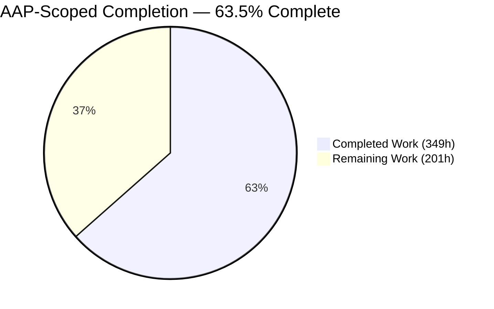
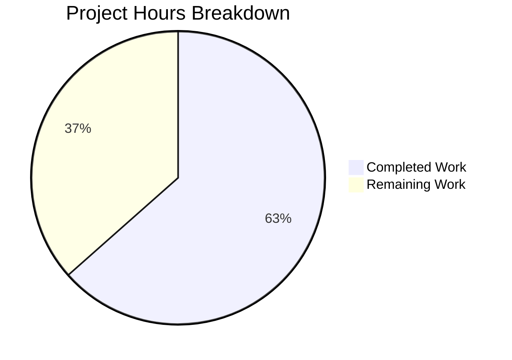
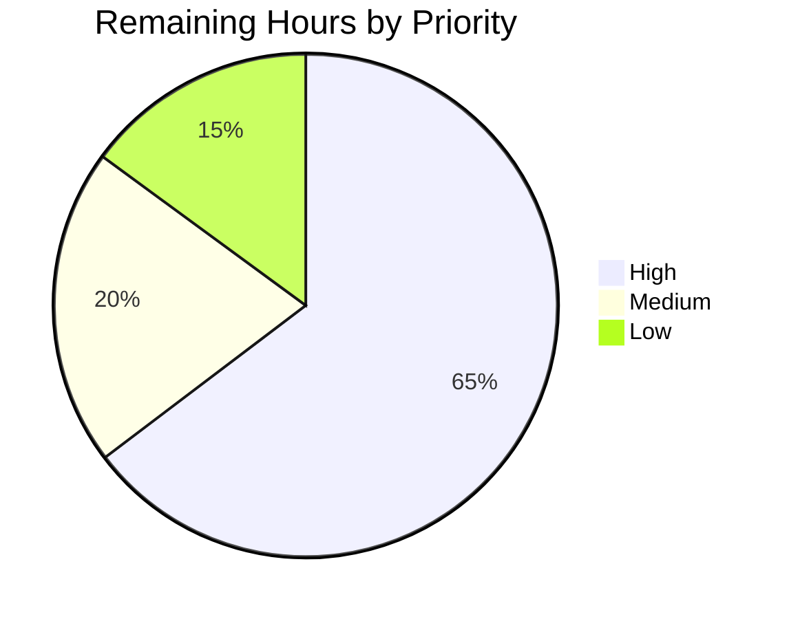
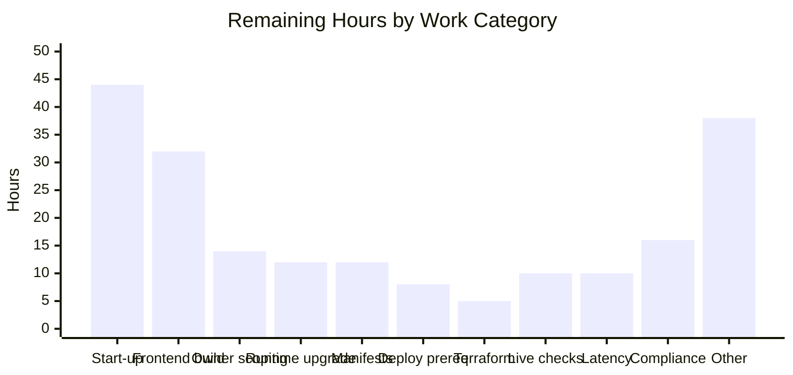
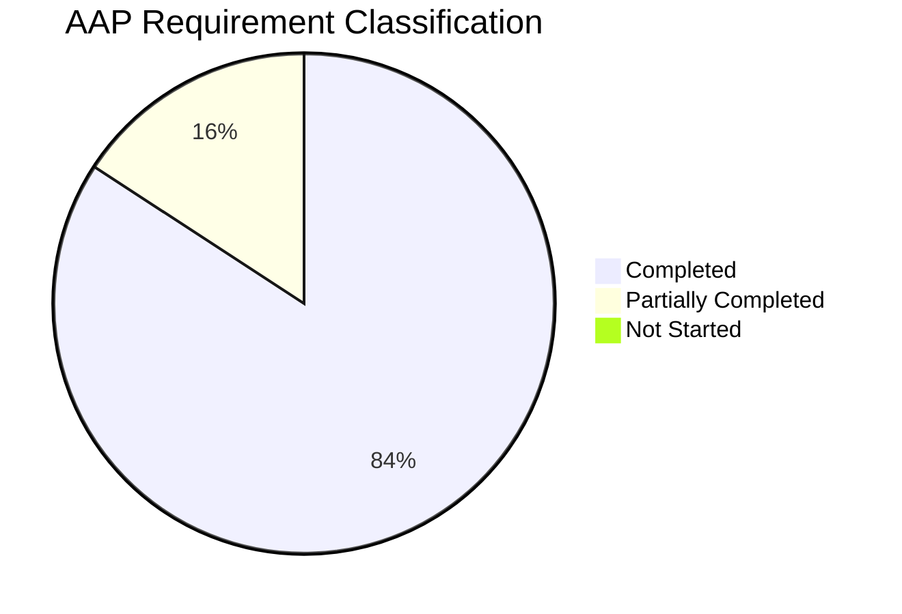

# 1. Executive Summary

## 1.1 Project Overview

Excel Clone is a browser-based spreadsheet: a React 18 / TypeScript single-page client over a Python FastAPI service, using Cloud SQL PostgreSQL, Firestore for real-time collaboration, Cloud Storage for workbook files, Secret Manager and GKE. This engagement closed twelve security gaps spanning every tier — unenforced API authentication, an unbridged identity model, world-readable object storage, permissive cross-origin policy, unencrypted database transport, absent security headers, a plaintext edge, no throttling, undefined collaboration-store authorization, a publicly invocable function, an unread token-lifetime setting and no reproducible dependency baseline. Every spreadsheet capability, REST contract, request schema and the Firebase-first sign-in experience is unchanged.

## 1.2 Completion Status



<!-- Blitzy brand colours: Completed = Dark Blue #5B39F3 · Remaining = White #FFFFFF -->

| Metric | Value |
|--------|-------|
| **Total Hours** | **550** |
| **Completed Hours (AI + Manual)** | **349** (AI 349 + Manual 0) |
| **Remaining Hours** | **201** |
| **Percent Complete** | **63.5%** |

`349 / (349 + 201) × 100 = 63.5%`, counting only Agent Action Plan scope plus the path-to-production work needed to deploy it. All twelve security requirements are implemented and verified; the balance is functional completeness and deployment plumbing.

## 1.3 Key Accomplishments

- ✅ Every API endpoint requires a verified token; unauthenticated requests get `401` with a bearer challenge
- ✅ Identity is verified server-side against one named project, with issuer pinning, revocation and a verified-address gate
- ✅ Uploaded workbooks are private: no public ACL, and access is a bounded-expiry signed URL needing no key file
- ✅ Cross-origin access is an explicit allow-list; a disallowed origin's preflight is refused outright
- ✅ Database traffic is encrypted both sides — the client requests TLS, the instance refuses plaintext
- ✅ The OWASP header baseline reaches clients on success, error, throttled and preflight responses, and at the edge
- ✅ Volume, body size and page windows are bounded, answering `429`, `413` and `422` instead of absorbing abuse
- ✅ Collaboration documents are governed by owner and collaborator rules, proven 32 of 32 against the emulator

## 1.4 Critical Unresolved Issues

| Issue | Impact | Owner | ETA |
|-------|--------|-------|-----|
| The API process does not start — `backend.app.main` raises `ImportError: cannot import name 'get_db'`; the package initialisers, `init_db`, the four domain service classes and `CollaboratorSchema` are all absent, and no table-creating DDL exists | Every delivered control is verified against the real modules but no served request has yet traversed them | Backend team | 44h |
| The single-page application does not compile or render — `tsc` reports 59 errors, the `@/*` alias is unresolved at bundle time, and the component/page barrels and stylesheet are absent | Nothing renders, so the credential interceptor and the static-path headers protect a blank document | Frontend team | 32h |
| Any authenticated caller can address another user's `workbook_id`; no handler consults `Workbook.owner_id` | Authenticated cross-tenant read and write — attributable, but not access-controlled | Backend team | 14h |
| Fourteen dependency advisories stand because every published fix requires a newer Python interpreter than the one pinned | The ASGI layer every request traverses carries five of them; the audit gate cannot be made strict | Platform team | 12h |
| A full-directory `terraform validate` fails on seven stale output references, so no cloud-side control has been validated by an executed plan | TLS mode, both bucket policies, the HTTPS edge and both IAM bindings rest on source assertions pending human plan review | Platform team | 5h |
| `frontend/package.json` omits six imported packages and no lockfile is committed although CI runs `npm ci` | Frontend install, build and dependency audit cannot run from a clean clone | Frontend team | 3h |
| Kubernetes manifests, a migration command and a post-deployment suite do not exist; the deployment script refuses to proceed without the latter two | Deployment stops in configuration rather than shipping against an unmigrated schema | Platform team | 12h |
| Nine deployment-time cloud checks have not been executed against a live project | Object confidentiality, instance TLS, edge headers, the HTTPS redirect and invoker refusal are asserted from configuration only | Platform team | 10h |

## 1.5 Access Issues

| System/Resource | Type of Access | Issue Description | Resolution Status | Owner |
|---|---|---|---|---|
| Google Cloud project | `gcloud` / `gsutil` CLI and project credentials | Not present in the development environment, so every cloud-side assertion is a deployment-time step | Open — deferred to staging | Platform team |
| Secret Manager | Three pre-created secrets | `PROJECT_ID`, `DATABASE_URL` and `SECRET_KEY` are read at start-up and are not created by this repository | Open — operator action, documented with exact commands | Platform team |
| Service-account IAM | `roles/iam.serviceAccountTokenCreator` | Required for keyless signed-URL generation; without it uploads raise a runtime error naming the role | Open — operator action | Platform team |
| Firebase / Identity Platform | Project plus a Web app configuration | No project is provisioned and the client build values are placeholders, so sign-in cannot be exercised end to end | Open | Platform team |
| Firebase Authentication | `roles/firebaseauth.viewer` | Required because token verification consults revocation state | Open — operator action | Platform team |
| PostgreSQL and Redis | Running servers | Neither is present locally; the suite uses in-memory SQLite and a process-local throttling store | Open — provision Redis before scaling past one replica | Platform team |
| GitHub Actions | Ability to trigger a workflow run | No run can be triggered from the development environment; the gates were exercised locally instead | Open | DevOps |

## 1.6 Recommended Next Steps

1. **[High]** Close the start-up gap so the controls serve real requests — package initialisers, `init_db`, migration tooling, the four service classes, and the container entry point.
2. **[High]** Scope every workbook query by owner, closing the authenticated cross-tenant read and write the plan accepted as a residual.
3. **[High]** Repair the stale Terraform outputs, run a full-directory `validate`, and review the plan by hand before the first `apply`.
4. **[High]** Upgrade the Python runtime, re-resolve the pinned manifest, then make the dependency-audit gate strict.
5. **[Medium]** Provision the deployment prerequisites and run the nine deployment-time cloud checks in staging before promoting.

# 2. Project Hours Breakdown

## 2.1 Completed Work Detail

| Component | Hours | Description |
|-----------|-------|-------------|
| Authenticated request path | 36 | Firebase ID-token verification in `backend/app/core/security.py` with issuer pinning to one named project, revocation checking, a verified-address gate, claim validation, a uniform leak-free `401`, an owned-and-closed database session, and token lifetime governed by `ACCESS_TOKEN_EXPIRE_MINUTES` |
| Route authentication enforcement | 9 | `Depends(get_current_user)` on all five endpoints across `backend/app/api/{workbooks,worksheets,cells,collaboration}.py`, plus an import guard so the dependency cannot be disarmed by rebinding after import |
| Browser request seam | 26 | `frontend/src/services/api.ts` attaches the token the Firebase SDK already holds, bootstraps the default app lazily behind a guard, redacts the credential from failure logs, classifies `401/403/429/503`, uses a keepalive transport on unload, and validates the response contract before returning it |
| Request throttling | 34 | `backend/app/core/rate_limit.py` — a global per-client ceiling, a tighter write-method budget, a configurable counter store, trusted-proxy client identity, bounded degradation when the store fails, and a request-body ceiling |
| HTTP security headers | 23 | `backend/app/core/security_headers.py` registered outermost from `backend/app/main.py`, a policy builder with a report-only toggle and a report destination, `infrastructure/docker/nginx.conf` with the SPA fallback and an entrypoint policy validator, edge `custom_response_headers`, and the document meta policy |
| HTTPS edge topology | 19 | Managed certificate, HTTPS target proxy, `443` forwarding rule, HTTP-to-HTTPS redirect map and staged cutover in `infrastructure/terraform/main.tf`, with `scripts/deploy.sh` asserting the edge instead of being able to create a plaintext listener |
| Private object storage | 16 | `backend/app/services/file_storage.py` returns a bounded-expiry V4 signed URL signed through IAM without a key file; uniform bucket-level access and enforced public-access prevention on the uploads bucket |
| Database transport security | 12 | `connect_args` carrying an encryption-guaranteeing mode narrowed by type in `backend/app/db/database.py`, proxy-aware endpoint validation, `ssl_mode = "ENCRYPTED_ONLY"` on the instance, and an explicit connection-pool contract |
| Cross-origin policy | 8 | `ALLOWED_ORIGINS` declared on the settings contract and consumed in `backend/app/main.py` with finite method and header lists, credentialed mode preserved |
| Firestore document authorization | 14 | `firestore.rules` and `firebase.json` enforcing owner and collaborator access keyed on the caller's UID with platform default-deny elsewhere, plus the corrected single-document client subscription |
| Cloud Function invoker identity | 7 | Public invoker binding removed from `scripts/deploy.sh`, an explicit named invoker in Terraform, and a runtime variable with a deny-list that refuses a decommissioned runtime |
| Pinned dependency manifest | 13 | `backend/requirements.txt` with 92 exact pins resolved on the documented interpreter, the JWT library held above its advisory fix floor, the password backend pinned to a working pair, the settings framework held on its v1 API, and a committed audit baseline |
| Additional hardening inside authorised files | 32 | Structured security logging with control-character escaping and a single managed handler (`backend/app/core/logging_config.py`), page-window bounds (`backend/app/core/pagination.py`), exception-text non-disclosure in handlers, response compression, the worksheet projection seam, and a server-error boundary |
| Automated verification suite | 40 | `backend/tests/test_security.py` — 823 cases across 54 classes — and `backend/tests/conftest.py`, whose fixtures neutralise the import-time couplings that otherwise prevent the application from being imported at all, plus the Firestore rules conformance harness |
| Continuous-integration security gates | 10 | `.github/workflows/ci.yml` gains a dependency-audit delta gate against the committed baseline, a Terraform gate, control assertions and a rules job, leaving the pre-existing jobs untouched |
| Decision log and traceability matrix | 20 | `documentation/Security Decision Log.md` and `documentation/Security Traceability Matrix.md`, bidirectional at 13 of 13 forward and 51 of 51 reverse, with executable guards that fail when a documented claim drifts from the code |
| Onboarding, policy, template and README | 30 | `documentation/Developer Onboarding.md`, `SECURITY.md`, `.env.example` (26 documented keys) and a `README.md` that describes the application that actually exists |
| **Total** | **349** | |

## 2.2 Remaining Work Detail

| Category | Hours | Priority |
|----------|-------|----------|
| Application start-up recovery — package initialisers, `init_db`, DDL or migration tooling, the four domain service classes, `CollaboratorSchema`, corrected container entry point and manifest path, start-up smoke test | 44 | High |
| Frontend build and render recovery — bundler alias, component and page barrels with the modules they re-export, stylesheet, typed store hooks and selectors, router API alignment | 32 | High |
| Owner-scoped authorization across the five endpoints | 14 | High |
| Python runtime upgrade, manifest re-resolution and a strict dependency-audit gate | 12 | High |
| Kubernetes manifests plus migration and post-deployment commands | 12 | High |
| Deployment prerequisites — three secrets, signer and Firebase IAM grants, database login, Workload Identity binding, DNS and certificate activation, origin and authorized-domain alignment | 8 | High |
| Terraform stale-output repair, the two undeclared OAuth variables, full-directory `validate` and plan review | 5 | High |
| Frontend dependency manifest and committed lockfile | 3 | High |
| Live cloud verification of the nine deployment-time checks in a staging project | 10 | Medium |
| Latency and query work — eager loading behind the workbook page, concurrency budget, pool pre-ping, a settings-caching strategy compatible with the per-request toggles | 10 | Medium |
| Continuous-integration and deployment wiring — test invocation, trigger name, federated deploy credential, Java runtime for the rules gate | 6 | Medium |
| Firestore document ownership — populate the owner and collaborator fields on write and repair the sync module's type imports | 6 | Medium |
| Static-delivery reconciliation — publish target, provider version floor record, fourth header carrier | 6 | Medium |
| Shared throttling store provisioning and aggregate quota record | 3 | Medium |
| Compliance controls beyond transport — network segmentation, customer-managed keys and rotation, audit logging | 16 | Low |
| Transport hardening beyond channel encryption — connector or full server verification, and private static delivery behind the edge | 8 | Low |
| Container and platform hardening — build-context exclusions, non-root user, healthcheck, digest pinning, immutable tags for rollback | 6 | Low |
| **Total** | **201** | |

## 2.3 Effort Distribution and Confidence

High-priority work accounts for 130 of the 201 remaining hours, Medium for 41 and Low for 30. The distribution reflects where the project actually stands: the security surface is finished and measured, while the functional completeness and deployment plumbing that let it protect live traffic are not.

Confidence in these estimates varies by category and is stated so the numbers can be used for planning rather than merely read:

- **High confidence** — the frontend manifest and lockfile (3h), the Terraform output repair (5h), the deployment prerequisites (8h), the shared throttling store (3h) and the CI/CD wiring (6h). Each is a bounded change with a known shape and a verifiable outcome.
- **Medium confidence** — start-up recovery (44h), frontend build recovery (32h) and owner scoping (14h). The work is well understood and the remedies are enumerated, but four service classes and the absent frontend modules involve product decisions — the cell-reference key format and the shape of the missing screens — that will shift the figure in either direction.
- **Lower confidence** — the runtime upgrade (12h) and the compliance controls (16h). The upgrade requires the whole pinned set to be re-resolved on a newer interpreter and re-tested; the compliance items depend on organisational standards this repository does not encode.

Section 2.1 (349) plus Section 2.2 (201) equals the 550 total hours in Section 1.2, and the Section 2.2 total is the same 201 shown in the Section 1.2 metrics table and the Section 7 chart.

# 3. Test Results

Every figure below was produced by executing the suite in this repository. The backend suite runs with the repository root on `PYTHONPATH`; the client suite runs from `frontend/`; the rules assertions run against a live Firestore emulator.

| Area / Category | Framework | Tests | Passed | Failed | Coverage | What This Proves |
|---|---|---|---|---|---|---|
| Identity and authentication — token verification outcomes, claim validation, issuer pinning, identity resolution, route dependency, unauthenticated refusal, enforcement switch, module importability, token lifetime | pytest | 127 | 127 | 0 | `security.py` 97% | No request reaches a handler body without a token verified against the configured project, and a forged, expired, revoked, wrong-project or malformed credential is refused as a uniform `401` that discloses nothing |
| Configuration, database contract and supply chain — settings contract, configuration template, driver and pool contract, runtime identity and database topology, dependency and CI gates | pytest | 250 | 250 | 0 | `config.py` 98%, `database.py` 79% | The seventeen-field configuration contract is enforced at construction, so an absent or malformed value stops the process instead of being silently accepted, the client requests an encrypted database channel, and the pinned manifest stays reproducible and auditable |
| Request boundary — throttling, throttling identity, storage degradation, preflight handling, body ceiling, page-window bounds, concurrency bound, compression | pytest | 111 | 111 | 0 | `rate_limit.py` 92% | Volume, body size, page size and concurrency are all bounded: the write budget answers `429` with `Retry-After`, an oversized body `413`, an out-of-range window `422`, and a failed counter store degrades without returning `5xx` |
| Transport and delivery surface — response headers, middleware registration order, static delivery policies and routing, cross-origin policy, throttled cross-origin readability | pytest | 91 | 91 | 0 | `security_headers.py` 92% | The six canonical headers reach the client on success, error, throttled and preflight responses because the header middleware is outermost, and a disallowed origin's preflight is refused with no allow-origin header |
| Object storage, persistence seam and disclosure hygiene — storage access, object size ceiling, ORM seam and worksheet projection, logging configuration, log sanitisation, handler non-disclosure | pytest | 87 | 87 | 0 | `workbook_schema.py` 100%, `file_storage.py` 75%, `logging_config.py` 85% | No public ACL is ever set and every returned link is a bounded-expiry signed URL; a populated worksheet serialises to the declared shape; and no handler or log line carries internal exception text or a credential |
| Deployment and published-claim surface — deployment surface and sequencing, cloud identity topology, rules-file structure, client contract, repository hygiene, documentation guards, known-residual pins | pytest | 157 | 157 | 0 | source-level assertions | The deployment sequence cannot create a plaintext listener or a public invoker, the cloud identity topology matches the code that depends on it, and every published claim — cited test identifiers, quoted counts, traceability coverage — is asserted against the code rather than trusted |
| Collaboration-store authorization | Firestore emulator | 32 | 32 | 0 | rules file, all paths | Owner access is admitted, stranger and anonymous access denied, ownership fields cannot be retyped or emptied, and any path no rule matches is denied |
| Browser request seam | Jest (react-scripts) | 93 | 93 | 0 | `api.ts` interceptor paths | The client never sends an uncredentialed request, redacts the token from every failure path, classifies transport failures by status alone, and refuses a `2xx` body of the wrong shape |
| **Total** | — | **948** | **948** | **0** | **88% of `backend/app`** | — |

The six pytest rows account for all **823** cases in `backend/tests/test_security.py` (127 + 250 + 111 + 91 + 87 + 157). Running the whole `backend/tests` directory yields the same **823 passed, 0 failed** alongside **exactly three collection errors** in the three legacy modules (`test_api.py`, `test_calculation_engine.py`, `test_collaboration.py`), which import a domain service layer and a module that do not exist. That three-error set is the project's established baseline and is unchanged. Statement coverage over `backend/app` is **88%** (989 statements, 115 missed), with the two low readings — the route module at 20% and the entry point at 12% — explained by the start-up gap below: the entry point's module body cannot execute, so the suite composes the same middleware stack from the same modules instead.

**Not Covered** — capabilities that were delivered but are not exercised by any automated test, and what to test before release:

- **The running service.** No test starts the process, because it cannot start: importing the entry point raises `ImportError`. Every control is exercised against the real modules composed into an equivalent stack. Once the start-up gap closes, re-run the suite and add a start-up smoke test that binds a socket and answers a request.
- **Live cloud behaviour.** Object confidentiality, bucket policy flags, the instance TLS mode and a live encrypted session, edge header delivery, the HTTP-to-HTTPS redirect, the TLS handshake, the certificate state and unauthenticated function invocation are all asserted from source. Execute all nine against a staging project.
- **The deployment script's runtime path.** `scripts/deploy.sh` passes a syntax check and its command graph, ordering and fail-closed behaviour are asserted as text, but no test runs it against a project. Run it end to end in staging.
- **A `terraform plan` or `apply`.** Formatting and a scoped `validate` pass; a full-directory `validate` cannot run until the stale outputs are repaired. Review the plan by hand before the first apply.
- **The container header carrier.** `infrastructure/docker/nginx.conf` and the Dockerfile that installs it are asserted as text; the image cannot be built while the frontend manifest lacks a lockfile, and the static bucket — not this image — serves users today.
- **Any rendered UI.** No visual, responsive or accessibility assertion exists, because nothing renders. Exercise the screens and re-measure accessibility once the client builds.
- **The CI gates as gates.** Each step was executed locally; no workflow run has executed them. The frontend audit and rules jobs deliberately name their blockers rather than passing silently.
- **Column references beyond `AAA` and the `named_ranges` field.** The projection is asserted at its boundary values and the field is structurally always null; neither is exercised with a wider value.

# 4. Runtime Validation & UI Verification

Each line below records what was actually driven and what was observed. The API surface was exercised over HTTP against the delivered modules composed into the same middleware stack the entry point builds; the collaboration rules were exercised against a live emulator; the client seam was exercised through its own suite.

- ✅ **Unauthenticated API access** — `GET /workbooks`, `GET /workbooks/{id}/worksheets`, `PUT /workbooks/{id}/worksheets/{id}/cells` and `POST /workbooks/{id}/share` each answered `401` with `WWW-Authenticate: Bearer`. No request reached a handler body.
- ✅ **Authenticated API access** — with a valid token the same four routes reached their handlers and returned their normal responses, including a populated worksheet serialised to the declared shape with every cell present.
- ✅ **Credential rejection** — forged, malformed, expired, revoked, wrong-project and unverified-address tokens were all refused as `401`. The response body named no internal detail; the cause appeared only in the server log.
- ✅ **Cross-origin policy** — an allowed origin received its own origin echoed with credentials enabled; a disallowed origin's preflight was refused with `400` and the body `Disallowed CORS origin`; a disallowed simple request came back with no allow-origin header.
- ✅ **Request throttling** — with the write budget set to two per minute, `POST` returned `[200, 200, 429, 429]` with `Retry-After: 60` while `GET` stayed unmetered across four calls. Killing the counter store degraded to a bounded in-memory fallback with no `5xx`.
- ✅ **Request and page bounds** — one byte over the body ceiling returned `413`; a sixteen-byte body returned `200`; `skip=-1`, `limit=0` and `limit=1000000` each returned `422`, and a valid window `200`.
- ✅ **Security headers** — all six canonical headers were present on the `200`, on the `401`, on the `429` and on the CORS preflight, confirming the header middleware sits outermost.
- ✅ **Collaboration-store authorization** — driven against a live Firestore emulator: the owner was admitted for read, create, update and delete; a stranger, an anonymous caller and a collaborator attempting deletion were denied; retyping or emptying the ownership fields was denied; and every unmatched path and subcollection was denied. 32 of 32 assertions passed.
- ✅ **Browser request seam** — the interceptor attached the token on every call, refused locally rather than sending an uncredentialed request, redacted the credential from all four failure paths, classified `401/403/429/503` from status alone, and rejected a `2xx` body of the wrong shape without naming any part of it.
- ❌ **Service start-up and rendered UI** — `uvicorn backend.app.main:app` exits with `ImportError: cannot import name 'get_db' from 'backend.app.db'` and binds no socket, so no traffic has reached a served process; `tsc` reports 59 errors and no route renders any DOM, so no screen, viewport or accessibility state has been observed.

**Never exercised at runtime.** The cloud-side controls have been driven in configuration only, not against a provider: object confidentiality and bucket policy on the uploads bucket, the instance TLS mode and a live encrypted session, edge header delivery, the HTTP-to-HTTPS redirect and the TLS handshake, the managed certificate reaching an active state, and refusal of an unauthenticated function invocation. The container header carrier and the deployment script's mutating path are likewise unexercised — the script passes a syntax check and its ordering is asserted as text, but it has not run against a project. All of this is deployment-time work and is priced in Section 2.2.

# 5. Compliance & Quality Review

## 5.1 Compliance Matrix

Each row states where the deliverable stands now, measured against the benchmark it was built to satisfy.

| Deliverable | Benchmark | Status | Progress | Evidence |
|---|---|---|---|---|
| API authentication enforcement | CWE-306 / OWASP A01 — no critical function reachable without authentication | ✅ Pass | 100% | `Depends(get_current_user)` on all five handlers; `401` observed on each unauthenticated route |
| Server-side identity verification | CWE-287 / OWASP A07 — identity proven cryptographically, not asserted | ✅ Pass | 100% | Admin-SDK verification with issuer pinning, revocation and a verified-address gate in `backend/app/core/security.py` |
| Object-storage confidentiality | CWE-732, CWE-200 / OWASP A01, A05 | ✅ Pass | 100% | No `make_public` call anywhere; bounded-expiry signed URLs; uniform bucket-level access and enforced public-access prevention on the uploads bucket |
| Cross-origin policy | CWE-942, CWE-346 / OWASP A05 | ✅ Pass | 100% | Explicit origin allow-list with finite method and header lists; disallowed preflight refused `400` |
| Database transport encryption | CWE-319 / OWASP A02 — TLS 1.3 intent | ✅ Pass | 100% | Client TLS mode narrowed by type with proxy-aware endpoint validation; instance set to encrypted-only |
| Edge transport encryption | CWE-319 / OWASP A02 | ✅ Pass | 100% | Managed certificate, HTTPS proxy and `443` rule with an HTTP-to-HTTPS redirect; the deployment script cannot create a plaintext listener |
| Browser hardening headers | CWE-1021, CWE-693 / OWASP Secure Headers baseline | ⚠️ Partial | 90% | Six headers on success, error, throttled and preflight responses and at the edge; the container carrier awaits a buildable frontend image and the document policy deliberately omits the connection directives |
| Abuse resistance | CWE-770, CWE-307 / OWASP A04 | ✅ Pass | 100% | Two throttling tiers with `Retry-After`, a body ceiling, page-window bounds and a concurrency bound; bounded degradation on store failure |
| Collaboration-store authorization | CWE-862, CWE-1188 / OWASP A01 | ✅ Pass | 100% | Owner and collaborator rules keyed on the caller's UID with platform default-deny; 32 of 32 emulator assertions |
| Function invoker identity | CWE-306 / OWASP A01, A05 | ✅ Pass | 100% | No public binding in the deployment script; an explicit named invoker and a runtime deny-list in Terraform |
| Dependency reproducibility | CWE-1104 / OWASP A06 | ⚠️ Partial | 70% | 92 exact pins with the JWT library above its advisory fix floor and a delta-based audit gate; fourteen advisories remain unreachable on the pinned interpreter |
| Object-level authorization | CWE-862 / OWASP A01 — least privilege per record | ❌ Not met | 0% | No handler consults `Workbook.owner_id`; authenticated cross-tenant access remains, as the plan accepted |

Two compliance requirements the specification names are untouched and remain so: encryption at rest under customer-managed keys, and audit logging. Both are outside the change authorisation and are priced in Section 2.2.

## 5.2 AAP & Rule Divergences and Gaps

| What the AAP/Rule Required | What Was Delivered Instead | Why It Diverged | Impact | Remediation |
|---|---|---|---|---|
| Route handlers may be edited only to add the authentication dependency | Handlers also received declarative page bounds and a fixed-detail exception replacing internal exception text | Both exposures sit on those exact lines, and no other site in the authorised set could carry either fix | Positive — `422` instead of `500` for an out-of-range window, and no driver or constraint text reaches a caller | None required; confirm the widened permission |
| Three modules are reference-only and must not change | An ORM reverse relationship, a response-model construction flag with a cell projection, and a corrected single-document Firestore reference | Without them every admitted request returned `500`, a populated worksheet could not serialise, and the new rules were unreachable from the only client that uses them | Positive and bounded — no DDL, no migration, no field added, removed or renamed | None required; confirm the three crossings |
| Object-level authorization scoped per owner (**Sanctioned**) | No ownership check; authentication only | The plan itself defers it: an ownership guard is business logic requiring the excluded domain service layer | Authenticated cross-tenant read and write remain possible | Scope every query by owner — 14h, Section 2.2 |
| Throttling built on the named rate-limiting library with per-route default limits | Built directly on the underlying limits library using an application-wide limit; the named library's pin was dropped | Its default limits are scoped per route endpoint and exempt unmatched requests, so no configuration yields the ceiling the plan describes | Positive — the control now behaves as specified | None required |
| Convert the deployment script's edge commands to HTTPS equivalents | The script creates no edge at all; it asserts the provisioned edge and aborts on mismatch | One authority for the edge, and a script that creates nothing cannot create a plaintext listener | Operational order becomes provision-then-deploy | Confirm the ordering; already documented |
| Default token verification, with revocation as an unadopted tunable | Revocation checking enabled, plus a verified-address gate | Without them a token survives sign-out and a self-registered account could select a known user's row | Roughly 100 ms provider read per request and one extra IAM grant to maintain | Accept, or disable and re-price the replay window |
| A dedicated URL signer distinct from the runtime identity | One service account is both runtime and signer, holding token-creator on itself | Workload Identity federates one Kubernetes account to exactly one cloud account | The runtime can sign only as itself, never as another principal | Accept, or split the accounts and add an impersonation grant |
| Onboarding must take a clean machine to a running, modifiable application | A clean machine reaches a fully verifiable security surface, not a running application | The start-up and frontend gaps are named in the plan as functional gaps to flag rather than implement | Rule 2 is partially satisfied and says so in every document | Close the start-up and build gaps — 76h, Section 2.2 |

**Route-handler edits beyond the authentication dependency.** The change authorisation permits attaching the dependency and nothing else, yet `backend/app/api/workbooks.py` lines 24–25 now carry `Query(..., ge=…, le=…)` bounds on `skip` and `limit`, and `backend/app/api/cells.py` line 51 and `collaboration.py` line 40 raise with fixed detail constants where they previously returned the exception text. Two exposures made that unavoidable, and neither had another possible site: an unbounded page window turned a query string into an unhandled `500`, and the exception text disclosed driver messages, table and column names and bound parameter values. The bodies are otherwise byte-identical, no path, method, decorator or request schema changed, and no ownership guard was added — the limit is still visible in what was not done.

**Reference-only modules that were modified.** `backend/app/db/models.py` line 19 adds a reverse relationship, `backend/app/schema/workbook_schema.py` adds a construction flag at line 63 with a cell-reference projection at lines 15 and 65, and `frontend/src/services/collaboration.ts` line 13 addresses a document rather than a two-segment collection. The exclusion protecting these files rests on schema migration, and none of these edits emits DDL or changes a field: the relationship is Python-level, the response model is unchanged field for field, and the Firestore call was rejected by the SDK before any rule could be consulted. Without the first, every successfully authenticated request ended in `500`; without the second, a populated worksheet could not be returned; without the third, the new rules were unreachable.

**Object-level authorization, deferred by the plan itself.** `current_user` appears in no handler body and `Workbook.owner_id` is consulted nowhere, so any caller holding a valid token can read, modify or share another user's workbook by supplying its identifier. This is the plan's own recorded residual and its highest-priority follow-up: an ownership guard is business logic, and doing it properly needs the domain service layer that the change authorisation excludes. The delivered state is still a strict improvement — an anonymous data leak became an authenticated, attributable access that appears in the security log with the caller's identity. It is the single largest open security risk and it is priced at 14 hours in Section 2.2, dependent on the start-up work.

**Throttling library substitution.** The plan named a specific rate-limiting wrapper and its per-route default limits. Reading that library's source established that default limits are keyed per route endpoint and skip requests matching no route, so no configuration of it produces the single application-wide ceiling the plan's own description requires. The control is therefore built directly on the underlying limits library with an application-wide limit plus a write-method tier, which is the alternative the plan explicitly sanctions. `backend/app/core/rate_limit.py` contains no reference to the wrapper and `backend/requirements.txt` no longer pins it, with the reason recorded beside the omission so an unused transitive surface is not shipped for a control nothing uses.

**The deployment script no longer creates the edge.** The plan prescribed rewriting the script's proxy and forwarding-rule commands to their HTTPS equivalents. `scripts/deploy.sh` instead performs read-only assertions — lines 312–314 check the proxies, their certificate and their URL maps — and aborts on any mismatch, leaving `infrastructure/terraform/main.tf` as the sole creator of the edge. The plan's controlling requirement is that the script be incapable of creating a plaintext listener, which a script that creates nothing satisfies more strongly than one rewritten to create a different listener. The consequence is an operational ordering: apply the configuration first, then run the script. That order is documented in the configuration template and the onboarding guide.

**Revocation checking and the verified-address gate.** The plan specified default token verification and recorded revocation as a tunable it had chosen not to adopt. `backend/app/core/security.py` line 287 passes `check_revoked=True`, and line 436 refuses any token whose `email_verified` claim is not exactly true. Both go beyond the plan because both close real windows: default verification lets a token outlive sign-out, password reset and account disablement for the remainder of its lifetime, and the plain email claim proves only that a project minted the token, not that its holder controls the address it names. The cost is about 100 ms of provider read on every authenticated request and one additional IAM grant that must stay in place.

**A single service account for runtime and signing.** The plan's wording implies a dedicated signer distinct from the workload identity, and the delivered configuration creates one account that is both, holding token-creator on itself. Workload Identity federates a Kubernetes service account to exactly one cloud service account, so a separate signer would require the runtime to impersonate it — a second grant, a second failure mode and a second identity to keep aligned. The plan's substantive constraints are met: the signing capability is scoped to one account rather than granted broadly, it is held on that account rather than project-wide, and no private key file exists anywhere in the image or the repository.

**Rule 2 partial compliance.** The rule requires onboarding that takes a clean machine to a running, modifiable application. A developer can install the pinned toolchain, configure every one of the 26 documented keys, modify the code and run both suites plus the rules emulator — but nobody can start the service or render a screen. `import backend.app.main` raises `ImportError` on the absent package initialisers, `init_db`, four domain service classes and one schema, and the client reports 59 type errors against absent modules. All of it is named in the plan as a functional gap to flag rather than implement, so the onboarding guide states the position as partial and enumerates the exact remedy for each half.

# 6. Risk Assessment

Forward-looking risks only — what could still go wrong in production, with the mitigation that exists today.

| Risk | Category | Severity | Probability | Mitigation | Status |
|---|---|---|---|---|---|
| The delivered controls protect no live traffic until the service starts | Technical | Critical | Certain | Start-up recovery leads the remaining work. Every control is already exercised against the real modules, so what is needed is functional completion, not security rework | Open |
| Authenticated cross-tenant read and write of any workbook | Security | High | High | Scope every query by owner once the domain service layer exists. Access is already authenticated, attributable and recorded with the caller's identity | Open — accepted residual |
| Fourteen dependency advisories cannot be closed on the pinned interpreter, five of them on the ASGI layer every request traverses | Security | High | Certain | Upgrade the runtime and re-resolve the manifest. The audit gate already fails on any newly published advisory and becomes strict after the upgrade | Open |
| No cloud-side control has been validated by an executed plan; promotion is manual and images carry one mutable tag, so rollback is configuration-only | Operational | High | High | Repair the stale outputs, run a full-directory validate and review the plan by hand before the first apply. The nine deployment-time checks are scripted and ready; adopt immutable tags and align the deployment trigger | Open |
| A first-enforced content-security policy blocking legitimate API or identity traffic | Integration | Medium | Medium | Ship report-only through the dedicated toggle, inspect the violation reports, and keep the API origin aligned across every carrier | Mitigated |
| Throttling quota multiplies by workers and pods while the counter store is process-local | Operational | Medium | High | Provision the shared store through the existing connection setting and record the aggregate ceiling in the runbook. Degradation is bounded and warns rather than failing open | Mitigated |
| Concurrency rather than request rate is the binding limit under burst, compounded by per-request identity and settings work of roughly 800 ms | Technical | Medium | Medium | Concurrency is bounded and responses are compressed. Eager loading behind the workbook page and a settings-caching strategy compatible with the per-request toggles are queued | Open |
| The static bucket serves objects directly, outside the header-bearing edge | Security | Medium | Medium | Deliberate, so the client can be served publicly. Close it by serving the bucket privately behind the load balancer and CDN, then enforce public-access prevention | Accepted |

# 7. Visual Project Status

**Overall progress — 349 of 550 hours complete (63.5%)**



<!-- Blitzy brand colours: Completed Work = Dark Blue #5B39F3 · Remaining Work = White #FFFFFF · accents Violet-Black #B23AF2, Mint #A8FDD9 -->

**Remaining work by priority — 201 hours**



**Remaining hours by category**



The "Other" column aggregates the frontend manifest and lockfile (3), CI/CD wiring (6), Firestore document ownership (6), static-delivery reconciliation (6), the shared throttling store (3), transport hardening beyond channel encryption (8) and container hardening (6).

**Requirement status — all twelve security requirements plus the dependency baseline**



Sixteen of the nineteen inventoried deliverables are complete. The three partials are the browser hardening headers at 90% (the container carrier awaits a buildable image), the continuous-integration gates at 95% (two steps name their blockers rather than gating), and onboarding at 80% (a clean machine reaches a verifiable surface, not a running application). Nothing in scope was left unstarted.

# 8. Summary & Recommendations

The security surface of this application has been rebuilt and measured. Twelve gaps that spanned every tier — from a route any anonymous caller could read to a bucket that published every uploaded workbook to the open internet — are closed, and each is held in place by executable assertions rather than by inspection. Authentication is enforced on all five endpoints and the identity behind it is verified cryptographically against one named project, with the issuer pinned, revocation consulted and the address gated. Objects are private behind bounded-expiry signed URLs produced without any key file. Cross-origin access is an explicit allow-list. Database and edge transport are encrypted on both sides. The OWASP header baseline reaches clients on success, error, throttled and preflight responses. Volume, body size, page windows and concurrency are all bounded. Collaboration documents are governed by owner and collaborator rules proven against a live emulator. The dependency set is pinned, auditable and gated on a delta. **The project stands at 63.5% of its AAP-scoped and path-to-production work: 349 hours delivered against 201 remaining.**

What the remaining 201 hours buy is not more security work — it is the functional completeness and deployment plumbing without which none of the above protects a real user. The service does not start: importing the entry point raises `ImportError` because the package initialisers, the schema initialiser, four domain service classes and one response schema were never written, and no table-creating DDL exists. The client does not render: 59 type errors, an unresolved bundler alias and several absent modules leave every route producing an empty document. Both conditions predate this work and both were named in the change authorisation as functional gaps to be reported rather than built. The consequence is precise and should not be softened — every control in this codebase is *enforceable* rather than *enforced*, and the 88% statement coverage and 948 green assertions establish correctness, not live protection.

The critical path is short and strictly ordered. Close the start-up gap first (44h) — nothing else can be observed end to end until a socket is bound and a request is served. Then scope every query by its owner (14h), which is the one security requirement the plan itself deferred and the largest open risk in the codebase: today any authenticated caller can address another user's workbook. In parallel, repair the seven stale Terraform outputs (5h) so a full-directory validate runs and the cloud controls can be reviewed against a real plan rather than against their source, and provision the deployment prerequisites (8h) — three secrets, two IAM grants, a database login, the workload binding, DNS and certificate activation. Then bring the client back (32h, plus 3h for the manifest and lockfile), upgrade the interpreter and re-resolve the manifest (12h) so the fourteen standing advisories become reachable, and execute the nine deployment-time cloud checks in staging (10h) before promoting anything.

Success is measurable rather than impressionistic. Release readiness means: the service binds a socket and answers an authenticated request; the suite still reports zero failures with the three legacy collection errors unchanged; a full-directory `terraform validate` succeeds and a reviewed plan applies cleanly; anonymous access to an uploaded object returns `401` or `403`; the instance reports encrypted-only and a live session reports TLS in use; port 80 returns a `301` and the TLS handshake succeeds; an unauthenticated function invocation returns `403`; the rules deploy and deny a stranger in the live project; every one of the six headers is present on both origins; and the shared throttling store is provisioned so the configured ceiling is the real ceiling.

**Production readiness assessment: not ready, for reasons that are not the security work.** The controls delivered here are of high quality and, judged on the evidence, would hold in production — the rejection paths are uniform and leak-free, the refusals were driven adversarially, and most of the nine deployment-time checks already have a scripted assertion waiting for a project to run against. Two things must be understood before scheduling a release. First, no security control can be credited with protecting live traffic until the start-up gap closes; the honest description of today's posture is "unreachable", not "protected". Second, promotion is currently a manual operation and images carry a single mutable tag, so a rollback is a configuration change or a tagged revert rather than a return to a prior image — plan the first deployment accordingly, stage it, and treat the nine live checks as gating rather than optional.

# 9. Development Guide

Every command below was executed in this repository and behaves as described. Commands are given for Windows PowerShell from the repository root; the POSIX equivalents differ only in path separators and the way environment variables are set.

## 9.1 System Prerequisites

| Requirement | Version used | Notes |
|---|---|---|
| Python | **3.9.13** | The application is coupled to the v1 settings API and pinned to a 3.9 interpreter. 3.9.13 is the newest 3.9 with a Windows installer, and satisfies the manifest floor of `>= 3.9.2` |
| Node.js | **22.23.2** with npm 10.9.8 | Needed for the client suite and the type check. The client build tooling cannot run on the end-of-life version the container image names |
| Terraform | **1.15.8** | For `fmt` and `validate`; the configuration requires the Google provider `~> 7.0` |
| JDK | **21** (Temurin) | Required by the Firestore emulator only |
| Git | 2.55 | Git for Windows also supplies the `bash` used for shell syntax checks |

No PostgreSQL and no Redis server is required for development or verification: the suite uses in-memory SQLite and a process-local throttling store.

## 9.2 Environment Setup

```powershell
# From the repository root. Create the virtual environment with a 3.9 interpreter.
python -m venv venv
.\venv\Scripts\python.exe --version        # expect: Python 3.9.13

# Install the pinned manifest and confirm the resolution is coherent.
.\venv\Scripts\python.exe -m pip install -r backend\requirements.txt
.\venv\Scripts\python.exe -m pip check     # expect: No broken requirements found.
```

Two rules apply to every Python command in this project:

```powershell
$env:PYTHONPATH = "."        # MANDATORY - there are no package initialisers under backend/,
                             # so the namespace packages only resolve from the repository root
```

…and always invoke the interpreter by path (`.\venv\Scripts\python.exe`) rather than relying on `python`, which may resolve to a different major version.

Client dependencies install from inside `frontend/`. A `--prefix` install from the repository root fails, because the root has no package manifest:

```powershell
cd frontend
npm install
cd ..
```

Configuration is documented in `.env.example`, which lists all 26 keys with their meaning and safe placeholders. Copy it and populate it, and note that the application does **not** read the copy — the values must reach the process as environment variables or be injected by the platform:

```powershell
Copy-Item .env.example .env
```

Six keys are required and their absence stops the process at import rather than degrading it: `PROJECT_ID`, `DATABASE_URL`, `REDIS_URL`, `SECRET_KEY`, `ALGORITHM`, `ACCESS_TOKEN_EXPIRE_MINUTES`. That is intentional — the process refuses to serve traffic it cannot read its own security configuration for.

## 9.3 Verification

```powershell
$env:PYTHONPATH = "."

# The security suite - 823 cases, all passing.
.\venv\Scripts\python.exe -m pytest backend\tests\test_security.py -q --no-header -p no:cacheprovider

# The whole backend directory. Expect 823 passed and exactly 3 collection errors
# in the three legacy modules - that error set is the established baseline.
.\venv\Scripts\python.exe -m pytest backend\tests --continue-on-collection-errors -q --no-header

# Coverage over the application package - expect 88%.
.\venv\Scripts\python.exe -m pytest backend\tests\test_security.py -q --cov=backend\app --cov-report=term

# One area at a time, by test class name.
.\venv\Scripts\python.exe -m pytest backend\tests\test_security.py -q -k CrossOriginPolicy
```

```powershell
# Dependency audit. Without the committed ignore list this reports 14 advisories in
# 9 packages and exits 1; the workflow supplies the 14 identifiers and exits 0.
.\venv\Scripts\python.exe -m pip_audit -r backend\requirements.txt --progress-spinner off
```

```powershell
# Client suite - 93 cases, all passing.
cd frontend
$env:CI = "true"
npx react-scripts test --watchAll=false --ci

# Type check. Expect exit 2 and exactly 59 pre-existing errors.
npx tsc --noEmit -p tsconfig.json
cd ..
```

```powershell
# Infrastructure. fmt names one pre-existing offender; a full-directory validate
# reports 7 errors, all of them in that same stale outputs file.
terraform -chdir=infrastructure\terraform fmt -check
terraform -chdir=infrastructure\terraform validate

# Shell syntax. Use the bash that ships with Git for Windows; another bash
# misreports the line endings in this tree.
& "$env:ProgramFiles\Git\bin\bash.exe" -n scripts\deploy.sh
& "$env:ProgramFiles\Git\bin\bash.exe" -n infrastructure\docker\csp-env-validate.sh
```

```powershell
# Collaboration rules against a live emulator - expect ALL 32 ASSERTIONS PASSED.
# The emulator needs the JDK's bin directory on PATH, not merely JAVA_HOME set.
$jdk = (Get-ChildItem "$env:ProgramFiles\Eclipse Adoptium" -Directory | Select-Object -First 1).FullName
$env:JAVA_HOME = $jdk
$env:Path = "$jdk\bin;$env:Path"
$env:PYTHONPATH = "."
npx --yes firebase-tools emulators:exec --only firestore --project demo-excel-clone `
  ".\venv\Scripts\python.exe backend\tests\firestore_rules_emulator_check.py"
```

## 9.4 Starting the Application

```powershell
$env:PYTHONPATH = "."
.\venv\Scripts\python.exe -c "import backend.app.main"
```

This currently fails with `ImportError: cannot import name 'get_db' from 'backend.app.db' (unknown location)`, raised from `backend/app/api/workbooks.py` line 4. It is the known start-up gap: there are no package initialisers under `backend/`, `init_db` is imported by the entry point but never defined, the four domain service classes and `CollaboratorSchema` do not exist, and no table-creating DDL exists. `documentation/Developer Onboarding.md` devotes a section to each gap and the exact remedy. Once the import succeeds, the service starts with:

```powershell
$env:PYTHONPATH = "."
.\venv\Scripts\python.exe -m uvicorn backend.app.main:app --host 0.0.0.0 --port 8000
```

The client dev server starts from `frontend/` with `npm start` once the bundler alias and the absent modules are in place; today it fails the same 59 type errors the check above reports.

## 9.5 Example Usage

Once the service is running, the controls are observable directly:

```bash
# Unauthenticated - expect 401 with a bearer challenge.
curl -si http://localhost:8000/workbooks

# Authenticated - expect 200 and the first page of workbooks.
curl -si -H "Authorization: Bearer $ID_TOKEN" http://localhost:8000/workbooks

# Cross-origin refusal - expect 400 and the body "Disallowed CORS origin".
curl -si -X OPTIONS -H "Origin: https://evil.example" \
  -H "Access-Control-Request-Method: GET" http://localhost:8000/workbooks

# Page-window bounds - expect 422 for each.
curl -si "http://localhost:8000/workbooks?skip=-1"
curl -si "http://localhost:8000/workbooks?limit=1000000"

# Throttling - drive past the write budget and expect 429 with Retry-After.
for i in $(seq 1 8); do curl -s -o /dev/null -w "%{http_code} " -X POST \
  -H "Authorization: Bearer $ID_TOKEN" -H "Content-Type: application/json" \
  -d '{"name":"probe"}' http://localhost:8000/workbooks; done

# Headers - expect all six on the 200 and on the 401.
curl -sI http://localhost:8000/workbooks
```

At deployment time, the same controls are checked against the provider:

```bash
gcloud storage buckets describe gs://BUCKET \
  --format='value(iamConfiguration.publicAccessPrevention,iamConfiguration.uniformBucketLevelAccess.enabled)'
curl -I https://storage.googleapis.com/BUCKET/OBJECT          # expect 401 or 403
gcloud sql instances describe INSTANCE --format='value(settings.ipConfiguration.sslMode)'
curl -sI http://DOMAIN/                                        # expect 301 to https
openssl s_client -connect DOMAIN:443 -tls1_3 </dev/null        # expect a handshake
curl -si FUNCTION_URL                                          # expect 403
```

## 9.6 Troubleshooting

| Symptom | Cause | Resolution |
|---|---|---|
| `ModuleNotFoundError: No module named 'backend'` | `PYTHONPATH` is not the repository root | `$env:PYTHONPATH = "."` before every Python command |
| A settings validation error naming a field at import | One of the six required configuration keys is absent | Supply all six. The refusal is deliberate: the process will not serve traffic with unreadable security configuration |
| `ImportError: cannot import name 'get_db'` | The known start-up gap | Close it as described in the onboarding guide. Verification still runs — the suite composes an equivalent stack from the real modules |
| `Could not spawn 'java -version'` | The JDK is installed but its `bin` is not on PATH | Add `$env:JAVA_HOME\bin` to PATH; setting `JAVA_HOME` alone is not enough |
| `npm error EUSAGE … can only install with an existing package-lock.json` | No lockfile is committed | Use `npm install`. Land the manifest declarations and the lockfile together — the workflow asserts which state the manifest is in and fails if only one arrives |
| A runtime error naming `roles/iam.serviceAccountTokenCreator` on upload | Signing is keyless and needs that grant | Grant it on the signer service account; the exact command is in `.env.example` |
| `400 Disallowed CORS origin` from your own front end | The origin is not in `ALLOWED_ORIGINS` | Add it, and keep the list aligned with the Identity Platform authorized domains. This refusal is the control working |
| `429` with `Retry-After` during heavy cell editing | The write budget is tighter than the editing cadence | Widen `rate_limit_write` — configuration, not code — and provision the shared store so the ceiling is not multiplied per pod |
| API calls blocked in the browser after enabling the policy | The connection directive does not admit the API origin | Set `csp_report_only` true, inspect the violation reports, align the API origin across every carrier, then enforce |
| `terraform validate` reporting undeclared resources | The seven stale output references | Repair them. Until then, validate `main.tf` and `variables.tf` in a scoped copy |
| A second `npm install` appears to remove packages | A separate install prunes the previous one's unsaved packages | Put every package in a single install command |

# 10. Appendices

## A. Command Reference

| Purpose | Command |
|---|---|
| Create the virtual environment | `python -m venv venv` |
| Install the pinned manifest | `.\venv\Scripts\python.exe -m pip install -r backend\requirements.txt` |
| Confirm resolution coherence | `.\venv\Scripts\python.exe -m pip check` |
| Security suite | `.\venv\Scripts\python.exe -m pytest backend\tests\test_security.py -q --no-header -p no:cacheprovider` |
| Whole backend directory | `.\venv\Scripts\python.exe -m pytest backend\tests --continue-on-collection-errors -q --no-header` |
| Coverage | `.\venv\Scripts\python.exe -m pytest backend\tests\test_security.py -q --cov=backend\app --cov-report=term` |
| One area by class name | `.\venv\Scripts\python.exe -m pytest backend\tests\test_security.py -q -k <ClassName>` |
| Dependency audit | `.\venv\Scripts\python.exe -m pip_audit -r backend\requirements.txt --progress-spinner off` |
| Client install | `cd frontend; npm install` |
| Client suite | `cd frontend; $env:CI="true"; npx react-scripts test --watchAll=false --ci` |
| Client type check | `cd frontend; npx tsc --noEmit -p tsconfig.json` |
| Infrastructure format check | `terraform -chdir=infrastructure\terraform fmt -check` |
| Infrastructure validate | `terraform -chdir=infrastructure\terraform validate` |
| Shell syntax check | `& "$env:ProgramFiles\Git\bin\bash.exe" -n scripts\deploy.sh` |
| Collaboration rules | `npx --yes firebase-tools emulators:exec --only firestore --project demo-excel-clone ".\venv\Scripts\python.exe backend\tests\firestore_rules_emulator_check.py"` |
| Import the entry point | `.\venv\Scripts\python.exe -c "import backend.app.main"` |
| Start the service | `.\venv\Scripts\python.exe -m uvicorn backend.app.main:app --host 0.0.0.0 --port 8000` |
| Change inventory since the baseline | `git diff 45a6b7b --name-status` |

## B. Port Reference

| Port | Service | Notes |
|---|---|---|
| 8000 | Backend API (uvicorn) | Also the container's exposed port |
| 3000 | Client development server | Development only |
| 80 | Container nginx listener; edge redirect rule | At the edge, port 80 only redirects to 443 |
| 443 | Edge HTTPS forwarding rule | TLS terminates here with a managed certificate |
| 8080 | Firestore emulator | Default; verification only |
| 4400 | Emulator hub | Default; verification only |

## C. Key File Locations

| Concern | Path |
|---|---|
| Identity verification, token lifetime, enforcement switch | `backend/app/core/security.py` |
| Throttling tiers, counter store, body ceiling | `backend/app/core/rate_limit.py` |
| Header set, policy builder, report-only toggle | `backend/app/core/security_headers.py` |
| Structured security logging | `backend/app/core/logging_config.py` |
| Seventeen-field configuration contract | `backend/app/core/config.py` |
| Page-window constants | `backend/app/core/pagination.py` |
| Engine construction and transport mode | `backend/app/db/database.py` |
| Signed-URL object storage | `backend/app/services/file_storage.py` |
| Middleware order — the header middleware is registered last, so it is outermost | `backend/app/main.py` |
| The five protected endpoints | `backend/app/api/{workbooks,worksheets,cells,collaboration}.py` |
| Pinned dependency manifest (92 pins) | `backend/requirements.txt` |
| Test fixtures that make the application importable | `backend/tests/conftest.py` |
| 823-case security suite | `backend/tests/test_security.py` |
| Rules conformance harness | `backend/tests/firestore_rules_emulator_check.py` |
| Collaboration-store rules and deploy manifest | `firestore.rules`, `firebase.json` |
| Cloud resources — TLS, buckets, edge, IAM | `infrastructure/terraform/main.tf`, `variables.tf` |
| Container edge configuration and its policy validator | `infrastructure/docker/nginx.conf`, `csp-env-validate.sh` |
| Deployment sequence and preflight assertions | `scripts/deploy.sh` |
| Browser request seam and its suite | `frontend/src/services/api.ts`, `api.test.ts` |
| Collaboration subscription | `frontend/src/services/collaboration.ts` |
| Document policy and referrer meta | `frontend/public/index.html` |
| Configuration template (26 keys) | `.env.example` |
| Security policy and residual risks | `SECURITY.md` |
| Decision rationale and traceability | `documentation/Security Decision Log.md`, `documentation/Security Traceability Matrix.md` |
| Clean-machine onboarding and next tasks | `documentation/Developer Onboarding.md` |
| Security gates | `.github/workflows/ci.yml` |

## D. Technology Versions

| Component | Version | Source |
|---|---|---|
| Python | 3.9.13 (manifest floor `>= 3.9.2`) | The container base names 3.9; it is end of life, and it is what makes the fourteen standing advisories unreachable |
| FastAPI / Starlette | 0.125.0 / 0.49.3 | `backend/requirements.txt` |
| Pydantic | 1.10.26 | Held below 2 because the settings module uses the v1 API |
| SQLAlchemy / psycopg2-binary | 1.4.54 / 2.9.12 | The driver is what makes the transport mode meaningful |
| firebase-admin | 7.5.0 | Supplies server-side token verification |
| python-jose[cryptography] | 3.5.0 | Held above its advisory fix floor of 3.4.0 |
| bcrypt / passlib | 4.0.1 / 1.7.4 | The newer backend breaks this password library; the pin is load-bearing |
| limits | 4.2 | Used directly for both throttling tiers |
| pytest / pytest-cov / httpx | 8.4.2 / 7.1.0 / 0.28.1 | Verification only |
| Node.js / npm | 22.23.2 / 10.9.8 | The container image and build matrix still name version 14, which is end of life |
| Terraform / Google provider | 1.15.8 / `~> 7.0` | Declared in `main.tf`; the measured working floor is 6.0 |
| PostgreSQL | 13 | Cloud SQL, set to encrypted-only |
| JDK | 21 | Firestore emulator only |

## E. Environment Variable Reference

| Key | Role | Notes |
|---|---|---|
| `PROJECT_ID` | Required | Read at import; absence stops the process |
| `DATABASE_URL` | Required | Validated for a topology consistent with the transport mode |
| `REDIS_URL` | Required | Also the natural shared store for throttling counters |
| `SECRET_KEY` | Required | Signs and verifies the retained legacy token path |
| `ALGORITHM` | Required | Narrowed to accepted signing algorithms |
| `ACCESS_TOKEN_EXPIRE_MINUTES` | Required | Must be positive and bounded; now actually governs lifetime |
| `ALLOWED_ORIGINS` | Security | The cross-origin allow-list; keep aligned with the identity provider's authorized domains |
| `gcs_bucket_name` | Security | Uploads bucket; validated against the naming grammar |
| `signed_url_expiry_minutes` | Security | Bounded 1–10080; default 15 |
| `db_sslmode` | Security | Narrowed to encryption-guaranteeing modes; a plaintext loopback is admitted only for a proxy endpoint |
| `auth_token_verifier` | Rollback | `firebase` or the legacy path; read per request, so it takes effect without a restart |
| `auth_enforcement_enabled` | Rollback | Break-glass only; still requires a credential, and every bypass is logged |
| `rate_limit_enabled` | Rollback | Read at registration; needs a restart |
| `rate_limit_default` | Security | Global per-client ceiling |
| `rate_limit_write` | Security | Tighter budget for mutating methods; widen this if editing is throttled |
| `csp_report_only` | Rollback | Ship the policy in report-only mode first |
| `firebase_project_id` | Security | Pins the accepted token issuer to one project |
| `GOOGLE_CLOUD_PROJECT` | Platform | Lets the SDK resolve the project without a key file |
| `GOOGLE_APPLICATION_CREDENTIALS` | Platform | Local development only; not used in the deployed runtime |
| `REACT_APP_API_BASE_URL` | Client build | The API origin the client calls |
| `REACT_APP_FIREBASE_*` (6 keys) | Client build | Web app configuration: API key, auth domain, project, app, storage bucket and messaging sender |

All 26 keys are documented with placeholders in `.env.example`. Three values are read from Secret Manager at start-up and must exist before the process runs; the repository creates none of them.

## F. Developer Tools Guide

- **Run one area at a time.** The suite is organised by capability into 54 classes, so `-k <ClassName>` gives a fast loop — for example `CrossOriginPolicy`, `RequestThrottling`, `SecurityResponseHeaders`, `TokenVerificationOutcomes`, `ConfigurationContract`.
- **The documentation is executable.** Guards assert that the published claims match the code: cited test node identifiers must resolve, quoted case counts must match what pytest collects, and the traceability matrix must cover every changed path. If you change a control and a documentation test fails, the document is what needs updating.
- **Known residuals are pinned.** `TestKnownResiduals` asserts the *current* state of the open items — the unimportable entry point among them. When you close one, that case fails on purpose and its message names what to retire.
- **The audit gate fails on a delta, not on a total.** The workflow supplies fourteen advisory identifiers it knows about; a fifteenth fails the build. Re-measure and re-curate whenever the manifest changes.
- **Verify the collaboration rules before deploying them.** The emulator harness is standard-library Python and adds no dependency. It needs a JDK on PATH.
- **Check infrastructure in a scoped copy.** Until the stale outputs are repaired, copy `main.tf` and `variables.tf` into a scratch directory to get a clean `validate`.

## G. Glossary

| Term | Meaning in this project |
|---|---|
| **Bearer challenge** | The `WWW-Authenticate: Bearer` header returned with every `401`, telling a client which credential is expected |
| **Issuer pinning** | Refusing any token not minted by the one configured identity project, so a token from another project cannot authenticate |
| **Revocation checking** | Consulting the identity provider on each verification so a token does not outlive sign-out, a password reset or account disablement |
| **Signed URL** | A time-limited, signature-bearing link to a private object; the object itself grants no public access |
| **Keyless signing** | Producing that signature through the cloud IAM signing endpoint using the workload's attached identity, so no private key file exists in the image |
| **Uniform bucket-level access** | Disabling per-object access lists so only bucket-level policy grants access |
| **Public-access prevention** | Overriding any grant to all users or all authenticated users, enforced at the bucket |
| **Report-only policy** | A content-security policy the browser reports on but does not enforce — the safe first step of a rollout |
| **Outermost middleware** | The last-registered middleware, which wraps every other layer and so can attach headers even to errors and preflights |
| **Write tier** | The tighter throttling budget applied to mutating request methods, distinct from the global per-client ceiling |
| **Delta gate** | A dependency-audit step that fails only on advisories outside a committed baseline, so it signals new exposure rather than permanent noise |
| **Fail-closed** | Refusing the operation when a control cannot be evaluated — an unreadable configuration stops start-up; an unmatched rules path is denied |
| **Break-glass switch** | An operator toggle for emergency use that still requires a credential and logs every request it affects |
| **Baseline collection errors** | The three legacy test modules that import a domain service layer and a module which do not exist; their unchanged error set is the regression standard |
