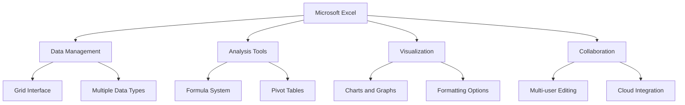
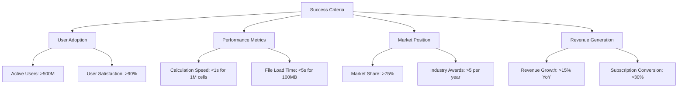
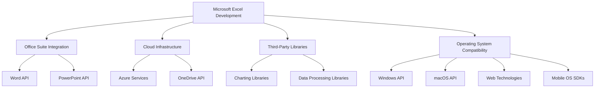
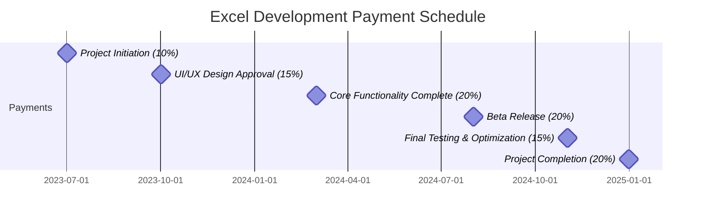
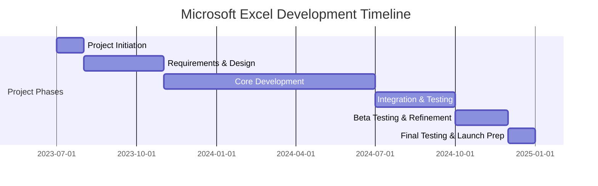
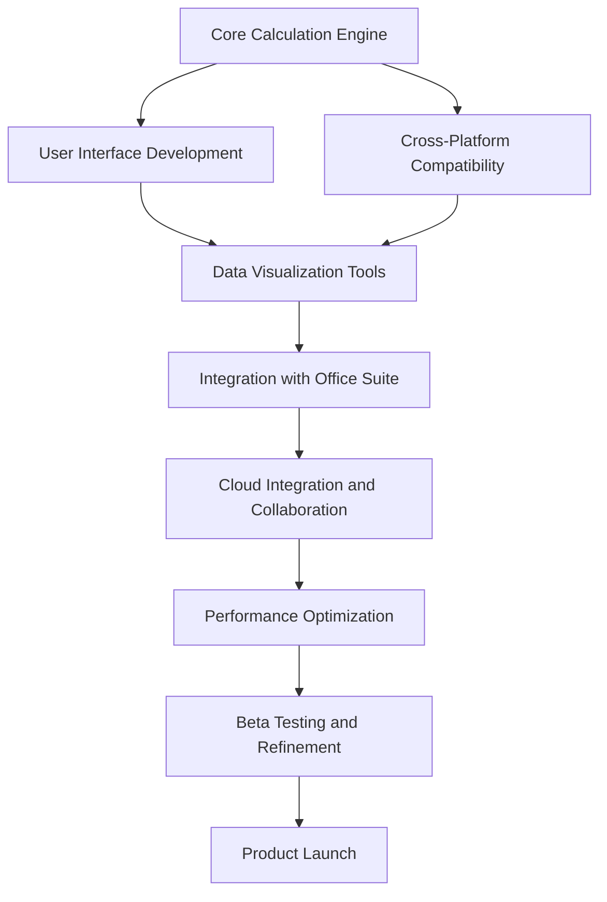
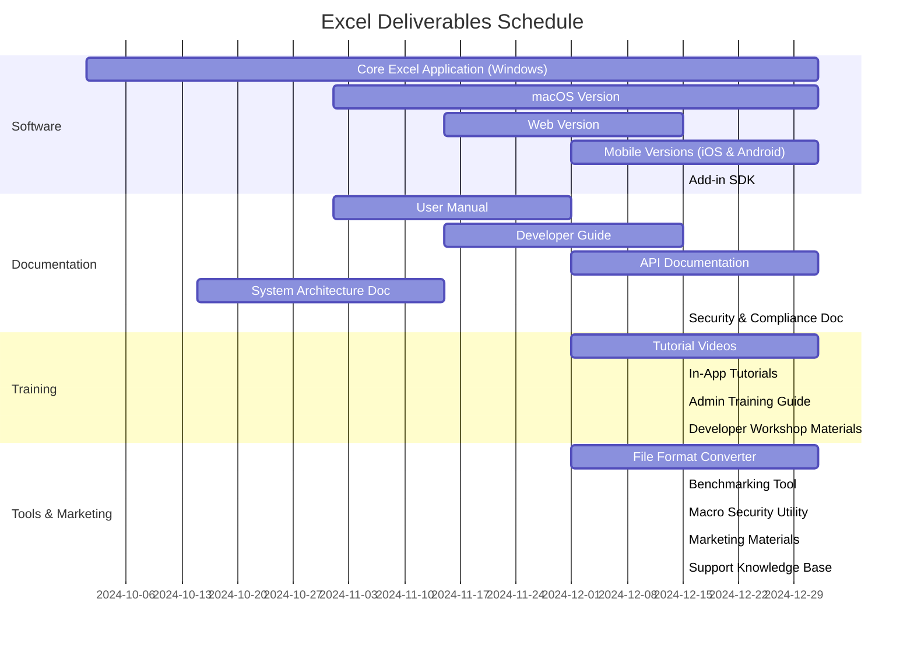

# EXECUTIVE SUMMARY

## PROJECT OVERVIEW

Microsoft Excel is a revolutionary spreadsheet software application designed to transform the way individuals and businesses organize, analyze, and visualize data. In response to the growing need for powerful yet user-friendly data management tools, Excel offers a comprehensive solution that combines intuitive design with advanced functionality. The software addresses the client's need for efficient data handling, complex calculations, and insightful data representation, all within a single, integrated platform.

## OBJECTIVES

1. Develop a robust, grid-based interface for seamless data input and manipulation
2. Implement a comprehensive formula system supporting complex calculations and data analysis
3. Create advanced charting and graphing capabilities for effective data visualization
4. Design an intuitive, ribbon-style toolbar to enhance user experience for both beginners and power users
5. Ensure cross-platform compatibility (Windows, macOS, web, and mobile)
6. Integrate cloud storage and syncing for seamless access across devices
7. Implement collaboration features to support multiple users working simultaneously

## VALUE PROPOSITION

Our agency offers unparalleled expertise in developing sophisticated software solutions that balance power with accessibility. For Microsoft Excel, we bring:

1. Deep understanding of user needs across various proficiency levels
2. Expertise in creating scalable, high-performance applications capable of handling large datasets
3. Experience in developing cross-platform solutions with seamless integration
4. Strong focus on user interface design, ensuring intuitive navigation and feature discovery
5. Proven track record in implementing robust calculation engines and data analysis tools
6. Commitment to ongoing support and feature enhancement based on user feedback and evolving market needs

## PROJECT OBJECTIVES

### BUSINESS GOALS

1. Establish Microsoft Excel as the industry-leading spreadsheet application
2. Increase market share in the productivity software sector
3. Enhance user productivity and efficiency across various industries
4. Drive adoption of the Microsoft Office suite through Excel's integration
5. Generate recurring revenue through subscription-based licensing models
6. Expand the user base by catering to both novice and advanced users
7. Foster a robust ecosystem of third-party add-ins and integrations

### TECHNICAL GOALS

1. Develop a high-performance calculation engine capable of handling large datasets
2. Implement a scalable and extensible formula system supporting complex operations
3. Create an intuitive, ribbon-style user interface for improved feature discoverability
4. Ensure cross-platform compatibility (Windows, macOS, web, and mobile)
5. Integrate cloud storage and real-time collaboration features
6. Optimize memory usage and processing speed for handling large workbooks
7. Implement robust data import/export capabilities supporting various file formats
8. Develop advanced data visualization tools with customizable charts and graphs
9. Create a flexible macro system and VBA environment for user-defined automation
10. Ensure seamless integration with other Microsoft Office applications

### SUCCESS CRITERIA

| Criterion | Target | Measurement Method |
|-----------|--------|---------------------|
| User Adoption | >500 million active users | Monthly Active Users (MAU) tracking |
| User Satisfaction | >90% satisfaction rate | User surveys and app store ratings |
| Performance - Calculation Speed | <1 second for 1 million cells | Automated performance testing |
| Performance - File Load Time | <5 seconds for 100MB file | Automated performance testing |
| Cross-Platform Availability | 100% feature parity | Feature comparison across platforms |
| Market Share | >75% in spreadsheet software category | Third-party market research reports |
| Revenue Growth | >15% year-over-year | Financial reports |
| Third-Party Integrations | >1000 approved add-ins | Microsoft AppSource metrics |
| Collaboration Adoption | >50% of users using co-authoring | Usage analytics |
| Industry Recognition | >5 major industry awards per year | Award tracking and documentation |

These success criteria will be regularly monitored and evaluated throughout the project lifecycle to ensure that Microsoft Excel meets and exceeds its objectives, maintaining its position as the premier spreadsheet application in the market.

## SCOPE OF WORK

### IN-SCOPE

1. User Interface Development
   - Grid-based interface for data input and manipulation
   - Ribbon-style toolbar for easy feature access
   - Customizable quick access toolbar
   - Cell, row, and column formatting options
   - Multiple worksheet support within workbooks

2. Data Management and Analysis
   - Support for various data types (numbers, text, dates, etc.)
   - Sorting and filtering capabilities
   - Data validation tools
   - Pivot table functionality for data summarization
   - Data import/export in multiple formats (CSV, TXT, XML, etc.)

3. Calculation Engine
   - Comprehensive formula system with 400+ built-in functions
   - Custom function creation capability
   - Array formula support
   - Automatic calculation and manual calculation modes

4. Visualization Tools
   - Extensive charting and graphing capabilities (50+ chart types)
   - Conditional formatting for visual data analysis
   - Sparklines for inline data visualization

5. Automation and Extensibility
   - Macro recording and editing
   - VBA environment for custom solutions
   - Add-in support for third-party extensions

6. Collaboration Features
   - Real-time co-authoring
   - Comments and review tools
   - Version history and change tracking

7. Cross-Platform Development
   - Windows desktop application
   - macOS desktop application
   - Web-based version
   - Mobile applications (iOS and Android)

8. Cloud Integration
   - OneDrive integration for cloud storage
   - Automatic saving and syncing across devices

9. Performance Optimization
   - Large dataset handling (up to 1 million rows)
   - Multithreading for improved calculation speed
   - Memory usage optimization

10. Security Features
    - Password protection for workbooks and worksheets
    - Data encryption for sensitive information
    - Information Rights Management (IRM) integration

### OUT-OF-SCOPE

1. Advanced database functionality (beyond basic data management)
2. Full-fledged project management tools
3. Advanced statistical analysis tools (beyond basic statistical functions)
4. Direct integration with non-Microsoft cloud storage services
5. Built-in machine learning or AI capabilities
6. Creation of standalone executable applications from Excel workbooks
7. Direct integration with external hardware devices (beyond standard input/output)
8. Real-time data feeds from external sources (stock tickers, IoT devices, etc.)
9. Built-in version control system (beyond basic version history)
10. Advanced 3D modeling or CAD-like features

### ASSUMPTIONS

1. Microsoft will provide necessary APIs and documentation for Office suite integration
2. The development team has access to required hardware and software resources
3. Third-party libraries and components are available and properly licensed
4. User testing groups are available for feedback throughout the development process
5. Cloud infrastructure (Azure) is available and scalable for cloud-based features
6. Existing Excel file formats (.xls, .xlsx) will remain backward compatible
7. The project has management support and allocated budget for the entire development cycle
8. Regulatory compliance requirements (e.g., GDPR) remain stable during development
9. Target operating systems and devices will support required technologies (e.g., .NET framework)
10. Localization and internationalization resources are available for global deployment

### DEPENDENCIES

| Dependency | Description | Potential Impact |
|------------|-------------|-------------------|
| Office Suite Integration | APIs and protocols for seamless integration with other Office applications | Delays in API updates could affect cross-application features |
| Cloud Infrastructure | Azure services for cloud-based features and storage | Service disruptions could impact cloud-related functionalities |
| Third-Party Libraries | External libraries for specialized functions (e.g., advanced charting) | Library updates or deprecations may require code adjustments |
| Operating System Compatibility | OS-specific APIs and features for cross-platform development | OS updates might necessitate application modifications |
| .NET Framework | Core framework for Windows application development | Version changes could require significant code refactoring |
| Web Technologies | HTML5, CSS3, and JavaScript for web-based version | Web standard evolution may impact web version functionality |
| Mobile OS SDKs | iOS and Android SDKs for mobile app development | SDK updates could require mobile app revisions |
| Localization Services | Translation and cultural adaptation resources | Delays in localization could impact global release schedules |
| Licensing Agreements | Agreements for using proprietary technologies or patents | Changes in licensing terms could affect feature implementation |
| User Testing Groups | Availability of diverse user groups for testing and feedback | Lack of timely feedback could lead to usability issues |

# BUDGET AND COST ESTIMATES

## COST BREAKDOWN

The following table provides a detailed breakdown of the estimated costs for the Microsoft Excel development project:

| Category | Description | Cost (USD) |
|----------|-------------|------------|
| Labor | Software Development (50 developers x 18 months) | $13,500,000 |
| Labor | UI/UX Design (10 designers x 12 months) | $1,800,000 |
| Labor | Project Management (5 managers x 18 months) | $1,350,000 |
| Labor | Quality Assurance (20 testers x 12 months) | $2,400,000 |
| Software | Development tools and licenses | $500,000 |
| Hardware | Development and testing equipment | $750,000 |
| Cloud Services | Azure infrastructure for development and testing | $1,000,000 |
| Third-party Services | API integrations and specialized libraries | $400,000 |
| User Testing | Beta testing programs and user feedback collection | $300,000 |
| Training | Staff training on new technologies and methodologies | $200,000 |
| Marketing | Pre-launch marketing and promotional activities | $1,500,000 |
| Contingency | 10% buffer for unforeseen expenses | $2,370,000 |
| **Total** | | **$26,070,000** |

## PAYMENT SCHEDULE

The payment schedule is structured around key project milestones and deliverables:

| Milestone | Percentage | Amount (USD) | Estimated Date |
|-----------|------------|--------------|----------------|
| Project Initiation | 10% | $2,607,000 | July 1, 2023 |
| UI/UX Design Approval | 15% | $3,910,500 | October 1, 2023 |
| Core Functionality Complete | 20% | $5,214,000 | March 1, 2024 |
| Beta Release | 20% | $5,214,000 | August 1, 2024 |
| Final Testing & Optimization | 15% | $3,910,500 | November 1, 2024 |
| Project Completion | 20% | $5,214,000 | December 31, 2024 |

## BUDGET CONSIDERATIONS

Several factors could potentially impact the budget and require careful management:

1. Scope Creep: As the project progresses, there may be requests for additional features or functionality. We will implement a strict change control process to evaluate and approve any scope changes, assessing their impact on the budget.

2. Technology Changes: Rapid advancements in web and mobile technologies could necessitate updates to our development approach. We have allocated a portion of the contingency fund to address potential technology shifts.

3. Integration Challenges: Unforeseen difficulties in integrating with other Office suite applications or third-party services could lead to increased development time. Regular integration testing and close collaboration with Microsoft's API teams will help mitigate this risk.

4. Performance Optimization: Achieving the desired performance levels for large datasets may require additional optimization efforts. We have factored in time for performance tuning, but complex issues could impact the timeline and budget.

5. Cross-Platform Development: Ensuring consistent functionality across all platforms (Windows, macOS, web, and mobile) may present unexpected challenges. We have allocated resources for platform-specific development and testing.

6. Cybersecurity Measures: Evolving security threats may require additional investment in robust security features. We will continuously assess security requirements and allocate resources from the contingency fund if needed.

7. User Testing Feedback: Extensive user testing may reveal the need for significant UI/UX changes or feature adjustments. We have built in multiple feedback loops, but major changes could impact the timeline and budget.

8. Licensing Costs: Changes in licensing terms for third-party libraries or technologies could affect ongoing costs. We will prioritize using stable, well-established libraries and negotiate favorable long-term licensing agreements where possible.

9. Cloud Infrastructure Scaling: As the project progresses, we may need to scale our cloud infrastructure to handle increased development and testing loads. We will closely monitor usage and adjust our Azure resources as needed.

10. Exchange Rate Fluctuations: For international resources or services, currency exchange rate fluctuations could impact costs. We will consider using financial instruments to hedge against significant currency risks.

To manage these considerations, we will:
- Conduct bi-weekly budget reviews to track expenses against projections
- Maintain open communication channels with all stakeholders to quickly address any budgetary concerns
- Utilize agile development methodologies to allow for flexibility in resource allocation
- Regularly reassess project priorities to ensure the most critical elements are completed within budget constraints
- Maintain a detailed risk register, updating it with potential budget impacts and mitigation strategies

# TIMELINE AND MILESTONES

## PROJECT TIMELINE

The development of Microsoft Excel is planned to span 18 months, divided into several key phases:

## KEY MILESTONES

| Milestone | Description | Target Date |
|-----------|-------------|-------------|
| Project Kickoff | Initial team assembly and project setup | July 1, 2023 |
| Requirements Finalization | Detailed project requirements approved | August 15, 2023 |
| UI/UX Design Approval | Final interface design and user experience flow approved | October 1, 2023 |
| Core Calculation Engine Complete | Basic spreadsheet functionality and formula system operational | February 1, 2024 |
| Data Visualization Tools Ready | Charting and graphing capabilities implemented | April 1, 2024 |
| Cross-Platform Compatibility Achieved | Excel functional on Windows, macOS, web, and mobile platforms | June 1, 2024 |
| Feature Freeze | All planned features implemented, focus shifts to testing and optimization | August 1, 2024 |
| Beta Release | Public beta testing begins | October 1, 2024 |
| Release Candidate | All critical issues resolved, final testing phase begins | December 1, 2024 |
| Product Launch | Official release of Microsoft Excel | December 31, 2024 |

## CRITICAL PATH

The following tasks and activities are critical to maintaining the project schedule:

1. Core Calculation Engine Development (4 months)
   - This forms the foundation of Excel's functionality and must be completed before other features can be fully implemented.

2. User Interface Development (3 months, overlapping with Core Engine)
   - The grid-based interface and ribbon toolbar are essential for user interaction and feature accessibility.

3. Cross-Platform Compatibility (3 months)
   - Ensuring Excel works consistently across all platforms is crucial for meeting user expectations and market demands.

4. Data Visualization Tools (2 months)
   - Charting and graphing capabilities are key differentiators and must be robust and user-friendly.

5. Integration with Office Suite (2 months)
   - Seamless interaction with other Microsoft Office applications is vital for the overall user experience.

6. Cloud Integration and Collaboration Features (2 months)
   - These features are essential for modern workflow requirements and must be thoroughly tested.

7. Performance Optimization (1 month)
   - Ensuring Excel can handle large datasets efficiently is critical for user satisfaction and competitive advantage.

8. Beta Testing and Refinement (2 months)
   - This phase is crucial for identifying and resolving issues before the official launch.

To maintain the project timeline, these critical path items will be closely monitored, with resources allocated prioritizing to ensure their timely completion. Regular status updates and risk assessments will be conducted to identify and address any potential delays in these crucial areas.

# DELIVERABLES

## LIST OF DELIVERABLES

1. Software Components
   - Core Excel Application (Windows, macOS, Web, iOS, and Android versions)
   - Excel Add-in SDK for third-party developers
   - Office Suite Integration Modules

2. Documentation
   - User Manual
   - Developer Guide
   - API Documentation
   - System Architecture Documentation
   - Security and Compliance Documentation

3. Training Materials
   - End-User Tutorial Videos
   - Interactive In-App Tutorials
   - Administrator Training Guide
   - Developer Workshop Materials

4. Supplementary Tools
   - Excel File Format Converter
   - Performance Benchmarking Tool
   - Macro Security Management Utility

5. Marketing and Support Materials
   - Product Brochures and Datasheets
   - Technical Support Knowledge Base
   - Troubleshooting Guide

## DELIVERY SCHEDULE

## ACCEPTANCE CRITERIA

| Deliverable | Acceptance Criteria |
|-------------|---------------------|
| Core Excel Application | - Passes all functional tests with 100% success rate - Performs calculations on 1 million cells in < 1 second - Achieves 99.9% uptime in stress tests - UI response time < 100ms for standard operations - Compatibility with all specified file formats |
| Mobile Versions | - Feature parity with desktop version (excluding hardware-specific features) - Touch-optimized UI with >= 95% user satisfaction in usability tests - Offline functionality for core features |
| Add-in SDK | - Successfully integrates with at least 10 sample third-party applications - Documentation covers 100% of API functions - Backward compatibility with previous Excel versions |
| User Manual | - Covers all features and functions - Includes step-by-step guides for common tasks - Passes readability assessment for target user groups |
| API Documentation | - 100% coverage of all public APIs - Includes code samples for each API function - Validated by external developer focus group |
| Tutorial Videos | - Cover all major features and common use cases - High-definition quality (1080p minimum) - Average user rating >= 4.5/5 in feedback surveys |
| File Format Converter | - Supports all legacy Excel formats (.xls, .xlsx, etc.) - 100% accuracy in file conversion tests - Processes 1000 files in < 10 minutes on standard hardware |
| Benchmarking Tool | - Accurately measures performance across all key metrics - Generates comprehensive reports in multiple formats (PDF, HTML, CSV) - Integrates with automated testing pipelines |
| Marketing Materials | - Align with Microsoft branding guidelines - Cover all key features and benefits - Approved by Marketing and Legal departments |
| Support Knowledge Base | - Covers top 100 most common user issues - Searchable with >= 95% relevant result rate - Updated with all new features and known issues |

Each deliverable will be subject to a formal review process involving key stakeholders from Microsoft and the development team. Acceptance will be granted only when all criteria are met and any identified issues are resolved to the satisfaction of the project manager and client representatives.