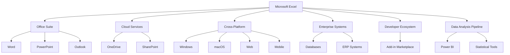
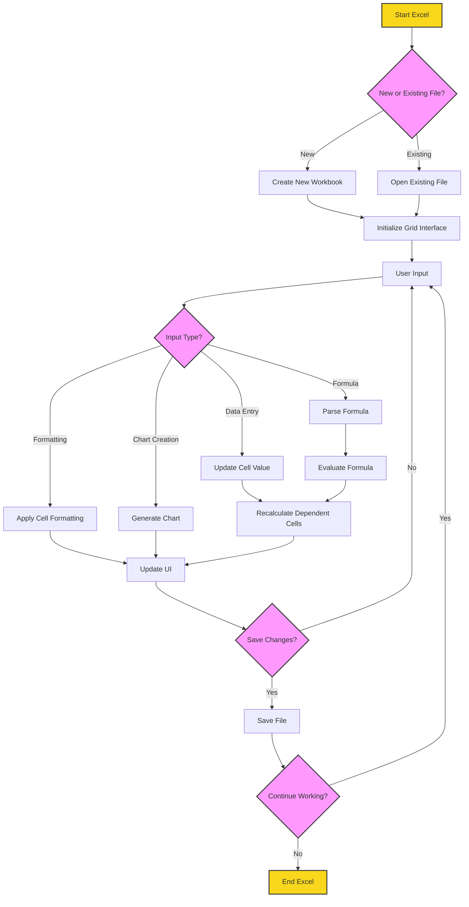
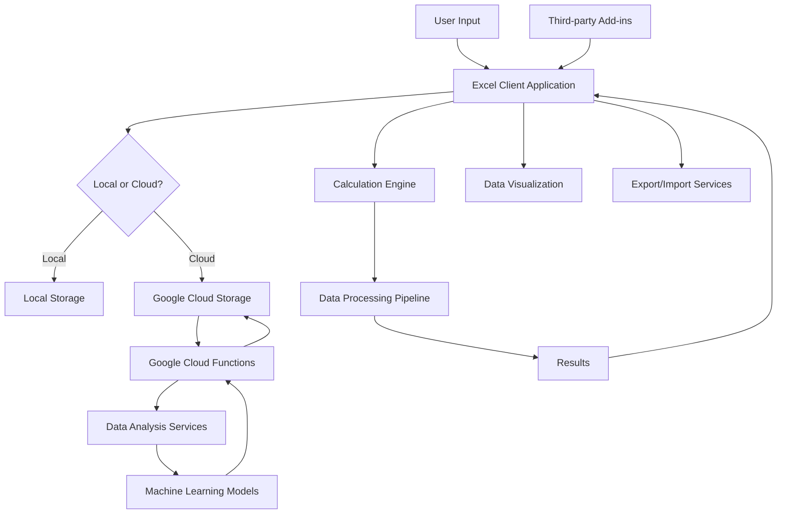

# INTRODUCTION

## PURPOSE

The purpose of this Software Requirements Specification (SRS) document is to provide a comprehensive and detailed description of the Microsoft Excel software application. This document serves as the primary reference for the development team, project managers, quality assurance testers, and other stakeholders involved in the creation and maintenance of Microsoft Excel.

The intended audience for this SRS includes:

1. Development Team: To understand the technical requirements and specifications for implementing the software.
2. Project Managers: To plan and track the project's progress based on defined requirements.
3. Quality Assurance Team: To develop test plans and ensure the software meets all specified requirements.
4. User Experience (UX) Designers: To align the user interface and experience with the documented requirements.
5. Microsoft Stakeholders: To review and approve the proposed features and functionalities.
6. Third-party Developers: To understand the system architecture and API specifications for developing add-ins and integrations.
7. Technical Writers: To create user documentation and help materials based on the specified features.

This document will serve as the foundation for the entire development process, ensuring all parties have a clear and consistent understanding of the project's objectives, features, and constraints.

## SCOPE

Microsoft Excel is a powerful and versatile spreadsheet application designed to revolutionize data management, analysis, and visualization for individuals and businesses across various industries. The software aims to provide an intuitive yet powerful platform for organizing, calculating, and presenting data in a structured format.

### Goals

1. Develop a user-friendly interface that caters to both novice and advanced users
2. Create a robust calculation engine capable of handling complex formulas and large datasets
3. Implement advanced data visualization tools for insightful representation of information
4. Ensure seamless integration with other Microsoft Office applications and third-party tools
5. Provide cross-platform compatibility for desktop (Windows and macOS), web, and mobile devices
6. Incorporate real-time collaboration features to enhance team productivity
7. Maintain high performance and reliability when dealing with large workbooks

### Benefits

1. Increased productivity through efficient data management and analysis tools
2. Enhanced decision-making capabilities with powerful data visualization features
3. Improved collaboration and data sharing within teams and organizations
4. Flexibility to work across multiple devices and platforms
5. Streamlined integration with existing business processes and software ecosystems
6. Reduced errors and increased accuracy in data processing and calculations
7. Time savings through automation of repetitive tasks and complex calculations

### Core Functionalities

1. Grid-based Interface
   - Customizable rows, columns, and cells
   - Support for multiple worksheets within a workbook
   - Freeze panes and split views for easier navigation of large datasets

2. Data Input and Manipulation
   - Support for various data types (numbers, text, dates, etc.)
   - Data validation and error checking
   - Auto-fill and flash fill for quick data entry
   - Sorting and filtering capabilities

3. Calculation Engine
   - Comprehensive formula system with 400+ built-in functions
   - Support for array formulas and dynamic arrays
   - Custom function creation using VBA or JavaScript
   - Automatic and manual calculation modes

4. Data Visualization
   - Wide range of chart types (50+) for creating graphs and diagrams
   - Conditional formatting for visual data analysis
   - Sparklines for inline data visualization
   - PivotTables and PivotCharts for data summarization and exploration

5. Formatting and Styling
   - Cell, row, and column formatting options
   - Customizable styles and themes
   - Conditional formatting rules

6. Data Analysis Tools
   - What-if analysis tools (Goal Seek, Scenario Manager, etc.)
   - Statistical analysis functions
   - Solver add-in for optimization problems

7. Collaboration Features
   - Real-time co-authoring
   - Comments and review tools
   - Version history and change tracking
   - Sharing and permission management

8. Integration and Extensibility
   - Seamless integration with other Microsoft Office applications
   - Support for add-ins and extensions
   - Import/Export capabilities for various file formats
   - Macro recording and VBA programming for automation

9. Cross-platform Support
   - Desktop applications for Windows and macOS
   - Web-based version built with React and TypeScript
   - Mobile applications for iOS and Android

10. Cloud Integration
    - OneDrive integration for cloud storage and syncing
    - Azure-based services for enhanced functionality and scalability

11. Security and Compliance
    - Data encryption for sensitive information
    - Password protection for workbooks and worksheets
    - Compliance with industry standards and regulations (e.g., GDPR)

By delivering these core functionalities, Microsoft Excel aims to maintain its position as the leading spreadsheet application in the market, catering to a wide range of users from individual professionals to large enterprises across various industries.

# PRODUCT DESCRIPTION

## PRODUCT PERSPECTIVE

Microsoft Excel is a core component of the Microsoft Office suite, designed to seamlessly integrate with other Office applications while providing powerful standalone functionality. Within the larger ecosystem:

1. Office Suite Integration: Excel interacts closely with other Office applications, allowing data exchange and embedded objects with Word, PowerPoint, and Outlook.

2. Cloud Ecosystem: Excel is deeply integrated with Microsoft's cloud services, particularly OneDrive and SharePoint, enabling real-time collaboration and anywhere access.

3. Cross-Platform Availability: Excel operates across multiple platforms:
   - Desktop: Windows and macOS versions
   - Web: Browser-based version built with React and TypeScript
   - Mobile: iOS and Android applications

4. Enterprise Systems: Excel connects with various enterprise data sources and business intelligence tools, serving as a front-end for data analysis and reporting.

5. Developer Ecosystem: Excel supports an extensive add-in marketplace, allowing third-party developers to extend its functionality.

6. Data Analysis Pipeline: Excel often serves as a key component in data analysis workflows, interfacing with more specialized tools like Power BI or statistical software.



## PRODUCT FUNCTIONS

Microsoft Excel provides a wide range of functions to support data management, analysis, and visualization:

1. Data Input and Management
   - Grid-based data entry and editing
   - Support for various data types (numbers, text, dates, etc.)
   - Data validation and error checking
   - Sorting and filtering capabilities
   - Import/export functionality for multiple file formats

2. Calculation and Formula Engine
   - Comprehensive formula system with 400+ built-in functions
   - Custom function creation using VBA or JavaScript
   - Array formulas and dynamic arrays
   - Automatic and manual calculation modes

3. Data Analysis Tools
   - Pivot Tables for data summarization and exploration
   - What-if analysis tools (Goal Seek, Scenario Manager)
   - Statistical analysis functions
   - Solver add-in for optimization problems

4. Data Visualization
   - Wide range of chart types for creating graphs and diagrams
   - Conditional formatting for visual data analysis
   - Sparklines for inline data visualization

5. Collaboration and Sharing
   - Real-time co-authoring
   - Comments and review tools
   - Version history and change tracking
   - Sharing and permission management

6. Automation and Extensibility
   - Macro recording and VBA programming
   - Support for add-ins and extensions
   - Integration with external data sources and APIs

7. Cross-Platform Functionality
   - Consistent core features across desktop, web, and mobile platforms
   - Cloud syncing for seamless transition between devices

8. Security and Compliance
   - Data encryption for sensitive information
   - Password protection for workbooks and worksheets
   - Compliance features for industry standards and regulations

## USER CHARACTERISTICS

Microsoft Excel caters to a diverse user base with varying levels of expertise:

1. Novice Users
   - Characteristics: Limited spreadsheet experience, may be intimidated by complex features
   - Needs: Simple data entry, basic calculations, and straightforward charting
   - Persona: Sarah, a small business owner who uses Excel for basic bookkeeping and inventory tracking

2. Intermediate Users
   - Characteristics: Comfortable with common Excel functions, use Excel regularly for work
   - Needs: More advanced formulas, data analysis tools, and collaborative features
   - Persona: Mark, a marketing analyst who uses Excel for campaign performance tracking and reporting

3. Advanced Users / Power Users
   - Characteristics: Expert in Excel, often push the limits of the software's capabilities
   - Needs: Complex data modeling, automation through VBA, integration with external data sources
   - Persona: Lisa, a financial controller who develops sophisticated financial models and automates reporting processes

4. Data Scientists / Analysts
   - Characteristics: Use Excel as part of a larger data analysis toolkit
   - Needs: Advanced statistical functions, large dataset handling, integration with other analytical tools
   - Persona: David, a data scientist who uses Excel for initial data exploration before moving to more specialized tools

5. Developers
   - Characteristics: Create custom solutions and add-ins for Excel
   - Needs: Comprehensive API documentation, development tools, and extensibility options
   - Persona: Alex, a software developer who creates custom Excel add-ins for enterprise clients

6. Enterprise Administrators
   - Characteristics: Manage Excel deployments across large organizations
   - Needs: Security features, compliance tools, and centralized management capabilities
   - Persona: Jennifer, an IT manager responsible for Office 365 deployment in a multinational corporation

## CONSTRAINTS

1. Technical Constraints
   - Must maintain backward compatibility with earlier Excel file formats (.xls, .xlsx)
   - Web version must function across all major browsers (Chrome, Firefox, Safari, Edge)
   - Mobile versions limited by device processing power and screen size
   - Maximum worksheet size limited to 1,048,576 rows by 16,384 columns

2. Regulatory Constraints
   - Must comply with GDPR for data protection in the EU
   - Need to adhere to accessibility standards (e.g., WCAG 2.1) for users with disabilities
   - Financial calculation functions must comply with accounting standards in various jurisdictions

3. Integration Constraints
   - Must integrate seamlessly with other Microsoft Office applications
   - API limitations when integrating with third-party services and databases

4. Performance Constraints
   - Large spreadsheets (>100MB) may experience performance issues on less powerful devices
   - Real-time collaboration features limited by network latency and bandwidth

5. Security Constraints
   - Encryption methods must meet industry standards for data protection
   - Macro and add-in functionality limited to prevent potential security vulnerabilities

6. User Interface Constraints
   - Ribbon interface must maintain consistency with other Office applications
   - Mobile interface must adapt to various screen sizes while maintaining core functionality

7. Localization Constraints
   - Must support multiple languages and regional settings (date formats, currency symbols, etc.)
   - Formulas and function names need to be translatable

8. Cloud Service Constraints
   - Dependent on the availability and performance of Microsoft's cloud infrastructure
   - Data residency requirements in certain regions may limit cloud storage options

## ASSUMPTIONS AND DEPENDENCIES

### Assumptions

1. Users have basic computer literacy and familiarity with spreadsheet concepts
2. The majority of users have reliable internet connectivity for cloud-based features
3. Organizations will transition to subscription-based licensing models
4. The core Excel file format (.xlsx) will remain stable for the foreseeable future
5. Users are willing to learn new features and adapt to interface changes
6. The demand for data analysis and visualization tools will continue to grow
7. Mobile devices will become increasingly powerful, enabling more complex Excel operations

### Dependencies

1. Microsoft Office Suite: Excel's integration capabilities depend on the development and API stability of other Office applications
2. Operating Systems: Excel's functionality is dependent on Windows, macOS, iOS, and Android platforms
3. Cloud Infrastructure: Reliance on Microsoft Azure for cloud-based features and storage
4. Web Technologies: The web version depends on ongoing support for React, TypeScript, and Tailwind CSS
5. Third-Party Libraries: Certain advanced features may rely on external libraries for specialized functions
6. App Stores: Distribution of mobile versions depends on Apple App Store and Google Play Store policies
7. Regulatory Environment: Ongoing compliance depends on stable regulatory requirements
8. User Feedback: Continuous improvement relies on user testing and feedback mechanisms
9. Developer Community: The success of the add-in ecosystem depends on active third-party developer participation
10. Hardware Advancements: Some performance improvements are contingent on advancements in consumer hardware capabilities

Here's the PROCESS FLOWCHART section for the Microsoft Excel SRS using Mermaid JS:

## PROCESS FLOWCHART

The following flowchart illustrates the high-level process flow for the core functionality of Microsoft Excel:



This flowchart represents the main processes within Microsoft Excel:

1. Application Start: The user launches Excel.
2. File Selection: The user chooses to create a new workbook or open an existing file.
3. Grid Interface: The main spreadsheet interface is initialized.
4. User Input: The user interacts with the spreadsheet through various input types.
5. Data Processing: Depending on the input type, Excel performs different actions:
   - Data Entry: Updates cell values
   - Formula Entry: Parses and evaluates formulas
   - Formatting: Applies cell formatting
   - Chart Creation: Generates visual representations of data
6. Recalculation: Updates dependent cells based on changes.
7. UI Update: Refreshes the user interface to reflect changes.
8. Save Option: The user can choose to save changes.
9. Continuation: The user decides whether to continue working or exit the application.

The process flow is designed to be intuitive and efficient, allowing users to seamlessly move between different tasks within Excel. The use of React and TypeScript for the user interface ensures a responsive and type-safe front-end implementation, while the backend calculations and data processing can be optimized using Python for performance-critical operations.

This flowchart provides a high-level overview of the core Excel processes. More detailed flowcharts for specific features (e.g., pivot tables, data analysis tools) can be created as needed for development and documentation purposes.

Here's a breakdown of Microsoft Excel's features with the requested sub-sections:

1. ID: GRID-001
   DESCRIPTION: Grid-based Interface
   PRIORITY: High
   TABLE OF FUNCTIONAL REQUIREMENTS:

   | Requirement ID | Description | Priority |
   |----------------|-------------|----------|
   | GRID-001-01 | Implement a responsive grid system using React and Tailwind CSS | High |
   | GRID-001-02 | Support up to 1,048,576 rows and 16,384 columns | High |
   | GRID-001-03 | Allow cell selection, range selection, and multi-select | High |
   | GRID-001-04 | Implement cell merging and splitting functionality | Medium |
   | GRID-001-05 | Support freeze panes and split views | Medium |

2. ID: CALC-001
   DESCRIPTION: Calculation Engine
   PRIORITY: High
   TABLE OF FUNCTIONAL REQUIREMENTS:

   | Requirement ID | Description | Priority |
   |----------------|-------------|----------|
   | CALC-001-01 | Implement a Python-based calculation engine for complex formulas | High |
   | CALC-001-02 | Support 400+ built-in functions | High |
   | CALC-001-03 | Allow custom function creation using JavaScript | Medium |
   | CALC-001-04 | Implement array formulas and dynamic arrays | High |
   | CALC-001-05 | Support automatic and manual calculation modes | Medium |

3. ID: VISU-001
   DESCRIPTION: Data Visualization
   PRIORITY: High
   TABLE OF FUNCTIONAL REQUIREMENTS:

   | Requirement ID | Description | Priority |
   |----------------|-------------|----------|
   | VISU-001-01 | Implement 50+ chart types using React and a charting library | High |
   | VISU-001-02 | Support conditional formatting with Tailwind CSS | High |
   | VISU-001-03 | Implement sparklines for inline data visualization | Medium |
   | VISU-001-04 | Allow customization of chart elements and styles | Medium |
   | VISU-001-05 | Support data-driven formatting rules | Medium |

4. ID: COLL-001
   DESCRIPTION: Collaboration Features
   PRIORITY: High
   TABLE OF FUNCTIONAL REQUIREMENTS:

   | Requirement ID | Description | Priority |
   |----------------|-------------|----------|
   | COLL-001-01 | Implement real-time co-authoring using Google Cloud Firestore | High |
   | COLL-001-02 | Add commenting and review tools with React components | High |
   | COLL-001-03 | Implement version history and change tracking | Medium |
   | COLL-001-04 | Support sharing and permission management using Google Cloud IAM | High |
   | COLL-001-05 | Implement presence awareness for collaborators | Low |

5. ID: FORM-001
   DESCRIPTION: Formatting and Styling
   PRIORITY: Medium
   TABLE OF FUNCTIONAL REQUIREMENTS:

   | Requirement ID | Description | Priority |
   |----------------|-------------|----------|
   | FORM-001-01 | Implement cell, row, and column formatting options using Tailwind CSS | High |
   | FORM-001-02 | Support custom number formats | Medium |
   | FORM-001-03 | Implement cell styles and themes | Medium |
   | FORM-001-04 | Allow font customization and rich text formatting | Medium |
   | FORM-001-05 | Support text wrapping and alignment options | Medium |

6. ID: DATA-001
   DESCRIPTION: Data Management
   PRIORITY: High
   TABLE OF FUNCTIONAL REQUIREMENTS:

   | Requirement ID | Description | Priority |
   |----------------|-------------|----------|
   | DATA-001-01 | Implement sorting and filtering capabilities | High |
   | DATA-001-02 | Support data validation rules | Medium |
   | DATA-001-03 | Implement pivot tables using React components | High |
   | DATA-001-04 | Allow data import/export in various formats (CSV, JSON, etc.) | High |
   | DATA-001-05 | Implement data cleansing and transformation tools | Medium |

7. ID: AUTO-001
   DESCRIPTION: Automation and Extensibility
   PRIORITY: Medium
   TABLE OF FUNCTIONAL REQUIREMENTS:

   | Requirement ID | Description | Priority |
   |----------------|-------------|----------|
   | AUTO-001-01 | Implement macro recording and editing | Medium |
   | AUTO-001-02 | Support VBA for custom solutions | Medium |
   | AUTO-001-03 | Develop an add-in system for third-party extensions | Medium |
   | AUTO-001-04 | Implement a Python-based scripting environment | Low |
   | AUTO-001-05 | Support workflow automation tools | Low |

8. ID: PERF-001
   DESCRIPTION: Performance Optimization
   PRIORITY: High
   TABLE OF FUNCTIONAL REQUIREMENTS:

   | Requirement ID | Description | Priority |
   |----------------|-------------|----------|
   | PERF-001-01 | Optimize React rendering for large datasets | High |
   | PERF-001-02 | Implement lazy loading for grid data | High |
   | PERF-001-03 | Utilize web workers for background calculations | Medium |
   | PERF-001-04 | Implement efficient memory management for large workbooks | High |
   | PERF-001-05 | Optimize file loading and saving operations | Medium |

9. ID: CLOU-001
   DESCRIPTION: Cloud Integration
   PRIORITY: High
   TABLE OF FUNCTIONAL REQUIREMENTS:

   | Requirement ID | Description | Priority |
   |----------------|-------------|----------|
   | CLOU-001-01 | Integrate with Google Cloud Storage for file storage | High |
   | CLOU-001-02 | Implement automatic saving and syncing | High |
   | CLOU-001-03 | Support offline mode with local storage | Medium |
   | CLOU-001-04 | Implement cloud-based computation for resource-intensive operations | Medium |
   | CLOU-001-05 | Support multi-device access and synchronization | High |

10. ID: SECU-001
    DESCRIPTION: Security Features
    PRIORITY: High
    TABLE OF FUNCTIONAL REQUIREMENTS:

    | Requirement ID | Description | Priority |
    |----------------|-------------|----------|
    | SECU-001-01 | Implement workbook and worksheet password protection | High |
    | SECU-001-02 | Support data encryption using Google Cloud KMS | High |
    | SECU-001-03 | Implement Information Rights Management (IRM) | Medium |
    | SECU-001-04 | Support secure external data connections | Medium |
    | SECU-001-05 | Implement audit logging for security events | Medium |

These features cover the core functionality of Microsoft Excel, with a focus on using React, TypeScript, and Tailwind CSS for the user interface, Python for backend operations, and Google Cloud solutions for cloud-based features. The priorities and requirements are aligned with the previously established project goals and constraints.

# NON-FUNCTIONAL REQUIREMENTS

## PERFORMANCE

1. Response Time
   - Grid rendering: < 100ms for up to 10,000 visible cells
   - Formula calculation: < 500ms for complex formulas (up to 1,000 nested operations)
   - Chart rendering: < 200ms for standard charts, < 1s for complex visualizations
   - File loading: < 5s for files up to 100MB, < 30s for files up to 1GB

2. Throughput
   - Support concurrent editing for up to 100 users per workbook
   - Handle up to 1,000,000 API requests per minute for cloud-based operations

3. Resource Usage
   - Memory usage: < 2GB for workbooks up to 100MB in size
   - CPU utilization: < 50% for standard operations on quad-core processors
   - Storage: Efficient compression to reduce file sizes by at least 30% compared to raw data

4. Optimization
   - Implement React virtualization for rendering large datasets
   - Use Web Workers for background calculations to maintain UI responsiveness
   - Leverage Google Cloud Functions for serverless backend operations

## SAFETY

1. Data Integrity
   - Implement automatic saving with 1-minute intervals to prevent data loss
   - Maintain a minimum of 100 undo/redo steps for all user actions

2. Fault Tolerance
   - Graceful degradation of features in case of limited connectivity
   - Automatic recovery from application crashes, restoring the last known good state

3. Backup and Recovery
   - Real-time synchronization with Google Cloud Storage for cloud-based backups
   - Ability to recover files from any point in the last 30 days

4. Error Handling
   - Comprehensive error logging and reporting system
   - User-friendly error messages with suggested actions for resolution

## SECURITY

1. Authentication
   - Multi-factor authentication support using Google Cloud Identity Platform
   - Single Sign-On (SSO) integration with Microsoft accounts and other major providers

2. Authorization
   - Role-based access control (RBAC) for workbook and worksheet level permissions
   - Granular control over feature access based on user roles

3. Data Encryption
   - At-rest encryption using Google Cloud Key Management Service
   - In-transit encryption using TLS 1.3 for all network communications

4. Privacy
   - Compliance with GDPR, CCPA, and other relevant data protection regulations
   - Data anonymization options for sensitive information in shared workbooks

5. Secure Development
   - Regular security audits and penetration testing
   - Adherence to OWASP Top 10 security practices in development

## QUALITY

1. Availability
   - 99.99% uptime for cloud-based services
   - Offline mode support for essential features in desktop and mobile applications

2. Maintainability
   - Modular architecture using React components for easy updates and feature additions
   - Comprehensive unit testing with minimum 90% code coverage
   - Automated CI/CD pipeline using Google Cloud Build

3. Usability
   - Intuitive UI design following Microsoft's Fluent Design System
   - Accessibility compliance with WCAG 2.1 Level AA standards
   - Localization support for at least 30 languages

4. Scalability
   - Support for workbooks with up to 1,048,576 rows and 16,384 columns
   - Ability to handle up to 1 million concurrent users across all platforms
   - Auto-scaling infrastructure using Google Kubernetes Engine for cloud services

5. Reliability
   - Mean Time Between Failures (MTBF) of at least 5,000 hours
   - Mean Time To Repair (MTTR) of less than 30 minutes for critical issues
   - Automated daily backups with 99.999% data durability

## COMPLIANCE

1. Legal Compliance
   - Adherence to software licensing agreements for all third-party libraries
   - Compliance with export control regulations for cryptographic features

2. Regulatory Compliance
   - GDPR compliance for data protection and user privacy
   - SOC 2 Type II certification for cloud-based services
   - HIPAA compliance for handling sensitive healthcare data

3. Standards Compliance
   - ISO/IEC 27001 certification for information security management
   - Conformance to ECMA-376 standard for Office Open XML file formats
   - Adherence to W3C standards for web-based components

4. Accessibility Compliance
   - Section 508 compliance for U.S. federal agencies
   - EN 301 549 compliance for European accessibility requirements

5. Industry-Specific Compliance
   - Support for XBRL (eXtensible Business Reporting Language) for financial reporting
   - Compliance with 21 CFR Part 11 for electronic records in pharmaceutical industries

6. Environmental Compliance
   - Adherence to energy efficiency guidelines for software applications
   - Support for paperless workflows to promote environmental sustainability

These non-functional requirements ensure that Microsoft Excel meets high standards of performance, safety, security, quality, and compliance across all platforms and use cases. The use of React, TypeScript, and Tailwind CSS for the user interface, Python for backend operations, and Google Cloud solutions for infrastructure aligns with modern development practices and provides a robust foundation for meeting these requirements.

# DATA REQUIREMENTS

## DATA MODELS

Microsoft Excel handles various types of data structures to support its wide range of functionalities. The core data models are represented in the following entity-relationship diagram:

```mermaid
erDiagram
    WORKBOOK ||--|{ WORKSHEET : contains
    WORKSHEET ||--|{ CELL : contains
    CELL ||--o| FORMULA : may_contain
    CELL ||--o| VALUE : contains
    CELL ||--o| STYLE : has
    WORKSHEET ||--o{ CHART : may_contain
    WORKSHEET ||--o{ PIVOT_TABLE : may_contain
    WORKBOOK ||--o{ NAMED_RANGE : may_contain
    WORKBOOK ||--o{ MACRO : may_contain
    USER ||--o{ WORKBOOK : owns
    USER ||--o{ COMMENT : creates

    WORKBOOK {
        string id PK
        string name
        datetime created_at
        datetime modified_at
        string owner_id FK
    }
    WORKSHEET {
        string id PK
        string name
        int order
        string workbook_id FK
    }
    CELL {
        string id PK
        string worksheet_id FK
        int row
        int column
    }
    FORMULA {
        string id PK
        string cell_id FK
        string expression
    }
    VALUE {
        string id PK
        string cell_id FK
        string data_type
        string content
    }
    STYLE {
        string id PK
        string cell_id FK
        string font
        string color
        string background
        string border
    }
    CHART {
        string id PK
        string worksheet_id FK
        string type
        string data_range
    }
    PIVOT_TABLE {
        string id PK
        string worksheet_id FK
        string source_range
    }
    NAMED_RANGE {
        string id PK
        string workbook_id FK
        string name
        string range
    }
    MACRO {
        string id PK
        string workbook_id FK
        string name
        string code
    }
    USER {
        string id PK
        string name
        string email
    }
    COMMENT {
        string id PK
        string cell_id FK
        string user_id FK
        string content
        datetime created_at
    }
```

This data model represents the core entities in Microsoft Excel and their relationships. It provides a foundation for implementing the various features and functionalities of the application.

## DATA STORAGE

Microsoft Excel will utilize a combination of local storage and cloud-based storage solutions to ensure data integrity, accessibility, and scalability.

### Local Storage

For desktop applications (Windows and macOS):
- Files will be stored in the XLSX format, which is based on the Office Open XML standard.
- Temporary files and auto-recovery information will be stored in a designated local directory.

For mobile applications (iOS and Android):
- Files will be stored in the app's sandboxed storage area, following platform-specific best practices.
- A local SQLite database will be used for managing file metadata and recent file lists.

### Cloud Storage

Google Cloud Storage will be used as the primary cloud storage solution for Excel files:

1. Bucket Structure:
   - Each user will have a dedicated bucket for their Excel files.
   - Shared files will be stored in separate buckets with appropriate access controls.

2. File Versioning:
   - Google Cloud Storage's built-in versioning will be enabled to maintain file history.
   - A maximum of 100 versions per file will be retained.

3. Data Redundancy:
   - Files will be stored using the "Multi-Regional" storage class to ensure high availability and redundancy across multiple geographic regions.

4. Access Control:
   - Google Cloud Identity and Access Management (IAM) will be used to manage access permissions for files and buckets.

### Data Retention

1. Active Files:
   - Files will be retained indefinitely as long as the user's account is active.
   - Users will have the option to manually delete files.

2. Deleted Files:
   - Deleted files will be moved to a "Trash" folder and retained for 30 days before permanent deletion.
   - Admins will have the ability to recover deleted files within this period.

3. Inactive Accounts:
   - Files belonging to inactive accounts (no login for 2 years) will be flagged for potential archival or deletion.

### Backup and Recovery

1. Cloud Backup:
   - Full backups of all user data will be performed daily using Google Cloud Storage Transfer Service.
   - Incremental backups will be performed every 6 hours.

2. Retention of Backups:
   - Daily backups will be retained for 30 days.
   - Weekly backups will be retained for 3 months.
   - Monthly backups will be retained for 1 year.

3. Recovery Process:
   - A automated recovery system will be implemented using Google Cloud Functions to restore files or entire user accounts.
   - Recovery can be initiated by users for individual files or by admins for larger restore operations.

4. Disaster Recovery:
   - A complete disaster recovery plan will be implemented using Google Cloud's cross-region replication features.
   - Regular disaster recovery drills will be conducted to ensure the effectiveness of the recovery process.

## DATA PROCESSING

Data processing in Microsoft Excel involves various operations on user data, including calculations, transformations, and analysis. The following measures will be implemented to ensure secure and efficient data processing:

### Data Security

1. Encryption:
   - All data in transit will be encrypted using TLS 1.3.
   - Data at rest will be encrypted using Google Cloud KMS (Key Management Service).

2. Access Control:
   - Fine-grained access control will be implemented using Google Cloud IAM.
   - Role-based access control (RBAC) will be used to manage user permissions within the application.

3. Data Isolation:
   - User data will be logically isolated using Google Cloud's VPC Service Controls.

4. Audit Logging:
   - All data access and modifications will be logged using Google Cloud Audit Logs.

5. Secure Computation:
   - Sensitive calculations will be performed in isolated environments using Google Cloud Confidential Computing.

### Data Flow

The following diagram illustrates the high-level data flow within the Microsoft Excel ecosystem:



This data flow diagram shows how data moves through the Excel application, from user input to storage, processing, and visualization. It also illustrates the integration with cloud services for advanced processing and analysis.

### Data Processing Pipeline

1. Input Validation:
   - All user inputs will be validated and sanitized to prevent injection attacks and ensure data integrity.

2. Calculation Engine:
   - The core calculation engine will be implemented in Python for performance and flexibility.
   - A distributed computation model using Google Cloud Dataflow will be employed for large-scale calculations.

3. Data Transformation:
   - ETL (Extract, Transform, Load) processes will be implemented using Google Cloud Dataflow for handling large datasets.

4. Analysis and Machine Learning:
   - Advanced data analysis and machine learning capabilities will be provided through integration with Google Cloud AI Platform.

5. Real-time Collaboration:
   - Real-time data synchronization will be implemented using Google Cloud Firestore for live collaboration features.

6. Caching:
   - A multi-level caching strategy will be implemented using Redis for frequently accessed data and calculation results.

7. Data Export/Import:
   - A robust import/export service will be developed to support various file formats, ensuring data interoperability.

By implementing these data requirements, Microsoft Excel will provide a secure, scalable, and efficient platform for handling diverse data processing needs while ensuring data integrity and user privacy.

# EXTERNAL INTERFACES

## USER INTERFACES

The Microsoft Excel user interface will be designed to provide an intuitive and efficient experience across multiple platforms. The interface will be built using React and styled with Tailwind CSS to ensure a modern, responsive design that adapts to various screen sizes and devices.

Key UI components include:

1. Ribbon Toolbar
   - Categorized tabs for easy access to features
   - Customizable quick access toolbar
   - Responsive design for different screen sizes

2. Grid Interface
   - Resizable columns and rows
   - Cell formatting options
   - Freeze panes and split view capabilities

3. Formula Bar
   - Intelligent formula suggestions
   - Function wizard integration

4. Charting and Visualization Tools
   - Interactive chart creation wizard
   - Real-time preview of data visualizations

5. Sidebar Panels
   - Context-sensitive property panes
   - Collapsible for maximizing workspace

6. Status Bar
   - Quick calculations and view options
   - Zoom controls and sheet navigation

7. Collaboration Features
   - Real-time co-authoring indicators
   - Comment and review interfaces

Mockup Placeholders:

```
[Placeholder for Excel Desktop UI Mockup]
[Placeholder for Excel Web UI Mockup]
[Placeholder for Excel Mobile UI Mockup]
```

The UI will be implemented using TypeScript and React, with Tailwind CSS for styling. This approach ensures type safety, component reusability, and consistent styling across the application.

Accessibility Considerations:
- WCAG 2.1 Level AA compliance
- Support for screen readers and keyboard navigation
- Customizable color themes for color-blind users

## HARDWARE INTERFACES

While Microsoft Excel is primarily a software application, it interfaces with various hardware components to enhance user experience and functionality:

1. Input Devices
   - Keyboard: Support for standard and extended keyboard layouts
   - Mouse/Trackpad: Precise cursor control and gesture support
   - Touch Screens: Full touch and multi-touch gesture support
   - Stylus: Precision input for tablet devices

2. Display Devices
   - Support for multiple monitors with extended desktop functionality
   - Adaptive rendering for various screen resolutions and pixel densities
   - High DPI support for crisp visuals on 4K and Retina displays

3. Storage Devices
   - Fast read/write operations for local storage (SSD, HDD)
   - Support for external storage devices (USB drives, network-attached storage)

4. Printers
   - Integration with local and network printers
   - Support for various paper sizes and orientations
   - Print preview and advanced printing options

5. Cameras
   - Integration for scanning documents and importing data via OCR
   - Support for QR code and barcode scanning in mobile versions

6. Biometric Devices
   - Integration with fingerprint readers and facial recognition for secure login

Hardware interface implementations will utilize standard APIs provided by the respective operating systems (Windows API, macOS API, iOS SDK, and Android SDK) to ensure broad compatibility and optimal performance.

## SOFTWARE INTERFACES

Microsoft Excel will interface with various software systems and components to provide a comprehensive and integrated user experience:

1. Microsoft Office Suite Integration
   - Seamless data exchange with Word, PowerPoint, and Outlook
   - Consistent styling and formatting across applications
   - Shared clipboard functionality

2. Operating System Integration
   - Windows: Deep integration with Windows OS features
   - macOS: Support for macOS-specific features like Handoff and Continuity
   - iOS/Android: Integration with mobile OS capabilities and app ecosystems

3. Cloud Storage Services
   - Google Cloud Storage: Primary cloud storage solution
   - OneDrive: Native integration for Microsoft ecosystem
   - Support for other popular cloud storage providers (Dropbox, Box, etc.)

4. Database Connections
   - Direct connection to various database systems (SQL Server, MySQL, PostgreSQL)
   - Support for ODBC and JDBC drivers
   - Integration with Google Cloud SQL for cloud-based databases

5. Web Services and APIs
   - RESTful API support for data import/export
   - Integration with web-based data sources and services
   - Support for OAuth 2.0 for secure API authentication

6. Add-in and Extension Support
   - Custom add-in development using Excel Add-in SDK
   - Support for legacy VBA macros
   - Integration with Power Query for advanced data import and transformation

7. Version Control Systems
   - Basic integration with Git for workbook version control
   - Support for popular version control platforms (GitHub, GitLab)

8. Business Intelligence Tools
   - Integration with Microsoft Power BI
   - Support for Google Data Studio for advanced reporting

9. Programming Language Interfaces
   - Python integration for advanced data analysis and machine learning
   - R language support for statistical computing

10. Collaboration and Communication Tools
    - Integration with Microsoft Teams and Google Workspace
    - Support for third-party collaboration platforms (Slack, Zoom, etc.)

Implementation of these software interfaces will primarily use standard APIs and protocols. For custom integrations, RESTful APIs will be developed using Python and deployed on Google Cloud Functions to ensure scalability and maintainability.

## COMMUNICATION INTERFACES

Microsoft Excel will support various communication interfaces to facilitate data exchange, collaboration, and integration with external systems:

1. Network Protocols
   - HTTP/HTTPS for web-based communication
   - WebSocket for real-time data updates and collaboration
   - FTP/SFTP for file transfers
   - SMB/CIFS for network file sharing

2. Data Formats
   - JSON for API data exchange
   - XML for legacy system compatibility
   - CSV for simple data import/export
   - XLSX/XLSM for native Excel file formats
   - OData for standardized REST API queries

3. Real-time Collaboration
   - Google Cloud Firestore for real-time data synchronization
   - WebRTC for peer-to-peer communication in co-authoring sessions

4. Email Integration
   - SMTP for sending emails directly from Excel
   - IMAP/POP3 for receiving data via email attachments

5. Remote Procedure Calls
   - gRPC for high-performance, cross-platform RPC
   - XML-RPC for legacy system compatibility

6. Authentication Protocols
   - OAuth 2.0 for secure API authentication
   - SAML for enterprise single sign-on (SSO) solutions
   - OpenID Connect for federated authentication

7. Encryption and Security
   - TLS 1.3 for secure data transmission
   - AES-256 for data encryption at rest
   - SSL/TLS certificates for secure connections

8. Messaging Protocols
   - AMQP for reliable message queuing
   - MQTT for IoT device communication

9. Synchronization Protocols
   - CalDAV for calendar data synchronization
   - CardDAV for contact data synchronization

10. Streaming Protocols
    - WebRTC for real-time audio/video communication in collaboration features
    - RTMP for live data streaming capabilities

Implementation of these communication interfaces will leverage industry-standard libraries and frameworks. For web-based communication, we will use Axios for HTTP requests in the React frontend. Backend services will be implemented in Python using libraries such as aiohttp for asynchronous HTTP handling and google-cloud-pubsub for messaging.

Security Considerations:
- All communication will be encrypted using TLS 1.3
- API rate limiting and throttling to prevent abuse
- Regular security audits and penetration testing of communication interfaces

Performance Optimization:
- Use of CDNs for static asset delivery
- Implementation of caching strategies for frequently accessed data
- Compression of data payloads to reduce bandwidth usage

By implementing these communication interfaces, Microsoft Excel will ensure robust, secure, and efficient data exchange and integration capabilities across various platforms and systems.

# APPENDICES

## GLOSSARY

- **Add-in**: A supplemental program that adds custom commands or features to Microsoft Excel.
- **Array Formula**: A formula that performs multiple calculations on one or more sets of values, and then returns either a single result or multiple results.
- **Cell**: The intersection of a row and column in a worksheet where data is entered.
- **Conditional Formatting**: A feature that changes the appearance of cells based on specified conditions.
- **Dynamic Array**: A formula that can spill results into multiple cells automatically.
- **Pivot Table**: An interactive table that automatically extracts, organizes, and summarizes data.
- **Ribbon**: The strip of commands and icons at the top of the Excel window, organized into tabs.
- **Sparkline**: A small chart in a worksheet cell that provides a visual representation of data.
- **VBA**: Visual Basic for Applications, a programming language used to create macros in Excel.
- **Workbook**: An Excel file that contains one or more worksheets.
- **Worksheet**: A single spreadsheet within a workbook, consisting of cells organized into rows and columns.

## ACRONYMS

- **API**: Application Programming Interface
- **CSV**: Comma-Separated Values
- **ETL**: Extract, Transform, Load
- **GDPR**: General Data Protection Regulation
- **IAM**: Identity and Access Management
- **JSON**: JavaScript Object Notation
- **KMS**: Key Management Service
- **ODBC**: Open Database Connectivity
- **REST**: Representational State Transfer
- **SDK**: Software Development Kit
- **SSO**: Single Sign-On
- **TLS**: Transport Layer Security
- **UI**: User Interface
- **UX**: User Experience
- **VPC**: Virtual Private Cloud
- **WCAG**: Web Content Accessibility Guidelines
- **XML**: eXtensible Markup Language
- **XBRL**: eXtensible Business Reporting Language

## ADDITIONAL REFERENCES

1. Microsoft Office Open XML File Formats Specification: 
   https://docs.microsoft.com/en-us/openspecs/office_standards/ms-xlsx/

2. React Documentation:
   https://reactjs.org/docs/getting-started.html

3. TypeScript Handbook:
   https://www.typescriptlang.org/docs/handbook/intro.html

4. Tailwind CSS Documentation:
   https://tailwindcss.com/docs

5. Python Official Documentation:
   https://docs.python.org/3/

6. Google Cloud Documentation:
   https://cloud.google.com/docs

7. Web Accessibility Initiative (WAI) Guidelines:
   https://www.w3.org/WAI/standards-guidelines/

8. OWASP Top Ten Project:
   https://owasp.org/www-project-top-ten/

9. Excel JavaScript API Reference:
   https://docs.microsoft.com/en-us/office/dev/add-ins/reference/overview/excel-add-ins-reference-overview

10. Google Cloud Firestore Documentation:
    https://cloud.google.com/firestore/docs

11. WebSocket API Specification:
    https://websockets.spec.whatwg.org/

12. OAuth 2.0 Specification:
    https://oauth.net/2/

13. gRPC Documentation:
    https://grpc.io/docs/

14. CalDAV Specification:
    https://datatracker.ietf.org/doc/html/rfc4791

15. WebRTC API:
    https://developer.mozilla.org/en-US/docs/Web/API/WebRTC_API

These additional references provide in-depth information on various technologies, standards, and specifications relevant to the development of Microsoft Excel. They serve as valuable resources for the development team, offering detailed guidance on implementation, best practices, and compliance with industry standards.