# SYSTEM OVERVIEW

Microsoft Excel is a comprehensive spreadsheet application designed to provide powerful data management, analysis, and visualization capabilities to users across various platforms. The system is built using modern technologies and cloud-based solutions to ensure scalability, performance, and cross-platform compatibility.

## Architecture Overview

The Excel system is composed of several key components working together to deliver a seamless user experience:

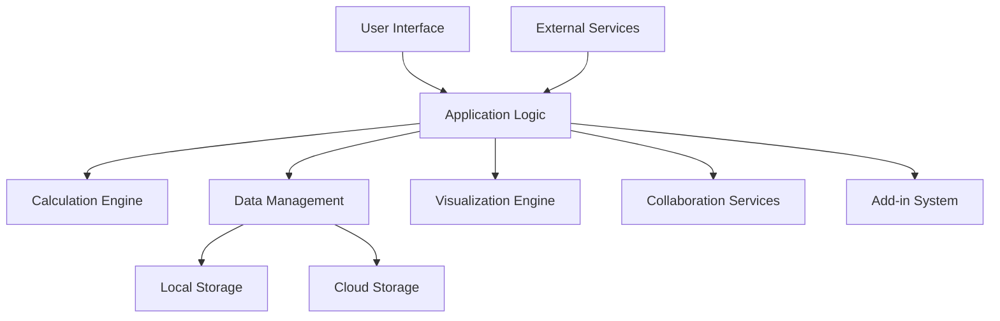

1. **User Interface (UI)**
   - Built with React and TypeScript for a responsive and type-safe frontend
   - Styled using Tailwind CSS for consistent and customizable design
   - Supports desktop (Windows, macOS), web, and mobile (iOS, Android) platforms

2. **Application Logic**
   - Core business logic implemented in TypeScript for the frontend
   - Backend services written in Python for performance-critical operations

3. **Calculation Engine**
   - High-performance engine written in Python
   - Supports 400+ built-in functions and custom function creation
   - Utilizes Google Cloud Functions for distributed computation of complex calculations

4. **Data Management**
   - Local storage for offline functionality and performance
   - Cloud storage using Google Cloud Storage for file synchronization and sharing
   - Database integration for external data sources

5. **Visualization Engine**
   - Chart rendering using React-based charting libraries
   - Support for 50+ chart types and custom visualizations
   - Integration with Google Data Studio for advanced reporting

6. **Collaboration Services**
   - Real-time co-authoring using Google Cloud Firestore
   - Comments and review system for team collaboration
   - Version history and change tracking

7. **Add-in System**
   - Support for custom add-ins using the Excel Add-in SDK
   - Integration with legacy VBA macros
   - Extensibility through RESTful APIs

8. **External Services Integration**
   - Connectivity with other Microsoft Office applications
   - Integration with third-party tools and services through APIs
   - Support for data import/export in various formats

## Key Technologies

| Component | Primary Technologies |
|-----------|----------------------|
| Frontend | React, TypeScript, Tailwind CSS |
| Backend | Python, Google Cloud Functions |
| Database | Google Cloud Firestore, Google Cloud SQL |
| Storage | Google Cloud Storage |
| Authentication | Google Cloud Identity Platform |
| API | RESTful APIs, gRPC |
| Deployment | Google Kubernetes Engine |

## Cross-Platform Support

Excel is designed to provide a consistent experience across multiple platforms:

1. **Desktop Applications**
   - Windows: Native application using Electron
   - macOS: Native application using Electron

2. **Web Application**
   - React-based SPA (Single Page Application)
   - Progressive Web App (PWA) capabilities for offline support

3. **Mobile Applications**
   - iOS: React Native application
   - Android: React Native application

## Cloud Integration

The system leverages Google Cloud Platform for various cloud-based services:

- **Google Cloud Storage**: For file storage and synchronization
- **Google Cloud Firestore**: For real-time collaboration and data synchronization
- **Google Cloud Functions**: For serverless computation and API endpoints
- **Google Cloud SQL**: For relational database needs
- **Google Kubernetes Engine**: For deploying and scaling backend services
- **Google Cloud Identity Platform**: For user authentication and access management

## Security and Compliance

Excel implements robust security measures and adheres to compliance standards:

- End-to-end encryption for data in transit and at rest
- Multi-factor authentication support
- Role-based access control (RBAC) for fine-grained permissions
- Compliance with GDPR, CCPA, and other data protection regulations
- Regular security audits and penetration testing

## Scalability and Performance

The system is designed to handle a large number of concurrent users and large datasets:

- Microservices architecture for independent scaling of components
- Caching strategies using Redis for improved performance
- Lazy loading and virtualization techniques for handling large spreadsheets
- Distributed computation for complex calculations using Google Cloud Dataflow

This system overview provides a high-level description of the Microsoft Excel application, highlighting its key components, technologies, and design considerations. The architecture leverages modern web technologies and cloud services to deliver a powerful, scalable, and cross-platform spreadsheet solution.

# SYSTEM ARCHITECTURE

## PROGRAMMING LANGUAGES

The following programming languages will be used in the development of Microsoft Excel:

| Language | Purpose | Justification |
|----------|---------|---------------|
| TypeScript | Frontend development | Provides static typing for improved code quality and developer productivity. Excellent for building large-scale applications like Excel. |
| React | UI component library | Offers a component-based architecture for building complex UIs with reusable elements. Provides efficient rendering through its virtual DOM. |
| Python | Backend services, Calculation engine | Versatile language with excellent libraries for data processing and scientific computing. Suitable for implementing complex algorithms in the calculation engine. |
| SQL | Database queries | Standard language for interacting with relational databases, used for storing and retrieving structured data. |
| VBA | Macro support | Maintained for backward compatibility and to support existing Excel macros. |
| JavaScript | Add-in development | Used for creating custom add-ins and extending Excel functionality. |

## HIGH-LEVEL ARCHITECTURE DIAGRAM

The following diagram provides an overview of the Microsoft Excel system architecture:

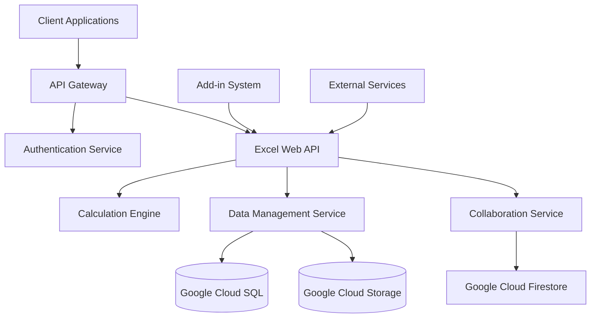

This architecture leverages Google Cloud services for scalability and reliability, while maintaining a modular design for flexibility and ease of maintenance.

## COMPONENT DIAGRAMS

### Frontend Components

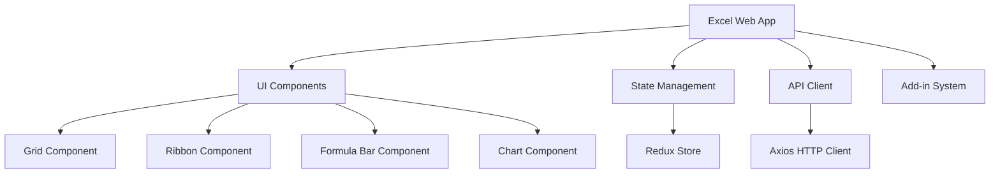

### Backend Components

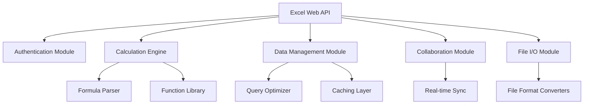

## SEQUENCE DIAGRAMS

### User Authentication Flow

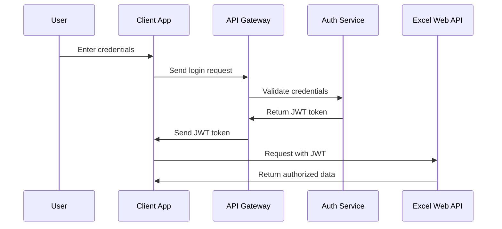

### Real-time Collaboration Flow

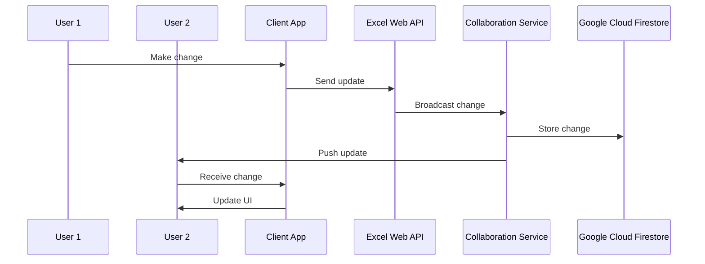

## DATA-FLOW DIAGRAM

The following diagram illustrates how data flows through the Microsoft Excel system:

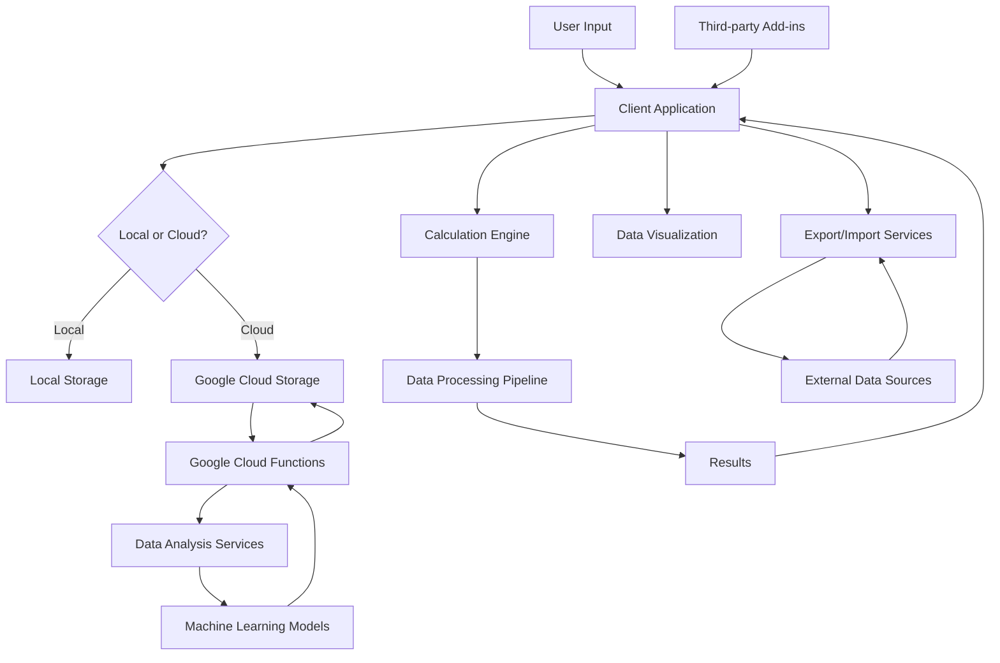

This data flow diagram shows how information moves through the Excel system, from user input to storage, processing, and visualization. It also illustrates the integration with cloud services for advanced processing and analysis, as well as the interaction with external data sources and add-ins.

The architecture leverages React and TypeScript for the frontend, Python for backend services and the calculation engine, and Google Cloud services for storage, real-time collaboration, and scalable computing. This design ensures a modern, scalable, and extensible system that can meet the diverse needs of Excel users across various platforms.

# SYSTEM DESIGN

## PROGRAMMING LANGUAGES

The following programming languages will be used in the development of Microsoft Excel:

| Language | Purpose | Justification |
|----------|---------|---------------|
| TypeScript | Frontend development | Provides static typing for improved code quality and developer productivity. Excellent for building large-scale applications like Excel. |
| React | UI component library | Offers a component-based architecture for building complex UIs with reusable elements. Provides efficient rendering through its virtual DOM. |
| Python | Backend services, Calculation engine | Versatile language with excellent libraries for data processing and scientific computing. Suitable for implementing complex algorithms in the calculation engine. |
| SQL | Database queries | Standard language for interacting with relational databases, used for storing and retrieving structured data. |
| VBA | Macro support | Maintained for backward compatibility and to support existing Excel macros. |
| JavaScript | Add-in development | Used for creating custom add-ins and extending Excel functionality. |

## DATABASE DESIGN

Microsoft Excel will use a combination of relational and NoSQL databases to store different types of data efficiently. The primary databases will be:

1. Google Cloud SQL (PostgreSQL) for structured data:

```mermaid
erDiagram
    USER ||--o{ WORKBOOK : owns
    WORKBOOK ||--|{ WORKSHEET : contains
    WORKSHEET ||--|{ CELL : contains
    CELL ||--o| FORMULA : may_have
    CELL ||--o| STYLE : has
    WORKBOOK ||--o{ NAMED_RANGE : contains
    WORKBOOK ||--o{ MACRO : contains

    USER {
        string id PK
        string email
        string name
        datetime created_at
    }
    WORKBOOK {
        string id PK
        string name
        string owner_id FK
        datetime created_at
        datetime modified_at
    }
    WORKSHEET {
        string id PK
        string workbook_id FK
        string name
        int order
    }
    CELL {
        string id PK
        string worksheet_id FK
        int row
        int column
        string value
    }
    FORMULA {
        string id PK
        string cell_id FK
        string expression
    }
    STYLE {
        string id PK
        string cell_id FK
        json properties
    }
    NAMED_RANGE {
        string id PK
        string workbook_id FK
        string name
        string range
    }
    MACRO {
        string id PK
        string workbook_id FK
        string name
        text code
    }
```

2. Google Cloud Firestore for real-time collaboration and document-based data:

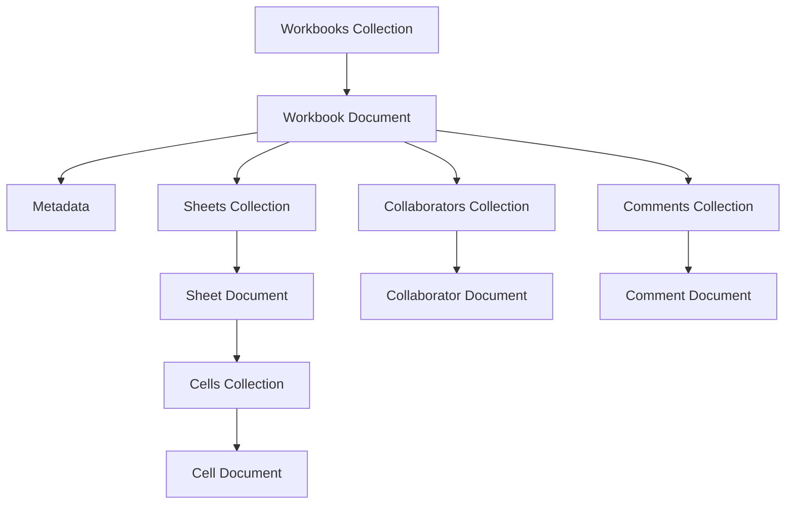

3. Google Cloud Storage for file storage:
   - Used for storing actual Excel files (.xlsx, .xls) and large binary data
   - Organized in buckets per user with versioning enabled

## API DESIGN

The Microsoft Excel API will be designed as a RESTful API using Google Cloud Functions and API Gateway. The main endpoints will include:

1. Workbook Management
   - `GET /workbooks`: List user's workbooks
   - `POST /workbooks`: Create a new workbook
   - `GET /workbooks/{id}`: Get workbook details
   - `PUT /workbooks/{id}`: Update workbook metadata
   - `DELETE /workbooks/{id}`: Delete a workbook

2. Worksheet Operations
   - `GET /workbooks/{id}/worksheets`: List worksheets in a workbook
   - `POST /workbooks/{id}/worksheets`: Add a new worksheet
   - `PUT /workbooks/{id}/worksheets/{sheet_id}`: Update worksheet properties
   - `DELETE /workbooks/{id}/worksheets/{sheet_id}`: Delete a worksheet

3. Cell Operations
   - `GET /workbooks/{id}/worksheets/{sheet_id}/cells`: Get cell data
   - `PUT /workbooks/{id}/worksheets/{sheet_id}/cells`: Update cell data
   - `POST /workbooks/{id}/worksheets/{sheet_id}/cells/format`: Apply cell formatting

4. Formula and Calculation
   - `POST /calculate`: Perform calculations on given formulas
   - `GET /functions`: List available Excel functions

5. Collaboration
   - `POST /workbooks/{id}/share`: Share a workbook with other users
   - `GET /workbooks/{id}/comments`: Get comments for a workbook
   - `POST /workbooks/{id}/comments`: Add a new comment

6. Add-ins and Macros
   - `GET /addins`: List available add-ins
   - `POST /workbooks/{id}/macros`: Create or update a macro

All API endpoints will use JWT for authentication and implement rate limiting for security. The API will be documented using OpenAPI (Swagger) specifications.

## USER INTERFACE DESIGN

The Microsoft Excel user interface will be built using React and styled with Tailwind CSS. The main components of the UI will include:

1. Ribbon Menu
```tsx
const Ribbon: React.FC = () => {
  return (
    <div className="flex bg-gray-100 p-2">
      <TabGroup>
        <Tab>Home</Tab>
        <Tab>Insert</Tab>
        <Tab>Page Layout</Tab>
        <Tab>Formulas</Tab>
        <Tab>Data</Tab>
        <Tab>Review</Tab>
        <Tab>View</Tab>
      </TabGroup>
    </div>
  );
};
```

2. Grid Component
```tsx
const Grid: React.FC<GridProps> = ({ data }) => {
  return (
    <div className="overflow-auto">
      <table className="border-collapse">
        {data.map((row, rowIndex) => (
          <tr key={rowIndex}>
            {row.map((cell, colIndex) => (
              <td key={colIndex} className="border border-gray-300 p-1">
                {cell.value}
              </td>
            ))}
          </tr>
        ))}
      </table>
    </div>
  );
};
```

3. Formula Bar
```tsx
const FormulaBar: React.FC = () => {
  const [formula, setFormula] = useState('');

  return (
    <div className="flex items-center bg-white p-2">
      <span className="mr-2">fx</span>
      <input
        type="text"
        value={formula}
        onChange={(e) => setFormula(e.target.value)}
        className="flex-grow border border-gray-300 p-1"
      />
    </div>
  );
};
```

4. Sidebar for Properties and Formatting
```tsx
const Sidebar: React.FC = () => {
  return (
    <div className="w-64 bg-gray-100 p-4">
      <h2 className="text-lg font-bold mb-4">Properties</h2>
      <div className="space-y-4">
        <FormattingOption label="Font" />
        <FormattingOption label="Size" />
        <FormattingOption label="Color" />
        <FormattingOption label="Alignment" />
      </div>
    </div>
  );
};
```

5. Chart Creation Dialog
```tsx
const ChartDialog: React.FC = () => {
  const [chartType, setChartType] = useState('bar');

  return (
    <div className="bg-white p-4 rounded shadow-lg">
      <h2 className="text-lg font-bold mb-4">Create Chart</h2>
      <select
        value={chartType}
        onChange={(e) => setChartType(e.target.value)}
        className="w-full p-2 border border-gray-300 rounded"
      >
        <option value="bar">Bar Chart</option>
        <option value="line">Line Chart</option>
        <option value="pie">Pie Chart</option>
      </select>
      <div className="mt-4">
        <button className="bg-blue-500 text-white px-4 py-2 rounded">
          Create
        </button>
      </div>
    </div>
  );
};
```

The UI components will be responsive and adapt to different screen sizes. For mobile devices, a simplified interface with essential features will be provided. The design will follow Microsoft's Fluent Design System guidelines while leveraging Tailwind CSS for efficient styling and customization.

Accessibility features will be implemented throughout the UI, including proper ARIA labels, keyboard navigation support, and high-contrast modes for users with visual impairments.

This system design provides a solid foundation for building a modern, scalable, and user-friendly version of Microsoft Excel using React, TypeScript, and Tailwind CSS for the frontend, Python for backend services, and Google Cloud solutions for infrastructure and data storage.

# TECHNOLOGY STACK

## PROGRAMMING LANGUAGES

| Language | Purpose | Justification |
|----------|---------|---------------|
| TypeScript | Frontend development | Provides static typing for improved code quality and developer productivity. Excellent for building large-scale applications like Excel. |
| Python | Backend services, Calculation engine | Versatile language with excellent libraries for data processing and scientific computing. Suitable for implementing complex algorithms in the calculation engine. |
| SQL | Database queries | Standard language for interacting with relational databases, used for storing and retrieving structured data. |
| VBA | Macro support | Maintained for backward compatibility and to support existing Excel macros. |
| JavaScript | Add-in development | Used for creating custom add-ins and extending Excel functionality. |

## FRAMEWORKS AND LIBRARIES

| Framework/Library | Purpose | Justification |
|-------------------|---------|---------------|
| React | UI development | Component-based architecture for building complex UIs with reusable elements. Provides efficient rendering through its virtual DOM. |
| Tailwind CSS | Styling | Utility-first CSS framework for rapid UI development and consistent styling across the application. |
| Redux | State management | Predictable state container for managing complex application state in large-scale React applications. |
| NumPy | Numerical computing | Efficient numerical operations for the calculation engine. |
| Pandas | Data manipulation | Powerful data structures and data analysis tools for backend data processing. |
| FastAPI | Backend API framework | High-performance, easy-to-use framework for building APIs with Python. |
| Celery | Task queue | Distributed task queue for handling background jobs and asynchronous tasks. |
| React-Query | Data fetching | Powerful data synchronization for React applications, simplifying server state management. |
| Chart.js | Data visualization | Flexible charting library for creating interactive and customizable charts. |
| Axios | HTTP client | Promise-based HTTP client for making API requests from the frontend. |

## DATABASES

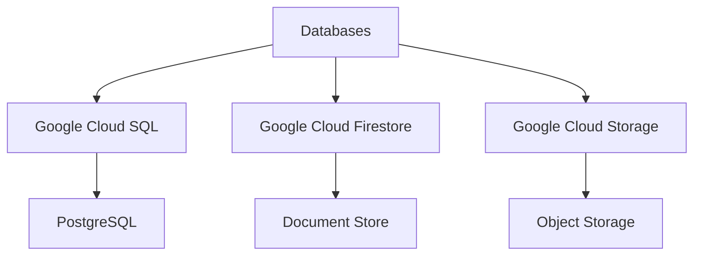

1. Google Cloud SQL (PostgreSQL)
   - Purpose: Relational database for structured data storage
   - Justification: Scalable, managed solution with strong consistency and ACID compliance

2. Google Cloud Firestore
   - Purpose: Real-time database for collaboration features and document storage
   - Justification: Scalable NoSQL database with real-time synchronization capabilities

3. Google Cloud Storage
   - Purpose: Object storage for large files and backups
   - Justification: Highly durable and available storage for unstructured data

## THIRD-PARTY SERVICES

| Service | Purpose | Justification |
|---------|---------|---------------|
| Google Cloud Identity Platform | Authentication and user management | Secure, scalable identity management solution with support for multi-factor authentication |
| Google Cloud Functions | Serverless compute | Scalable, event-driven compute platform for handling microservices and API endpoints |
| Google Cloud Pub/Sub | Messaging | Reliable, scalable messaging service for event-driven architectures |
| Google Cloud AI Platform | Machine learning | Managed platform for deploying and running machine learning models |
| Google Cloud CDN | Content delivery | Global content delivery network for improved performance and reduced latency |
| Google Cloud Monitoring | Application monitoring | Comprehensive monitoring and alerting solution for maintaining system health |
| Google Cloud Key Management Service | Encryption key management | Secure management of encryption keys for data protection |
| Stripe | Payment processing | Robust payment processing platform for handling subscriptions and one-time payments |
| SendGrid | Email service | Scalable email delivery service for sending notifications and alerts |
| Twilio | SMS and voice services | Communication APIs for sending SMS notifications and implementing voice features |

This technology stack leverages modern, scalable technologies that align with the requirements of Microsoft Excel. The combination of TypeScript and React for the frontend, Python for the backend, and Google Cloud services for infrastructure provides a robust foundation for building a powerful, cross-platform spreadsheet application. The selected frameworks, libraries, and third-party services offer a balance of performance, scalability, and developer productivity, enabling the team to efficiently implement the complex features required for Excel.

# SECURITY CONSIDERATIONS

## AUTHENTICATION AND AUTHORIZATION

Microsoft Excel will implement a robust authentication and authorization system to ensure secure access to the application and its features.

### Authentication

1. Multi-factor Authentication (MFA)
   - Implement MFA using Google Cloud Identity Platform
   - Support for SMS, email, and authenticator app options
   - Biometric authentication for mobile devices (fingerprint, face recognition)

2. Single Sign-On (SSO)
   - Integration with Microsoft accounts
   - Support for SAML 2.0 and OpenID Connect protocols
   - Enterprise SSO solutions (Azure AD, Okta, OneLogin)

3. OAuth 2.0
   - Implement OAuth 2.0 for secure API access
   - Support for various grant types (Authorization Code, Refresh Token)

### Authorization

1. Role-Based Access Control (RBAC)
   - Implement fine-grained RBAC using Google Cloud IAM
   - Define roles such as Viewer, Editor, Admin, and Custom roles

2. Attribute-Based Access Control (ABAC)
   - Use ABAC for more complex access scenarios
   - Consider attributes like user department, project, or location

3. Least Privilege Principle
   - Assign minimum necessary permissions to users and services

### Authentication Flow

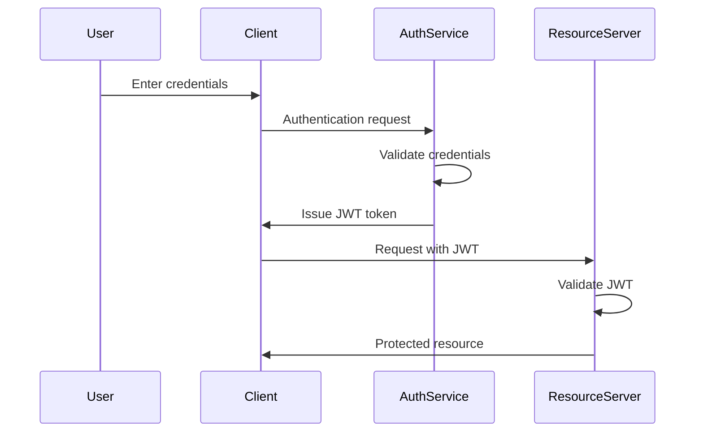

### Authorization Matrix

| Role | View Workbooks | Edit Workbooks | Share Workbooks | Manage Users | Access Admin Panel |
|------|----------------|----------------|-----------------|--------------|---------------------|
| Viewer | ✓ | ✗ | ✗ | ✗ | ✗ |
| Editor | ✓ | ✓ | ✗ | ✗ | ✗ |
| Manager | ✓ | ✓ | ✓ | ✗ | ✗ |
| Admin | ✓ | ✓ | ✓ | ✓ | ✓ |

## DATA SECURITY

Microsoft Excel will implement comprehensive data security measures to protect sensitive information throughout its lifecycle.

1. Encryption
   - At-rest encryption using Google Cloud KMS with AES-256
   - In-transit encryption using TLS 1.3
   - End-to-end encryption for highly sensitive workbooks

2. Data Classification
   - Implement a data classification system (Public, Internal, Confidential, Restricted)
   - Apply security controls based on data classification

3. Data Masking and Anonymization
   - Implement data masking for sensitive information in non-production environments
   - Provide anonymization options for data exports and sharing

4. Secure Data Deletion
   - Implement secure deletion procedures using cryptographic erasure
   - Comply with data retention policies and regulations (e.g., GDPR)

5. Data Loss Prevention (DLP)
   - Integrate with Google Cloud DLP for identifying and protecting sensitive data
   - Implement controls to prevent unauthorized data exfiltration

6. Audit Logging
   - Comprehensive logging of all data access and modifications
   - Use Google Cloud Audit Logs for centralized log management

7. Backup and Recovery
   - Regular automated backups using Google Cloud Storage
   - Implement a robust disaster recovery plan with defined RPO and RTO

### Data Security Flow

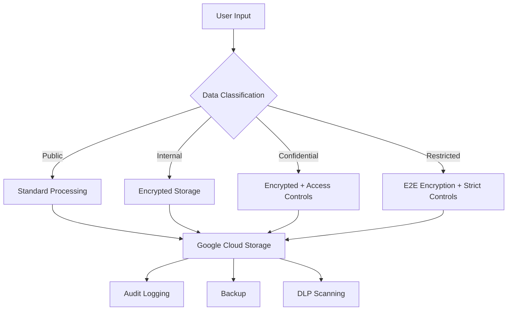

## SECURITY PROTOCOLS

Microsoft Excel will adhere to industry-standard security protocols and best practices to maintain a robust security posture.

1. Secure Development Lifecycle (SDL)
   - Implement security requirements in the planning phase
   - Conduct regular security code reviews and static analysis
   - Perform penetration testing before major releases

2. Vulnerability Management
   - Regular vulnerability scans using tools like Nessus or Qualys
   - Implement a responsible disclosure program for external researchers
   - Timely patching of identified vulnerabilities

3. Incident Response Plan
   - Develop and maintain an incident response plan
   - Conduct regular tabletop exercises to test the plan
   - Integrate with Google Cloud Security Command Center for threat detection

4. Access Control
   - Implement the principle of least privilege
   - Regular access reviews and prompt revocation of unnecessary access
   - Use of strong, unique passwords and password managers

5. Network Security
   - Implement network segmentation using Google Cloud VPC
   - Use Web Application Firewall (WAF) for protecting web interfaces
   - Regular network penetration testing

6. Third-party Security
   - Conduct security assessments of third-party integrations and add-ins
   - Implement a vendor risk management program

7. Compliance and Certifications
   - Maintain compliance with relevant standards (ISO 27001, SOC 2, GDPR)
   - Regular internal and external audits

8. Security Awareness Training
   - Mandatory security awareness training for all employees
   - Phishing simulations and social engineering tests

### Security Monitoring and Response

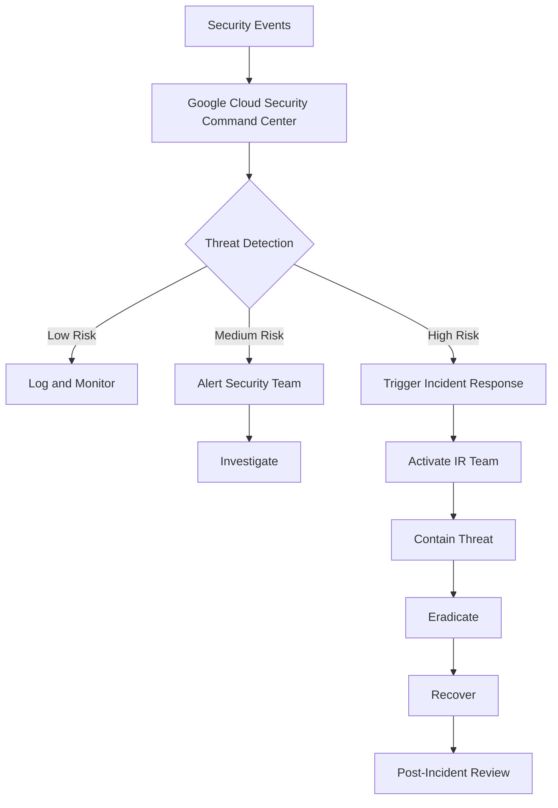

By implementing these security considerations, Microsoft Excel will maintain a strong security posture, protecting user data and ensuring the integrity and confidentiality of the application. The use of Google Cloud services for security features aligns with the overall architecture and provides a robust, scalable security infrastructure.